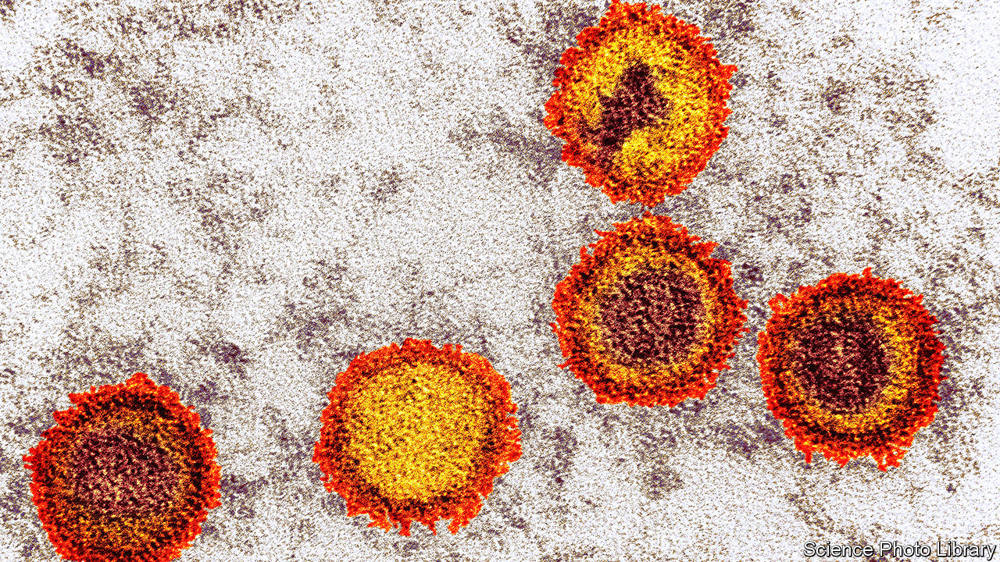

###### A kiss and a cure

# Scientists want to tackle multiple sclerosis by treating the kissing virus 

##### Vaccines and antivirals are already undergoing trials 

 

> Feb 28th 2024 

Multiple sclerosis (MS) affects around 1.8m people worldwide. Symptoms include fatigue, blurred vision, and trouble walking. Eventually, some people become severely disabled and complications from the condition can lead to death. There is currently no cure, and few treatments for advanced stages of the disease. But a series of recent findings have led to a tantalising idea—could a vaccine against a common virus finally consign MS to the history books?

MS occurs when a patient’s immune system attacks their myelin, the fatty tissue that insulates the nerve cells of their brain and spinal cord and which enables those cells to pass on electrical signals. Most existing treatments focus on modulating or suppressing a patient’s immune system. Trials of a new type of immunotherapy, for example, known as CAR-T, have recently begun. The treatment, which scientists hope could stop the progression of MS, involves removing a patient’s immune cells, editing the DNA within, and then reinjecting the cells.

In 2022 scientists identified the reason why the immune system attacked myelin in people with MS: Epstein-Barr virus (EBV), the cause of mononucleosis or glandular fever (also known as the “kissing disease”). This opened up new treatment options for MS and trials of antivirals and vaccinations against EBV are now under way.

Almost all MS patients show signs of EBV infection, but so do around 95% of healthy adults. Roughly half the population catch the virus in childhood and, in most people, it lingers harmlessly in the immune system and cells of the throat. Of those who encounter EBV after childhood, around half contract mononucleosis.

To prove the link to MS, a group of researchers led by Alberto Ascherio at Harvard University tracked more than 10m American military employees who were given regular blood tests for HIV. During the study, 955 of the soldiers were diagnosed with MS. The scientists then went back and tested the blood samples taken before the soldiers’ diagnoses, for signs of EBV infection. All but one had antibodies for the virus, a rate far higher than would be expected by chance. 

The next step was to understand how, in a small number of people, the virus can turn a patient’s own immune system against them. A paper published in  in 2022 showed that a protein produced by EBV shares a similar structure with a protein in human cells crucial for the production of myelin. In some people, antibodies created to destroy EBV inadvertently attacked the nervous system too. A handful of genetic variants that significantly increase the probability of this confusion were identified in December 2023.

Antiviral therapies could reduce the amount of EBV circulating in patients’ immune systems. A large international study published in December found that people living with HIV, and taking antiviral drugs, were less likely to be diagnosed with MS than the general population. But full-scale clinical trials are yet to justify this optimism. A small study of the antiviral drug Famciclovir, published in January, found that the drug had no effect on the levels of EBV in the saliva of MS patients. Other trials are under way in Boston and Norway.

Meanwhile, vaccines against EBV are also in development. Two are being trialled in people—one by Moderna, a pharmaceutical company, and a second by the National Institute of Allergy and Infectious Diseases (NIAID) in America. Both are designed to train the body to attack an EBV protein known as gp350, which enables the virus to invade immune cells.

Even if these vaccines can protect against EBV it will be many years before researchers know their impact on MS—people develop the disease years after infection with EBV. But there is a lot of hope. “You can compare this to the HPV vaccine,” said Jessica Durkee-Shock, who is leading the NIAID trial, “We had to wait more than ten years before we proved that it protected people from cervical cancer.” The HPV vaccine has virtually eliminated cervical cancer in the women who received it as children. Scientists hope MS will be next. ■


