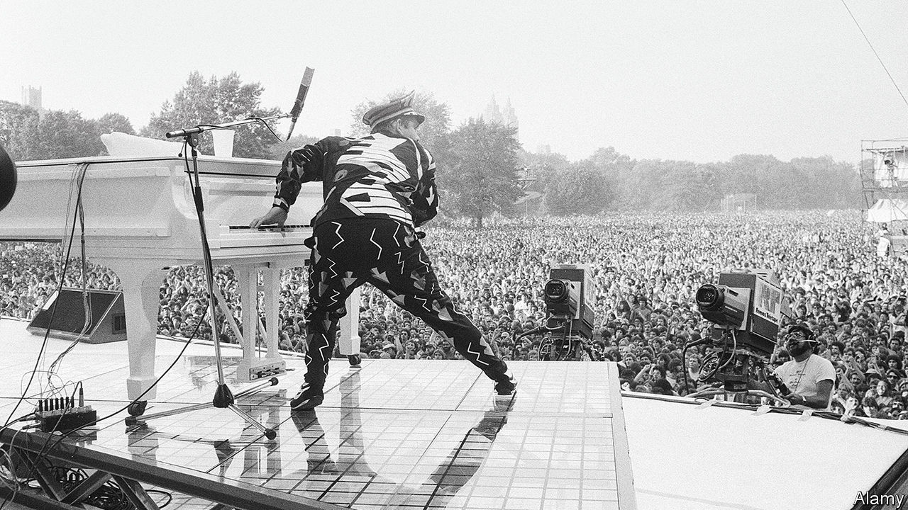

###### Your brain on music

# Why recorded music will never feel as good as the real thing 

##### The answer, according to neuroscience 

 

> Feb 28th 2024 

In a world of music streaming services, access to almost any song is just a few clicks away. Yet, the live gig lives on. People still fill sweaty basements, muddy fields and gilded concert halls to hear their favourite musicians play. And now neuroscientists might know why: live music engages the brain’s emotion centres more than its recorded counterpart.

Concerts are immersive social experiences in which people listen to and feel the music together through crescendos, key changes and drops. They are also dynamic—artists can adapt their playing according to the crowd’s reaction.

It was this last difference that led neuroscientists, based at the Universities of Zurich and Oslo, to study the brain responses of people listening to music. In the “live” experiment, participants lay in an MRI scanner listening to the music through earphones, while a pianist was positioned outside the room. The pianist was shown the participant’s real-time brain activity as a form of feedback. In the recorded condition, participants listened to pre-recorded versions of the same tunes.

The scientists were interested in how live music affected the areas of the brain that process emotions. In the live condition pianists were instructed to try and modulate their playing in order to drive the activity in one of these regions known as the amygdala, an almond-shaped area deep inside the brain. 

The results, just published in the journal , showed that live music had far more emotional impact. Whether the music was happy or sad, listening to the pianist playing in a dynamic way generated more activity in both the amygdala and other parts of the brain’s emotion processing network. The researchers also found that participants’ brain activity tracked the acoustic features of the music, like tempo and pitch, far more closely when it was played live.

The study was far from replicating the real experience of a gig, and the authors noted that the live music ended up sounding quite different from the recorded tracks, which may have driven some of the differences in participant’s brain activity. But the results indicate that the ability of artists to change the way they play in response to the audience may be one aspect of what makes live music special. Some musical acts now attempt to recreate the real gig experience with everything but the artist—ABBA Voyage is a social, immersive show performed entirely by pre-recorded hologram avatars. But without Benny’s ability to read the mood of the room, it will never quite match the real thing. ■


