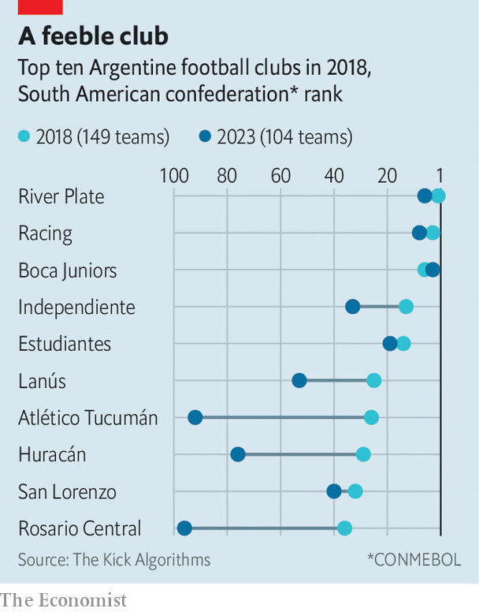

###### Kicking back

# Argentina’s football clubs are resisting privatisation 

##### Javier Milei wants to attract foreign money into ailing teams 

 

> Feb 29th 2024 

On a balmy afternoon in late February, Argentina’s two biggest football clubs, River Plate and Boca Juniors, met for the , as matches between the two sides are called. The 111-year-old Buenos Aires derby, which ended in a 1-1 draw, has legendary status with the world’s football fans. Tourist packages to attend games sell for more than one thousand dollars.

 


The is a bright spot in an otherwise dull picture. Argentina’s football clubs are in decline (see chart), even as its national team ranks best in the world. Fans bemoan a run of losses to Brazilian teams in the Copa Libertadores (South America’s equivalent to Europe’s Champions League), club mismanagement, and an exodus of Argentine players to foreign clubs. 

Argentina’s recently elected president, Javier Milei, believes that a lack of private investment is to blame for the sorry state of club football in his country. By law, clubs are run as non-profit associations owned by their members. Most revenue comes from ticket sales and TV rights. 

Many struggle to make ends meet. Last year, the situation was so dire for Independiente (one of Argentina’s “big five” teams) that a social-media influencer started a crowdfunding campaign to help repay the club’s gigantic debts. 

Mr Milei reckons he has a quick fix: rewriting the law to allow clubs to become limited companies. He has said this could bring in billions of dollars from rich Arab and European investors, and claims that British club Chelsea is already sniffing around for opportunities. “Quick money”, as Mr Milei calls it, would bring huge benefits. If your team is winning, he says, who cares who owns the club?

It turns out that a lot of Argentines care a great deal. Mr Milei’s proposals have been roundly opposed by Argentina’s football association, clubs and fans. They worry that clubs’ role in their local communities would change. Argentine football clubs often provide facilities for dozens of other sports, education and healthcare services, and even run the odd university. Private ownership would probably not find those provisions to be profitable.

Another concern is that new owners might buy up Argentinian clubs in order to turn them into talent farms for more lucrative leagues in Europe. This model of ownership would increase the flood of players to foreign clubs, rather than stem it.

The courts are already involved. On January 30th a federal judge upheld an objection from a league in Salto arguing that the government’s privatisation plans are unconstitutional. The judge ruled that allowing football clubs to become limited companies could undermine non-profit associations and their broader role in society. Other court cases are likely to follow, as football clubs seek to derail Mr Milei’s plans.

And even if Mr Milei can push his reforms through, there is unlikely to be a long queue of investors eager to buy stakes in domestic clubs. Other countries in the region have made similar moves in the past, notably Brazil, which opened clubs to private investment in 2021. Only a few Brazilian clubs have received foreign money since then, and at nowhere near the levels touted by Mr Milei. 

There are several Argentina-specific factors which might put investors off, too. There are problems with violence between rival (thuggish groups of supporters). New owners may fear retribution for making unpopular decisions. “These are the most visible businesses in Argentina. If you sell a player they disagree with, they know where you live and where your children go to school,” notes Simon Kuper, author of “Soccernomics”.

Risk appetite

Others may be dissuaded by the dire state of Argentina’s economy. Triple-digit inflation, multiple exchange rates, foreign currency shortages and a recent history of on-off capital controls do not inspire confidence that foreigners will be able to remit any profits. That Argentina regularly flip-flops between populist and pragmatist governments means that measures introduced by one administration are often reversed by the next. With the rules of the game changing so frequently, private investors may conclude that ploughing money into Argentinian clubs is too risky.

This all has implications beyond football. The president aims to deregulate and open up other (larger) sectors to private investment. It is tempting, but wrong, to assume that money will pour in if laws change. Investors need to be convinced that potential rewards are worth the risk. They want reassurance that government policy will be less erratic. That is lacking at present. The risk for Mr Milei is that even if he survives bruising battles with congress and the courts, and pushes his reforms through, investors will end up waiting on the sidelines.■


