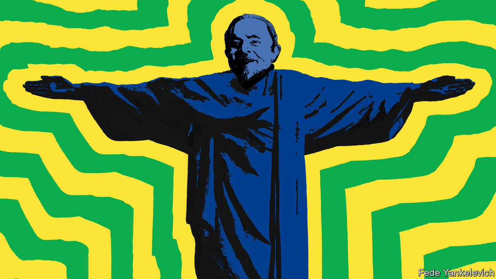
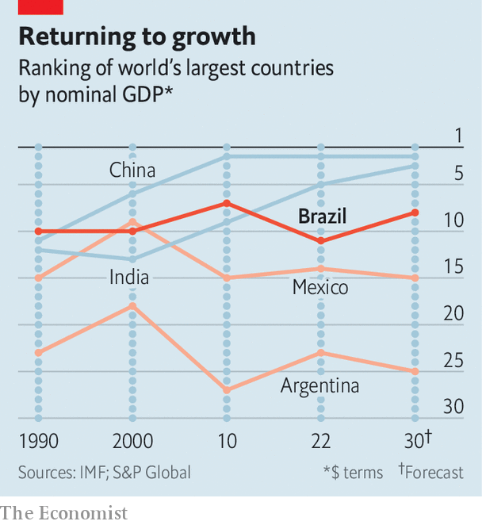

###### Bringing back Brazil

# Lula’s gaffes are dulling Brazil’s G20 shine 

##### Its relationships with the West are healing. But Brazil has not decided what kind of country it will be 

 

> Feb 27th 2024 

The summit is not until November, but the meetings have already begun. Foreign ministers arrived in Rio de Janeiro on February 21st to inaugurate Brazil’s presidency of the G20, an intergovernmental talking shop for countries representing over 80% of global GDP. Finance ministers and central-bank governors held their own opening pow-wow in São Paulo on February 28th and 29th. Brazil’s president, Luiz Inácio Lula da Silva (known as Lula), aims to use his year at the helm of the G20 to convince the world of his most repeated promise, that “Brazil is back”.

The world’s ninth-largest economy spent four years prior to Lula’s inauguration as something of an international pariah. His predecessor, far-right populist Jair Bolsonaro, allowed destructive development of the Amazon rainforest and aligned himself with autocrats. He told Brazilians to “stop being a country of sissies” during the covid-19 pandemic, urged them to take hydroxychloroquine, a malaria drug, and speculated that vaccines might cause AIDS (they do not). Mr Bolsonaro made few international trips and pulled out of hosting COP25, the UN’s climate summit.

After being in power between 2003 and 2010, the first year of Lula’s third term in office has, for the most part, been a repudiation of conspiracy and insularity. He has already made 27 foreign trips, more than Mr Bolsonaro did through his entire term, including to the G7 in Japan, the UN General Assembly in New York, and high-profile bilateral visits to Washington and Beijing. 

Relations with the United States have improved, even if more in terms of goodwill than substantive cooperation. Lula and President Joe Biden have bonded over attacks on government buildings by their predecessors’ followers, and their shared support for labour rights. Brazilian officials want to emulate Mr Biden’s industrial policy. Speaking in Rio on February 21st, Antony Blinken, America’s secretary of state, proclaimed that ties between the two countries were “stronger than ever”.

 


Economic revival after a decade-long slump has lent Lula more heft. Analysts initially reckoned GDP might grow by just 0.8% in 2023, the year he took office. Official figures, due to be published as  went to press, are expected to show it grew by 3%. Growth is likely to slacken in 2024 due to a weak harvest, but Elijah Oliveros-Rosen of S&amp;P, a ratings agency, thinks Brazil is relatively well placed for strong performance in this decade (see chart). Recent structural reforms, including an overhaul of the consumption-tax system, are boosting investment. 

Brazil is likely to benefit from the energy transition. Affordable green technology of all kinds is pouring in from China, as is money, which is being invested into everything from telecoms infrastructure to mining and hydroelectricity generation. According to the OECD, a club of mostly rich countries, Brazil was the second-biggest recipient of foreign direct investment in the world in the first half of 2023, the latest period for which data are available.

And Lula’s return to power has yielded progress on what is perhaps Brazil’s most important global responsibility, the protection of the Amazon rainforest. Deforestation in the Amazon fell by half in 2023, compared to 2022. Brazil will aim to capitalise on this success when it hosts COP30 next year, in the Amazonian city of Belém (though Lula’s efforts to turn Brazil into a big oil exporter will weaken his environmental credentials). 

Yet Lula has undermined his administration’s successes with unscripted remarks, and a naive desire to appear chummy with autocrats and democrats alike.

Shortly before foreign ministers gathered in Rio, Lula was touring Egypt and Ethiopia. Both had recently joined the BRICS, a group of emerging economies, and Lula was promoting Brazil as a leader for the global south. But it was his inflammatory statements at a press conference in Addis Ababa on February 19th that made headlines. “What is happening in Gaza and to the Palestinian people has not existed at any other time in history,” he said, adding erroneously, that “actually, it has existed: when Hitler decided to kill the Jews”. 

Israel immediately declared Lula to be a “persona non grata” and summoned Brazil’s ambassador to the Holocaust Museum in Jerusalem for a reprimand. Hamas, the Palestinian Islamist group which runs Gaza, praised his comments as “accurate”. 

He is strikingly less keen to judge other countries. When asked at the same press conference about Alexei Navalny, the Russian opposition leader who died on February 16th in the Arctic penal colony to which Mr Putin had banished him, he demurred. “Why the rush to accuse someone? A citizen died in prison; I don’t know if he was ill or had any issues.” 

It was not Lula’s first display of sympathy towards Mr Putin’s regime. He has blamed Ukraine for being invaded by Russia. In September he said Mr Putin would not be arrested if he attended the G20 summit, though he later walked back the comment (a warrant from the International Criminal Court obliges Brazil’s courts to detain Mr Putin). This attitude differs little from that of his predecessor, who visited Mr Putin one week before Russia invaded Ukraine. Brazil has become the world’s biggest buyer of Russian diesel. 

Gift of the gaffe

The most generous interpretation is that remarks of this kind are a cynical ploy to galvanise the leftist base of Lula’s Workers’ Party. Even if that is working, it is having severe side-effects. As well as irking Western allies, Lula has forged common ground on which Brazil’s right wing and alienated centrists have come together. 

On February 25th Mr Bolsonaro called on his followers to march in São Paulo against an investigation into his role in the events of January 8th 2023, when his supporters attempted to overturn the results of the presidential election. Mr Bolsonaro and thousands of his fans, many of whom are evangelical Christians who support Israel, arrived at the march draped in Israeli flags. Senators and congressmen who had been attempting to avoid association with Mr Bolsonaro felt compelled to show up in the wake of Lula’s outburst. 

These inconsistencies risk weakening the overall effect of Lula’s foreign policy, says Rubens Ricupero, a former Brazilian ambassador. Lula wants Brazil to be all things to all people: a friend of the West and a leader of the global south, a defender of the environment and a global oil power, a promoter of peace and an ally for autocrats. Brazil may well be back, but the part it is playing on the world stage is murkier than it should be.■ 


