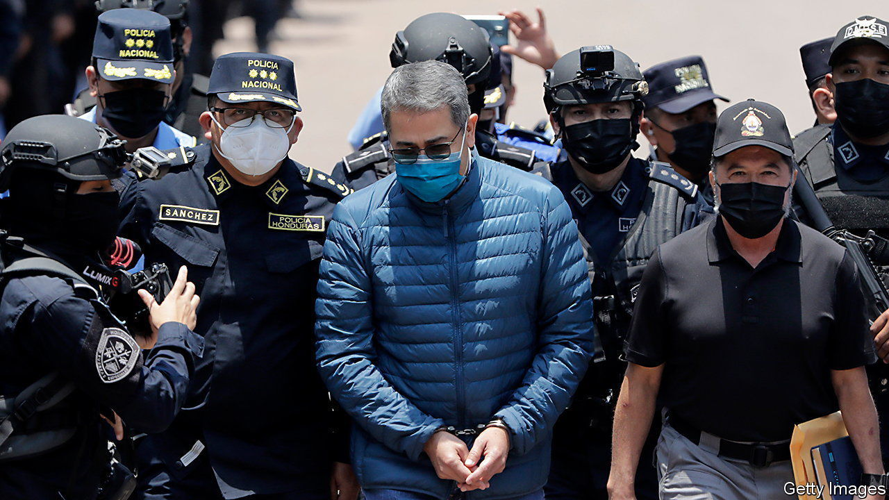

###### The switcheroo

# The former president of Honduras is tried for drug trafficking 

##### Juan Orlando Hernández used to be a prominent ally in the US war on drugs 

 

> Feb 29th 2024 

The United States has long struggled to find reliable allies in the so-called war on drugs. Take former Honduran president, Juan Orlando Hernández. Once feted in Washington as a partner in the struggle against the flow of narcotics, on February 20th he found himself in the dock in New York, standing trial for his alleged role in a drug-trafficking conspiracy that has run on for more than a decade. 

In a 96-page document laying out their case against the former president, federal prosecutors say that Mr Hernández had merely “pretended to support the United States’ efforts to curb drug trafficking”, and had in fact been conspiring with drug lords to finance his political campaigns. Mr Hernández has strongly denied the accusations. He says they are lies made up by convicted traffickers looking to reduce their sentences in exchange for co-operation with prosecutors. 

The case raises the question of why it is hard for the United States to find trustworthy allies in the war on drugs. Recent examples of apparent duplicity abound. In 2020, US officials arrested former Mexican defence minister General Salvador Cienfuegos, on charges of colluding with organised crime (the charges were dropped after Mexico threatened to restrict US Drug Enforcement Administration operations in Mexico). Mexico’s former Secretary of Public Security, Genaro García Luna, was convicted in February last year of colluding with the Sinaloa syndicate during his time in office, between 2006 and 2012. At sentencing, he faces a minimum of 20 years in jail. Before his arrest, Mr García Luna was heralded as a “Supercop” who worked closely with US officials.

The waning popularity of the war on drugs is one part of the problem. That US allies question its commitment to the drug war at home is another. They cite the insatiable market for illegal drugs and the sale of guns to organised crime groups across Latin America. This has encouraged a softer stance on drugs across the region. 

In Mexico, President Andrés Manuel López Obrador has broken with his predecessors’ militarisation of the drug war, adopting what he calls a “hugs, not bullets” policy in an effort to reduce the country’s astronomical homicide rate. While still cooperating with the United States, Mr López Obrador complains that DEA operations in Mexico abuse its sovereignty. When old DEA reports were leaked in January, alleging that Mr López Obrador’s presidential campaign may have received financing from drug gangs, he responded by slamming the United States for running unsanctioned operations in the first place, denouncing such “immoral practices”.

Things are no better in Colombia, which produces about 60% of the world’s coca, the crop which is processed to make cocaine. Its leftist president Gustavo Petro is an open critic of the drug war, and has cut back on the eradication of coca crops. 

The United States’ record of working with unsavoury characters (most famously expressed in President Franklin D. Roosevelt’s apocryphal remark that Nicaraguan dictator Anastasio Somoza García “may be a son of a bitch, but he’s our son of a bitch”) may also offer foreign leaders and officials a false sense of security. 

“There is something very appealing about being considered one of the good guys. That is what the US sells,” said John Feeley, a retired US ambassador who served most of his career in Latin America. Visiting the White House and receiving delegations of powerful US officials can bolster a leader’s image at home. 

Honduras was a priority in the drug war due to its role as an “air bridge” for flights carrying cocaine from South America to the United States. The corruption and violence associated with drug trafficking turned the country into one of the most violent places in the world, and fuelled migration to the United States. 

The Honduran president really did play a pivotal role in helping to ease these problems. He created many structures used to take down drug kingpins, including an extradition treaty with the US that helped to seal his own fate a decade later. He also allowed the DEA to vet and train a special Honduran police team to go after major international drug trafficking networks. As a result of this cooperation, his government was a recipient of lavish US aid. 

Mr Hernández may have thought that Washington would also turn a blind eye to his election campaign finances. Drug money was so plentiful in Honduras, a poor country of 10m people, that by the time he became a political force it was already ingrained in campaign financing. 

But all the while, according to court documents, DEA agents in Honduras and prosecutors in the United States were quietly accumulating evidence of his alleged ties to influential drug traffickers.

They indicted Mr Hernández just two weeks after he left office, in early 2022. As many Hondurans celebrated, Mr Hernández was shackled and led away in disbelief. He is unlikely to be the last leader to let down Washington in its war on drugs.■


