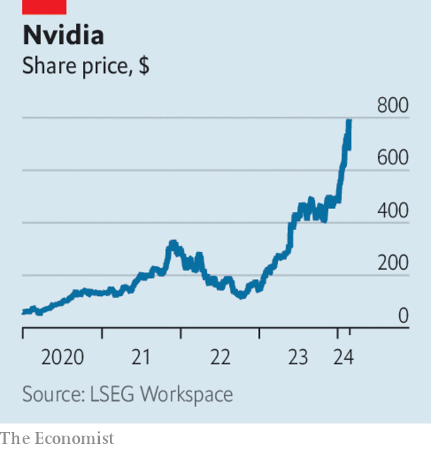

###### The world this week

# Business 

#####  

 

> Feb 29th 2024 

 struck a partnership with , a French startup working in artificial intelligence, that will help expand its services in cloud computing. Mistral was founded just a year ago by former researchers at Google and Meta. Its large language model is seen as rivalling GPT-4 in terms of reasoning. GPT-4 has been developed by OpenAI, in which Microsoft owns a 49% stake. 

 


 share price retained most of the gains it made after its quarterly earnings smashed expectations. Its market value surged by $277bn in a day, the most ever for a company. With a market capitalisation nearing $2trn the maker of high-end chips for AI has become the third-most-valuable American company, after Microsoft and Apple. Nvidia is a rising tide lifting all boats. The S&amp;P 500 hit a new record, as did the Nikkei 225 in Japan and Stoxx Europe 600. 

By contrast Alphabet, Google’s parent company, lost $80bn in market value in a day amid the controversy over . In overcompensating for diversity the AI model has depicted erroneous woke images of historic figures and at times refused to show images of white people. Examples include black Vikings, an Asian Founding Father of America, a female pope and a Native-American British king. Google has withdrawn the tool to make improvements. Sundar Pichai, Google’s boss, told staff that Gemini had “shown bias” which was “wrong”. 

Underlining the shift in market priorities,  has reportedly ditched its project to develop an electric car in order to redirect funding towards AI. And heralding a potential shift in the priorities of investors, two big groups of Apple shareholders supported a resolution at its annual general meeting asking the company to disclose its ethical guidelines on AI. The proposal was defeated but was supported by 38% of all shareholders. 

Government involvement

America’s Justice Department hired its first   . Jonathan Mayer, a computer scientist and lawyer, will advise the department on law enforcement, regulatory and legal issues and help develop an in-house team of experts in the technology. 

Japan promised to provide funding for a second factory in the country to be built by , the world’s biggest chipmaker. TSMC, based in Taiwan, has just opened its first plant in Japan. The Japanese want to bolster their supply chains against possible disruption from China.

The obituaries came thick and fast for , after a leaked memo showed that it plans to stop publishing on its website and cut hundreds of jobs. Founded in the 1990s as a hip journalistic brand, Vice’s digital platform was one of the pioneers challenging established media. But digital sales never lived up to their promise. Vice is now looking to distribute its content through those traditional channels. 

 continued to restructure its business in the face of its proxy battle with Nelson Peltz, an activist investor. The company is merging its division in India into a joint venture with Reliance Industries, which will hold a 63% stake in the new entity. Disney took control of the Star TV network, India’s biggest, in 2019, but it is losing money, increasing its operating loss in Disney’s latest quarter. 

, the holding company for Warren Buffett’s investments, reported an annual operating profit of $37.4bn, up by 21% from 2022 and boosted in part by the performance of its insurance business. But the Sage of Omaha warned that there were only a few companies left to invest in that offered the big gains that Berkshire has enjoyed in the past. 

America’s Federal Trade Commission sued to block the $25bn proposed merger of the  and  supermarket chains, saying the deal would harm workers and lead to higher food prices. Kroger said both it and Albertsons “look forward to litigating this action in court”. 

 announced the closure of 150 stores, about a third of its total, and will renovate its remaining properties, creating smaller shops located away from malls. Tony Spring took over as the retailer’s chief executive in February. 

Timed for lunch?

, a fast-food chain, denied reports that it would introduce surge pricing for its menu. Surge pricing is used by Uber and other businesses to raise prices when demand increases at any given time, so customers at Wendy’s would pay more if there was a surge in demand for its Pretzel Baconators. The company said that instead its new digital menu boards would bring in “dynamic pricing”, which is not surge pricing, it insisted, but allows it to display discounts “particularly in the slower times of day”. New technology is increasingly allowing many businesses to adjust their prices in real time to changes in demand. 

