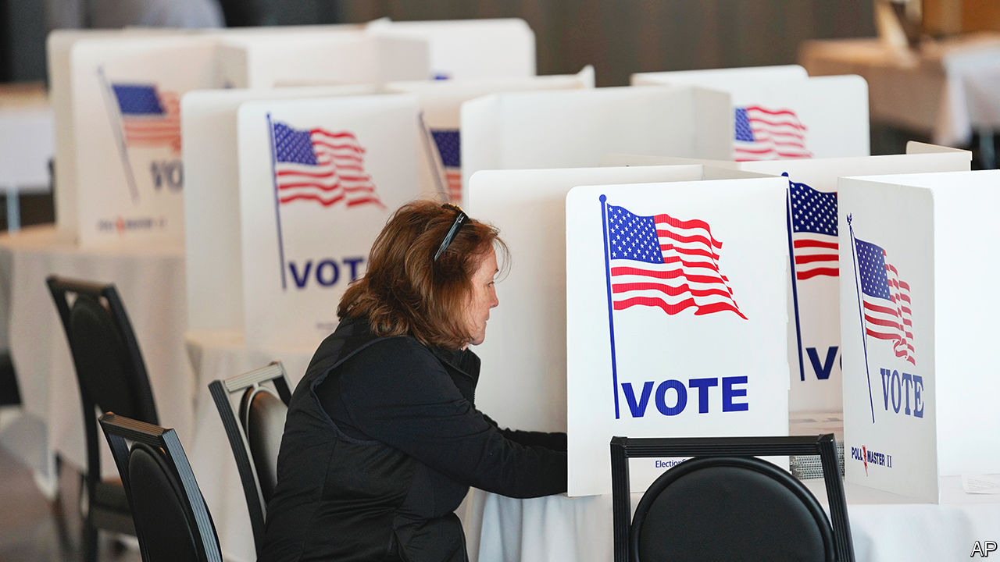
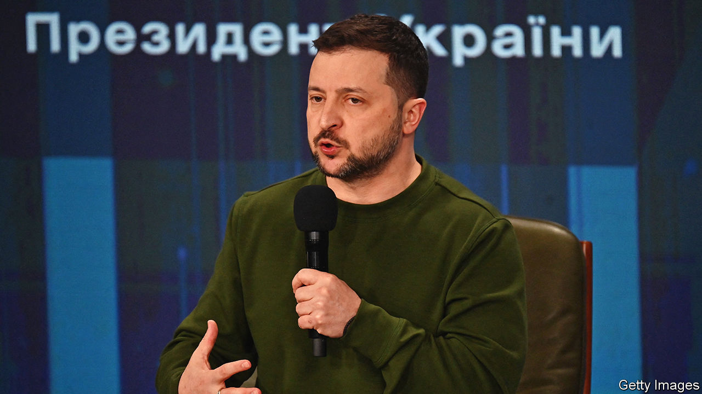

###### The world this week

# Politics 

#####  

 

> Feb 29th 2024 

Donald Trump’s march towards the  reached Michigan, where he won the party’s primary with 68% of the vote. Mr Trump had earlier beaten Nikki Haley in her home state of South Carolina. She has vowed to continue her campaign. Meanwhile the Supreme Court said it would hear arguments about whether Mr Trump is immune from prosecution in the week beginning April 22nd. Prosecutors seeking to try the former president had hoped for an earlier hearing. The court will rule soon on a separate case about whether Mr Trump can be kicked off the ballot. That matter has gained a sense of urgency after a judge in Illinois decided to remove him from the state’s primary ballot. 

Around 13% of voters in Michigan’s Democratic primary voted for “uncommitted”, a  against  support for Israel from left-wing Democrats. Nearly 3% of the vital swing-state’s electorate is Muslim. 

Into the sunset

announced that he would step down as the Republicans’ leader in the Senate after the election in November. He has held the role since 2007, but had a few health scares recently. Mr McConnell has had a poor relationship with Mr Trump. 

Talks continued on a potential temporary  between Israel and Hamas in Gaza that would be based on the release of Israeli hostages and Palestinian prisoners during Ramadan, a month of fasting for Muslims. Mr Biden said a deal could be announced within days. Qatar, which is hosting the talks, said it was “hopeful, not necessarily optimistic”. Gaza’s health ministry said 30,000 people, mostly women and children, had died in the conflict. It didn’t say how many were Hamas militants. 

 parliament passed a law under which people can be jailed for three years if they say they are lesbian, gay, bisexual or transgender. It also criminalises forming or funding LGBT+ groups or calling for gay rights. The bill will only come into force when signed by the president.

Heavy gunfire was reported in  capital, N’Djamena, after an attack on the headquarters of the country’s security agency. The government blamed an opposition party.

ECOWAS lifted economic sanctions and border closures imposed on  after a coup last year. The change in policy seems to be aimed at dissuading Niger, Burkina Faso and Mali, which all have military governments, from leaving the 15-member west African bloc. ECOWAS had imposed sanctions to try to force them to restore democratic rule.

Documents and chat-logs from a private Chinese security firm, I-Soon, were leaked onto a public website. They showed its extensive involvement in government spying on a wide range of targets, including dissidents, foreign governments, businesses and charities. It is unclear how the leak occurred. Meanwhile  passed amendments to its state-secrets law. It includes a new vaguely defined category called “work secrets”, the leaking of which could be deemed as a threat to national security. 

New Zealand’s new centre-right government rescinded a for future generations that would have taken effect in July. The ban would have been the first in the world to phase out smoking by prohibiting people born after January 1st 2009 from buying tobacco products, even as they grow older. The government thinks this would have created a black market for cigarettes. Instead it will use the revenue it receives from tobacco sales to fund tax cuts. 

Narendra Modi, the prime minister of, visited Kerala and Tamil Nadu. The trip was part of a push on behalf of the ruling Bharatiya Janata Party to  ahead of the forthcoming general election.

Hun Sen, who was prime minister of  from 1985 to 2023, returned to an official government position as president of the Senate, who acts as head of state in the king’s absence. Hun Sen’s son, Hun Manet, took over as prime minister when his father relinquished the office. 

Hungary for change, at last

 parliament approved  application to join . Hungary and Turkey were the last members of the military alliance to ratify the bid; Turkey gave its formal approval in late January. “Sweden is leaving 200 years of neutrality and military non-alignment behind,” said the Swedish prime minister, Ulf Kristersson, a shift in security policy that Vladimir Putin never anticipated when he invaded Ukraine. 

 


Speaking during the weekend of the second anniversary of Russia’s invasion of , Volodymyr Zelensky said that 31,000 Ukrainian troops had been killed in the conflict as well as “tens of thousands” of civilians (American estimates of Ukraine’s military deaths are far higher). The Ukrainian president urged America to pass a big military aid package that Republicans in Congress are blocking within a month. “If we lose, there will be no us,” he warned. 

The suggestion by Emmanuel Macron that  could be sent to Ukraine was firmly rebuffed by other European leaders. The French president said that all options should be considered to ensure Russia’s defeat. The Kremlin warned that deploying European soldiers would spark a conflict with NATO.

Supporters of were expected to try to attend his burial in Moscow on March 1st. The body of the former Russian opposition leader was handed over to his mother, nine days after his death in an Arctic penal colony. The authorities are worried that the funeral could turn into a protest. Meanwhile a court sent Oleg Orlov, a prominent human-rights campaigner, to prison for “repeatedly discrediting” the Russian army. 

The European Parliament passed a controversial  that requires EU countries to rehabilitate at least 20% of their land and sea ecosystems by 2030, rising to 100% by 2050. The bill was opposed by the European People’s Party, the grouping for centre-right MEPs. Green tape is one of the issues flaming the farmers protests across the European Union. Ahead of the vote they again clashed with police in Brussels. One farmer said she was fed up with having to detail everything about her “horse poops” to bureaucrats. 

A left-wing candidate won the election for governor of Sardinia, handing Giorgia Meloni her first big defeat since becoming  prime minister at the head of a right-wing coalition in 2022. Ms Meloni had handpicked her Brothers of Italy party’s candidate for the election.

The EU received 1.1m applications for  last year, an increase of 18% compared with 2022 and the highest number since the migrant crisis of 2015-16. Syrians continued to lodge the most applications; up by 38% over 2022. Afghans were the second-largest group to apply, though their numbers fell from 2022. Applications from Turkish nationals surged by 82%. Germany was the main destination country, receiving 29% of all applications. France was second on 15% and Spain third on 14%. 

The   lander, the first commercial spacecraft to touch down successfully on the lunar surface, relayed its first images. Operated by Intuitive Machines, the  is conducting the first of three missions with NASA. It is America’s first return to the Moon since 1972.

