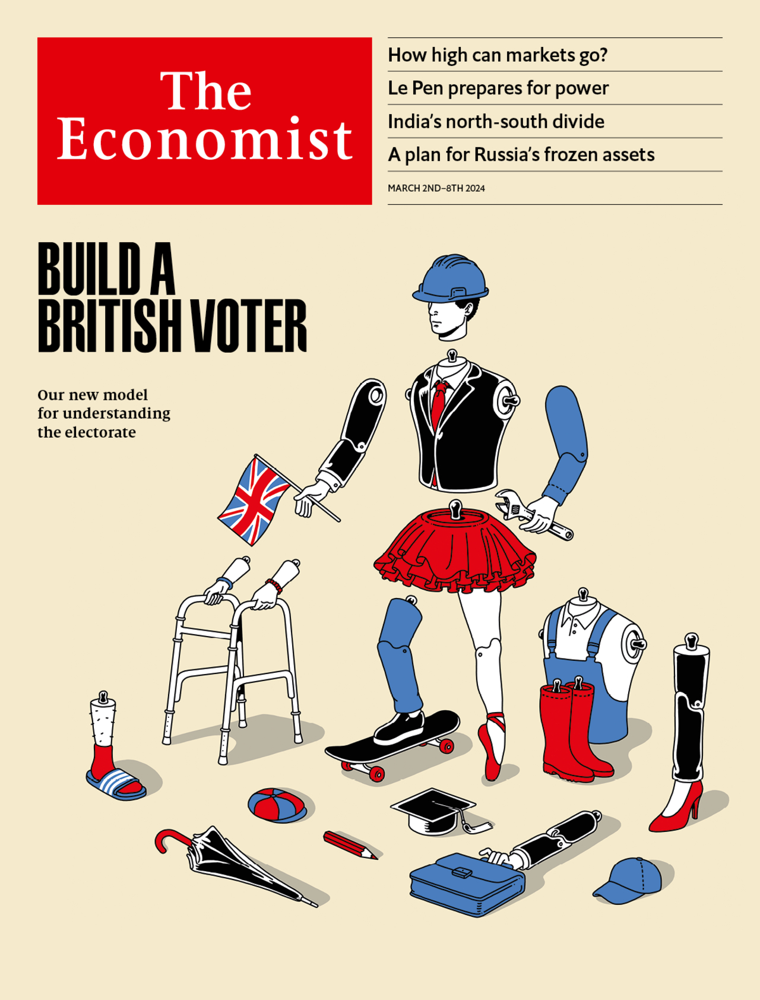
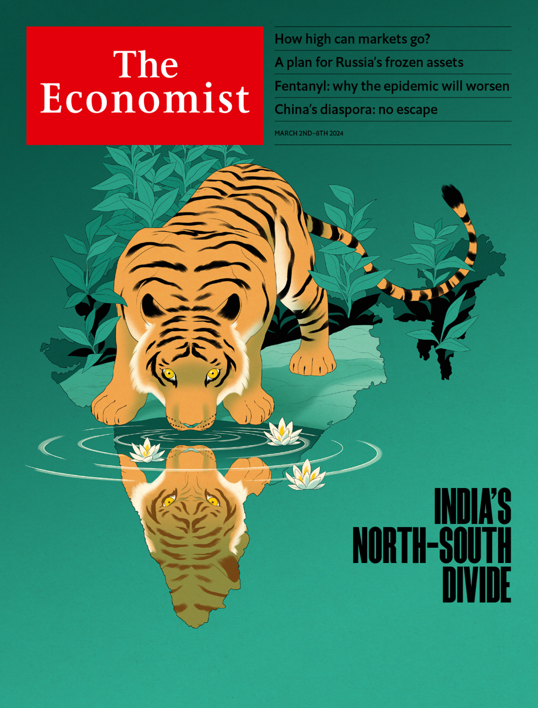

###### The world this week

# This week’s covers 

##### How we saw the world 

> Feb 29th 2024 

THIS WEEK we had three covers. In Britain, we considered the country’s new electorate. The Labour party is on the cusp of a remarkable victory. Our new model—based on the views of nearly 100,000 Britons—shows what is driving people away from the Conservatives.

 


 

 


In America and Europe, we looked at soaring stockmarkets. American stocks are up by 21% since the end of October; on February 22nd European equities set a new record for the first time in two years. But their golden age is drawing to a close: even AI is unlikely to drive a repeat of the past decade’s performance. 

 


 

 


Political and economic divisions could ruin India. Our cover in Asia considers the country’s north-south divide. The wealthy south is where you will find the slick new India, with its startups and gleaming iPhone-assembly plants. The party of India’s prime minister, Narendra Modi, gets a low share of its votes from there and relies on the poorer, Hindi-speaking north. The divide will be a defining issue in this year’s election. And how it is managed in the long run is of critical importance to India’s prospects.

 


 

 

