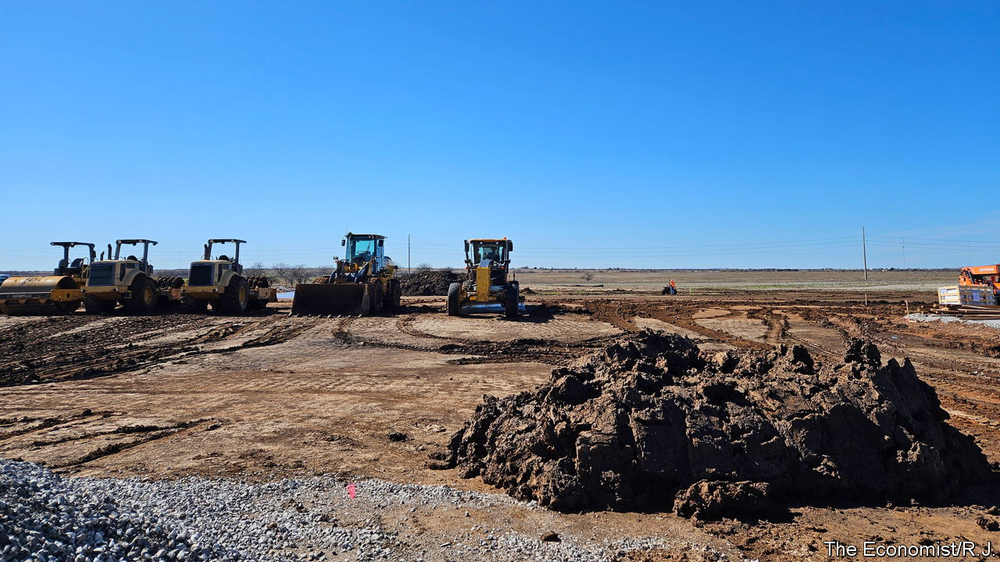

###### Cobalt blues

# A millennial is building America’s first nickel-cobalt refinery 

##### But it’s proving ethically trickier than she expected 

 

> Feb 29th 2024 

Kaleigh Long believed there had to be an American fix. As an Oklahoman working on political campaigns in the Democratic Republic of Congo she saw all too closely the bloodiness of the critical-mineral trade. Militias killed her flatmate’s siblings, burnt homes on resource-rich land and forced children to dig in the mines—as Chinese companies tolerated the abuses. 

Back home the 28-year-old single mother reckoned that getting into the mineral business was the best way to clean up the supply chain and ease China’s chokehold on cobalt and other minerals vital to a greener economy. America had no nickel-cobalt refineries of its own. In early 2022 Ms Long set out to build its first. She raised $50m for her startup, Westwin Elements, and recruited oil-and-gas tycoons, a former intelligence officer and the longtime boss of Boeing, an aerospace company, to sit on her board. In her Oklahoma City headquarters the self-described libertarian touched her necklace, the pendant a silhouette of Africa, as she spoke about the $185m grant Westwin next hopes to win from the Department of Energy.

Westwin’s ambitions show the promise of the largesse doled out by the Inflation Reduction Act (IRA), Joe Biden’s signature bill to catalyse America’s clean-energy transition. Subsidies for electric cars attracted $110bn in investments in green manufacturing and battery-making within a year of the IRA’s passage in 2022. But as firms boosted production it became clear that China’s grip on the world’s mineral mines and refineries could prove perilous for its political foes. If China decides not to export refined metals tomorrow, as it has threatened to do, dozens of brand-new American gigafactories could soon sit idle.

Even with subsidies, mining and refining in America are not for the faint of heart. Regulations can make both activities uncompetitive. But the maths flipped in refiners’ favour in December 2023 when the tax agencies charged with implementing the IRA made it more protectionist. Their new rules clarified that companies selling electric cars made with materials processed by firms with at least 25% Chinese ownership are ineligible for subsidies. For makers of batteries and cars this was bad news—their inputs got pricier overnight. But for Ms Long it meant that her higher-cost product would have a market.

Drive 90 miles south-west of Oklahoma City through fields of cotton and cattle and you will find yourself at the construction site of Westwin’s pilot plant in Lawton. A steel skeleton of the refinery sits on a 40-acre plot framing the Wichita mountain-range; on a February morning engineers buzzed around it in hard hats. By 2030 Westwin plans to produce 64,000 metric tonnes of processed nickel and—if it can find ethical suppliers and sell the refined product without crashing the price—20,000 tonnes of cobalt. According to calculations by Daniel Quiggin of Chatham House, a British think-tank, that would meet roughly half of America’s demand for electric-car batteries. For building the supply chain “projects like this are indispensable,” says Bentley Allan, a professor at Johns Hopkins University.

Blood, sweat and fears

But in leaving Congo for America’s prairies Ms Long finds herself still haunted by ethical problems. By building in Oklahoma she inserted her project in the middle of a bitter row over indigenous rights. Leaders of the Apache, Comanche and Kiowa nations say the plant comes too close to their sovereign land and that the firm’s failure to consult them before building shows the same disrespect as settlers past. They fear that contamination from the refinery will give their babies cancer and dirty their sacred land and air. Having lost countless kin to covid-19 they refuse to back it without a guarantee that it will not make their people sick. Westwin cannot make that promise.

The protests echo those mounted against the Keystone XL oil pipeline in the Dakotas. At a sweat ceremony on a recent winter evening, between prayers for locked-up loved ones and addicted brothers, native residents pleaded for Westwin to stop construction. As an elder poured water on embers the hut filled with steam and became so hot your correspondent struggled to breathe. In darkness they sang and passed a tobacco pipe between them, the smoke a vehicle to lift their anti-industrial supplications “to the spirits”. 

The next day the tribal chairmen met with Westwin executives. Lawton locals who attended had no patience for Ms Long’s tearful tale of child-slaves in the Congolese cobalt mines—indigenous people, she noted, just on a different continent—and no interest in what her project means for American national security. 

Because they lack the muscle of richer tribes to the east who lobby more, their objections are probably for naught. But the distress of it all may in the end convince Ms Long not to build the commercial plant in her home state, especially if Texas or Louisiana offer better tax breaks. 

The permitting process could be long and litigious in any of those places and the delay may undermine climate goals. As long as domestic refineries are not yet up and running and China’s mineral stash is still on offer, the IRA’s protectionist rules could slow progress towards decarbonisation, says Tom Moerenhout of Columbia University who advises the State Department and White House on energy policy. 

Since hawkishness towards China is trendy in both parties, and most of the investments have gone to Republican districts, it is a fair bet that any future president will keep the subsidies in place. That comforts Ms Long, who says she worries about the risks facing her business “almost every day, most of the day”. Though many are cheering her on, Westwin has already shown just how hard it is to bring critical-mineral refining to America, never mind an ethical model for the world. ■


