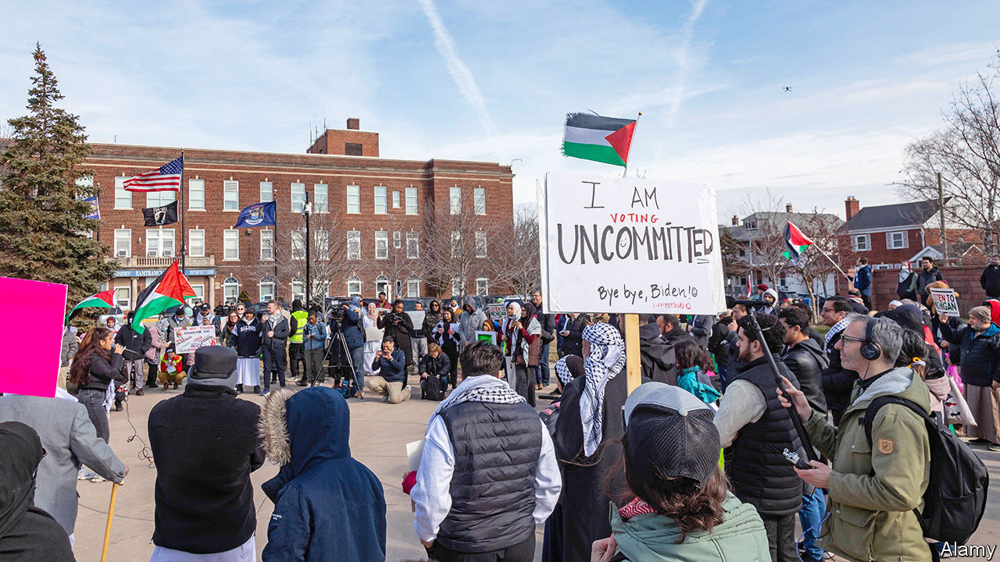

###### Commitment phobia

# Does Joe Biden’s re-election campaign have a Gaza problem? 

##### The Michigan result would make Donald Trump president if it’s repeated in November 

 

> Feb 29th 2024 

IT IS NEVER nice for a campaign when a steadfast constituency turns irate and threatens to withhold their votes; it is the stuff of nightmares when they happen to reside in a swing state that may decide the next presidential election. Incensed over the Israeli military campaign in Gaza—which is fast approaching 30,000 Palestinian deaths—Muslim-American and Arab-American voters staged a campaign to withhold their votes for President Joe Biden in Michigan’s Democratic primary. Rashida Tlaib, a prominent Palestinian-American congresswoman representing the heavily Muslim western suburbs of Detroit, encouraged her fellow Democrats to vote “uncommitted”, as did most prominent Muslim officials in the state. Over 100,000 Michiganders voted “uncommitted”, representing 13.3% of the total vote.

The threat to Mr Biden is not veiled. “There is not really a path that does not go through Michigan. And there is not really a path that goes through Michigan without the Muslim community,” says Hira Khan of Emgage, a Muslim-voter mobilisation group. Michigan has had a recent spate of tight elections. In 2016 Donald Trump beat Hillary Clinton by a margin of 10,704 votes (or 0.22% of those cast); in 2020 Mr Biden won by 154,188 (or 2.78%). The state also has one of the highest concentrations of voters with Middle Eastern and Muslim backgrounds. In 2020 there were an estimated 206,000 Muslims in the electorate—roughly 2.8% of the total—and most of them probably voted for Democrats. If the anti-Gaza backlash persisted through November (including among the three-quarters of young voters who disapprove of Mr Biden’s handling of it), the effect would be marginal. But in a state like Michigan, marginal effects can matter quite a lot.


That is why the Biden campaign seemed particularly concerned. Weeks ago, it sent Julie Chávez Rodríguez, the campaign manager, to the state to meet Muslim leaders. The meeting was cancelled when all of them refused to attend. Reportedly, a suggested meeting with Vice-President Kamala Harris in Washington was also nixed. The White House dispatched senior policymakers, including Jon Finer, the deputy national security adviser. A recording of the conversation, published by the  shows Mr Finer being unusually self-critical: “We have left a very damaging impression based on what has been a wholly inadequate public accounting for how much the president, the administration and the country values the lives of Palestinians. And that began, frankly, pretty early in the conflict,” he said. 

The listening sessions are only going so far. “I think they’re hearing the concerns. The problem is that they’re not acting on them yet,” says Alabas Farhat, a Democratic state representative who has been campaigning for the uncommitted vote.

Despite the display of discontent in the primary, it remains unclear how seriously the grumbling will jeopardise the president’s prospects in the general election. In 2012, when Barack Obama was running for re-election, 10.7% of Democratic primary voters in Michigan voted “uncommitted”, even though there was no concerted campaign to do so. Graded against that baseline, the 13.3% showing mustered by this campaign looks less impressive. 

Back in 2012 the discontent was diffuse. This year it was concentrated. In some precincts of Dearborn, a heavily Arab-American city near Detroit, three-quarters of voters were “uncommitted”. If 100,000 Democratic voters were really willing to spoil their ballots in November in order to nix Mr Biden’s chances of winning, he would be in serious trouble. Yet the president would also face an electoral backlash were he seen to abandon Israel. In ’s YouGov poll 36% of those questioned say their sympathies in the conflict are more with Israelis, while just 15% are more sympathetic to Palestinians.

Some Muslims say they are ready to abandon Biden and that his inability to restrain Israel is cause enough to make him a one-term president. Given Mr Trump’s evident antipathy to Muslim-Americans, his favour towards Israel and his general lack of concern for most things that sound like human rights, this might seem paradoxical. Ahead of the primary vote Gretchen Whitmer, the popular governor of Michigan, argued that “any vote that is not cast for Joe Biden supports a second Trump term.” Many Muslims concede that outcomes under Mr Trump would not have been better, but that there would be no offensive pretence of caring about human rights. “I prefer to be stabbed from the front than from the back,” says one.

Others say that Mr Biden can win back their support if he were to call for a permanent ceasefire, if he stops sending weapons to the Israelis and resumes funding the United Nations Relief and Works Agency (which was cut off after the Israelis said that several of its employees had taken part in Hamas’s attack on October 7th that murdered 1,200). Asked what happens in the next nine months, Abdullah Hammoud, the mayor of Dearborn, says: “That’s a question for President Biden.” ■


