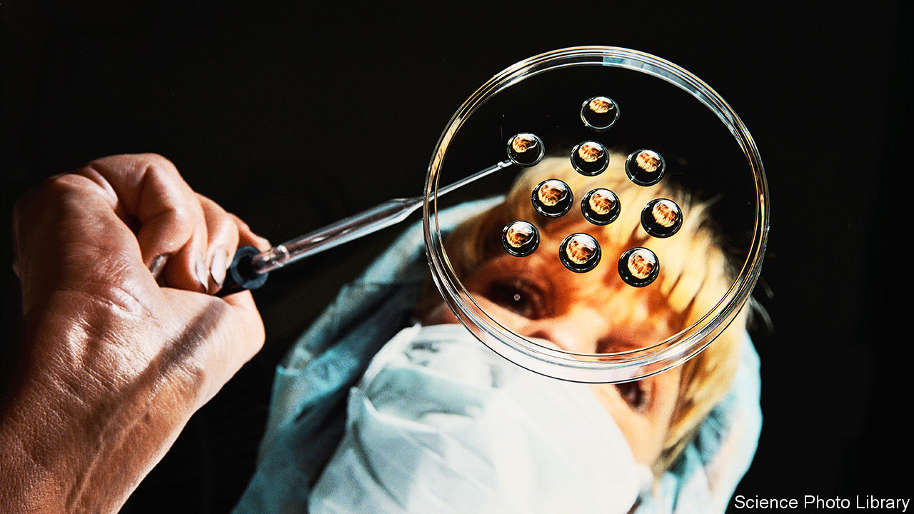

###### In vitro veritas

# IVF is a slam-dunk issue for Democrats. Abortion may not be 

##### The Democratic Party is so giddy about Alabama’s daft court ruling that it risks overlooking its own vulnerabilities 

 

> Feb 28th 2024 

SPARE A THOUGHT for Republican staffers who had to explain the female reproductive system to their bosses this week. Following a decision by Alabama’s Supreme Court, which led to the halting of fertility treatments in several clinics, some showed just how little they understood about baby-making. Tommy Tuberville, an Alabama senator, declared he was “all for” the ruling because “we need to have more kids”. In vitro fertilisation (IVF) in fact helps make more kids. Greg Abbott, Texas’s governor, wondered whether IVF created “one, ten, 100, 1,000” embryos (between zero and a dozen per cycle is common).

Patients in Alabama have become the latest collateral damage in America’s abortion wars. The ruling on February 16th found that embryos created by IVF and kept in “cryogenic nurseries” count as “extrauterine children”, and thus as people under state law. Politically this seems a gift to Democrats. Everything from the judgment’s scripture-heavy language, to jubilant pro-lifers declaring it a “tremendous victory for life”, and the fumbled responses by Republicans, helped paint Republicans as a radical, woman-hating party.

Democrats put the blame squarely on Donald Trump and his Supreme Court picks. “They came for abortion first. Now it’s IVF and next it’ll be birth control,” warned Hillary Clinton, a former secretary of state. Hastily the National Republican Senatorial Committee rushed out a memo instructing all Senate candidates to oppose any restrictions on IVF and “align with the public’s overwhelming support”. Several of them had previously co-sponsored bills—such as the Life At Conception Act—which, by in effect codifying embryos as people, could have had a similar impact on IVF .

Nearly two years after the Supreme Court overturned , returning the issue of abortion to states, Republicans continue to struggle with the consequences of their victory. Conventional wisdom is that any talk about abortion is a win for Democrats. The immediate aftermath to Alabama’s ruling certainly suggests so. But it might not be quite that simple. 

After an uncharacteristic pause, Mr Trump tried to end the fumbling and declared his resounding support for women, IVF and “Beautiful Babies”. “We want to make it easier for mothers and fathers to have babies, not harder!” he wrote on Truth Social, his social-media platform. This tone comes on the heels of his privately floating a federal abortion ban at 16 weeks (though states could go further). If that is Mr Trump’s position it would be a more moderate one than any Republican presidential nominee has held since the 1970s.

Since  was overturned, the total number of abortions in America has remained stable. But there has been a big shift in where they have been performed. A new report by the Society of Family Planning, a non-profit, estimated that the 14 states with strict abortion bans had 120,930 fewer abortions over the past 15 months than over a similar period before the end of . American fertility doctors predict that a similar “regulatory migration” wave could follow for IVF patients if state courts start cracking down on fertility treatment. That is what has happened in Europe, where stricter embryo rules in countries like Germany and Italy helped make Spain the largest IVF market in Europe.

IVF may be the clearest example yet of pro-life buyer’s remorse. The vast majority of Americans support a procedure that has helped realise dreams for couples from the Obamas to the Pences. This is not a fight Republicans want. Yet it is one of several real-world questions that pro-lifers will now increasingly need to confront. The questions around fertility treatment are not just whether IVF is ok. They include whether embryos can be biopsied to check for abnormalities, how to deal with embryos left in freezers after death or divorce and what to do with surplus embryos. Republicans may be lining up to pledge their unconditional support to IVF, but none has (yet) confronted the corollary—the related destruction of embryos along the way.

And yet Democrats should not assume that the abortion debate can only win them votes. A 16-week ban is not as radical or unpopular as it may sound: 96% of abortions happen before 16 weeks and that cut-off would put America in line with many European countries (although with fewer medical exceptions after 16 weeks). Whereas a majority of Americans (69%) are in favour of abortion in the first trimester, this drops to a minority in the second trimester (37%) and the third (22%), according to Gallup. Americans are not that different from Europeans—more conservative but mostly in favour of some access to abortion. 

The Democratic playbook is: remind voters that Republicans took away abortion and promise to bring back . In swing states with potential ballot initiatives planned for election day, such as Arizona, this could just make the difference. The Democratic National Committee paid for dozens of billboards across swing states this week, tying Mr Trump to the loss of IVF and asking what could be next. However, Democrats need to tread more carefully than they may realise. On abortion at least, Joe Biden’s extreme wing has become bigger than Mr Trump’s. Whereas 24% of Republicans believe abortion should always be illegal, 44% of Democrats think it should be legal during the third trimester. That is out of step with both American and European public opinion. The “abortion positivity movement” on the left is also a uniquely American phenomenon.

Yet all of this posturing has little to do with actual policy. Mr Trump’s 16-week ban is as unlikely to materialise as Mr Biden’s promise to codify , says Mary Ziegler, a legal historian at the University of California, Davis. More immediately, the Supreme Court cases to watch will be on the availability of the abortion drug mifepristone in March, followed in April by the question of whether the Emergency Medical Treatment and Labour Act protects pregnant women with health-endangering emergencies against state abortion bans. ■


]

