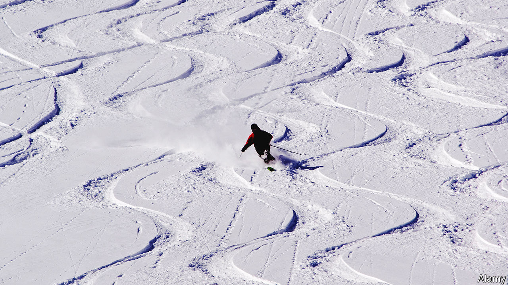

###### Stoked

# The economics of skiing in America 

##### How monopoly and price discrimination are transforming an industry 

 

> Feb 27th 2024 

WHITE POWDER can drive many people mad. At the bottom of the Imperial chairlift in Breckenridge, a mountain resort in Colorado, at 10 o’clock in the morning on a sunny Saturday, at least 200 people are queuing to get up. The chairlift is not yet carrying people, but the crowd is patient. There is, after all, a show to watch. Up the mountain, men in red jackets are trying to set off avalanches. Explosions ring out every few minutes. Your correspondent, who was slow to arrive, joins the back of the queue as it begins to move, and a cheer goes up. By the time he gets onto a chair, the pristine powder snow below the lift has already been chopped up by a hundred tracks, and the line to get back up stretches the length of a football field.

The benefits of committing early have always been clear to skiers. Yet in the ski resorts of Colorado, being quick is now about more than just getting up the mountain first. To be allowed up there your correspondent, an unsavvy European, paid $260 for a single day’s lift ticket. Almost nobody else on the chairs with him paid as much. These days, if you want to ski in America, the wise thing to do is to buy your pass before the first snow falls. Commit before November, and you can get unlimited skiing all season for less than the cost of a few days. In the past decade or so the ski business has been transformed by clever pricing and industry consolidation. A close look delivers an insight into how the American consumer economy as a whole is changing. It shows how  can accumulate, but also spur growth.

Breckenridge is owned by Vail Resorts, a listed company with headquarters near Denver that now operates on three continents. In 2008 the firm, which then owned just five resorts, launched the “Epic Pass”. Before, season tickets for skiing were a niche product, generally sold to locals, for as much as $1,500. The ski industry made most of its money from day tickets. Unlike the way things work in Europe, where resorts are often owned by local or national governments, skiing in America has never been a stable business. Most mountains were prestige assets owned by rich families, and their fortunes rose and fell . If the snow fell plentifully, resorts made money. If not, they struggled. “It didn’t make much of an investment opportunity,” says Sara Olson, Vail’s vice-president of communications.

With the Epic Pass, Vail has changed the offer. Skiers can now get unlimited skiing at a whole pack of resorts cheaply, but only by committing before the season starts. The result, says Stuart Winchester, who runs the Storm Skiing Journal, an industry blog and podcast, is that for the first time in decades skiing in America is reliably profitable. But it has come at a cost to competition. “Everyone else is swimming around. Vail is buying everything,” he says. 

Vail now owns 41 resorts, including more than two dozen tiny hills on the East Coast and in the Midwest, which they consider “feeder” resorts that nurture new skiers who eventually may come west. In 2018 a competing pass, the Ikon, was launched by the Alterra Mountain Company, owned by the billionaire Crown family of Chicago, which shares revenue with independent resorts. Nowadays, most of America’s biggest ski areas are on one or the other pass.

In basic economic theory, excessive market power reduces the efficiency of an industry. Firms reduce output so as to be able to charge more. There is, however, an exception: if a monopolistic firm can charge different prices to different customers, it need not reduce output to increase its profit. The skiing industry shows the truth of this. As the industry has consolidated, daily prices have soared, extracting more cash from price-insensitive skiers. But if you buy a season pass early, or one of your friends does, you can get a ticket for a lot less, and so the slopes are still busy. Last year 65m people visited American resorts, the largest number ever, according to the National Ski Areas Association, an industry group. Vail’s revenue increased by 14%. Season passes now make up 61% of the firm’s lift-ticket revenue.

Piste off pistes

Yet the transformation is not entirely popular. As the number of people with passes grew, “locals started losing their shit at all of these people coming into town,” says Mr Winchester. On a T-Bar drag lift at Breckenridge, Vince, a paramedic who has been skiing there since the 1980s, says that Vail “is the evil empire”. With far more people skiing, the lift queues have grown, particularly on the best snow days. A skiing culture that catered to locals has changed into a mass business. Real estate has soared in value—and with it property taxes. Vince says he had to sell his house and move farther away. Getting back to ski is tougher. Traffic jams snake up the mountain, and parking is no longer free.

Vail may soon hit the limits of its ability to squeeze more skiers onto the slopes. Although lift passes can be had cheaply, the cost of accommodation has soared. Last year the firm raised its minimum wage to $20 per hour, but staff shortages remain a problem—in towns where houses now cost millions, that doesn’t go very far. On the biggest days, the firm has had to resort to rationing—limiting the number of lift tickets available, and drastically raising the cost of things like parking, so as to stop the crowds. Many variants of the Epic and Ikon passes now come with “blackout dates”, when passholders cannot ski. This has controlled some of the worst crowds, but at the cost of annoying customers. Nonetheless, on snowy weekends, social media still fill up with videos of lengthy lift queues posted by grumpy skiers.

What skiing needs is in fact much of what the economy more generally needs: supply-side reform, and especially the construction of new housing and transport in the most popular spots. Though there are more skiers than ever, there are in fact fewer resorts than there were a few decades ago. Expanding—or opening new resorts—is extremely difficult, thanks to endless environmental challenges. At Vail mountain proper, in 2022 the local government squashed a plan to build more employee housing last year in favour of creating a wildlife sanctuary for bighorn sheep. At Park City in Utah plans to upgrade two chairlifts were blocked over fears that it would add to the town’s interminable traffic jams. “Cars at scale do not work in the mountains,” says Mr Winchester. But local officials simply cannot imagine skiers arriving without their own vehicles, and public-transport options are often limited.

The richest skiers are shunning the resorts on passes altogether. This December Powder Mountain in Utah announced that it would be moving to a model where only local property-owners are allowed to ski certain chairlifts. The idea is to profit from real-estate sales, by offering private skiing without the crowds. “To stay independent and uncrowded, we needed to change,” says Reed Hastings, the firm’s boss. In Montana the Yellowstone Club offers exclusive skiing—to those who can afford an upfront fee of $400,000, an annual fee of $40,000 and to buy or build a $3m property in the area. Frustrated by crowds and soaring prices, many more Americans are flocking to ski in Europe. There passes can still be bought cheaply on the day; trains and buses transport people from airports; and the bottoms of lifts are surrounded by apartment blocks rather than car parks.

All of this reflects how the American economy is changing. The airline industry too was once famously unprofitable. Nowadays, it is profitable. As with skiing, stability comes from market power and price discrimination. Flights are expensive and uncomfortable—but those who accumulate the right credit-card points and are loyal to a particular airline can get them cheaper, and planes almost never take off with many empty seats. Even fast-food restaurants are turning to price discrimination. In mid-February Wendy’s the CEO of Wendy’s, a fast-food restaurant, suggested food prices could be varied dynamically according to when restaurants are busiest. The firm later backtracked. And firms like Amazon have mastered the art of locking customers in with subscription products. Those who play the game can get fresh tracks for cheap. But everyone else is left struggling with the moguls. ■


