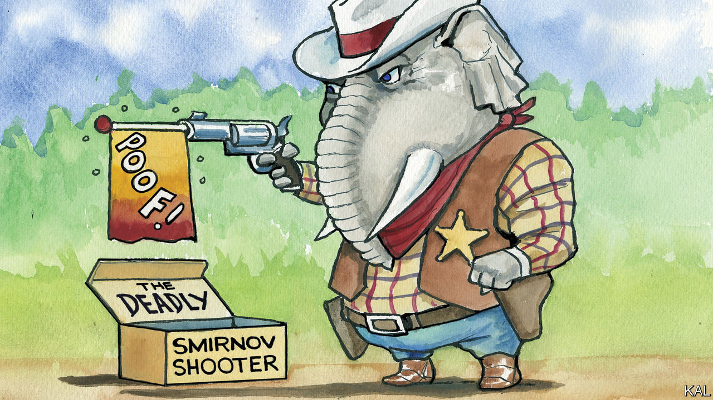

###### Lexington

# Vladimir Putin hardly needs to interfere in American democracy 

##### Domestic politicians are happy to spread dysfunction on their own 

 

> Feb 29th 2024 

President Vladimir Putin of Russia must get a kick out of spreading disinformation to Americans for its own sake. Otherwise it is hard to see why he would bother. As has episodically been the case for eight years, Washington is abuzz over allegations of Russian manipulation. The special counsel investigating President Joe Biden’s son, Hunter, has charged an FBI informant with telling lies about the president that have been central to Republican efforts to impeach him; the indictment links the informant to Russian intelligence.

You might expect such a dramatic development to derail the impeachment. That would betray a touching faith that the truth mattered in the first place. Republicans who once trumpeted the informant’s claims are shrugging them away and insisting that impeachment will move ahead based on other suspicions and suppositions, though the Republicans’ two-seat majority in the House of Representatives is all but certain to doom any vote, given the misgivings of some members. 

This is not to minimise Russian efforts to undermine democracy. Robert Mueller, the special counsel who investigated Russian interference in the 2016 election, found it “sweeping and systematic”. But politicians of both parties have shown that when it comes to spinning conspiracies and spreading dysfunction they can manage on their own. Republican members of the House are the best at this. The most shocking facts are not emerging from the shadows thanks to congressional investigations but are being paraded in the open thanks to congressional inanity, from the refusal of House Republicans even to vote on the Senate’s bipartisan agreement to tighten border security and help Ukraine and Israel, to their inability to agree among themselves on budget priorities with a government shutdown looming, tiresomely, yet again. 

The story of the informant, or misinformant, has the familiar, miasmic qualities of other scandals in the Trump era. No one is said to have peed on anyone, but the tale does involve vivid characters, duplicitous dealings in European capitals, affectionate texts with FBI agents, investigations of investigations, ties to Ukraine and, in the end, benefits to Russia. 

Before he was arrested in mid-February Alexander Smirnov, a dual citizen of America and Israel, had been slipping the FBI information for 13 years. The agency trusted him enough to authorise him to commit crimes as part of investigations, though it warned him not to lie, at least not to the FBI, according to the indictment. Mr Smirnov, now 43, was in contact with his handler almost daily; he called the agent “bro”. 

In 2013 Mr Smirnov was struggling with credit-card debt of $125,000, according to the , but prosecutors say he now has access to $6m, though he does not own a house or have a job, at least in America. He does have nine guns at home, prosecutors say. He has pleaded not guilty. 

Here comes the complicated bit. You recall Burisma, the Ukrainian gas firm of which Mr Biden’s son, Hunter, became a member of the board while his father was vice-president? In 2017 Mr Smirnov mentioned to his handler that Hunter Biden was on the board, as was known. Then, in 2020, as Mr Biden was running against Donald Trump for president, Mr Smirnov sent his handler texts “expressing bias” against Mr Biden, according to the indictment. When he promised information incriminating the Bidens, the handler replied, “that would be a game changer.”

Meanwhile, in early 2020, the attorney-general under Mr Trump had directed Scott Brady, a US attorney, to investigate the suspicions of Biden family corruption about which Mr Trump had previously demanded that Ukraine launch an investigation, triggering Mr Trump’s first impeachment. After Mr Brady tasked the FBI with searching its files for “Burisma”, the mention from 2017 popped up, and the handler contacted Mr Smirnov. This time Mr Smirnov said Burisma’s chief executive told him as far back as 2015 that the company paid bribes of $5m apiece to the Biden men. The FBI recorded the new accusations on a “Form 1023”. 

In 2023 Republican congressmen got wind of the form and demanded it, extracting it and publicising it after threatening the FBI director with contempt. Although the information was uncorroborated, Nancy Mace, a South Carolina congresswoman, declared at the first impeachment hearing in September that “we already know the president took bribes from Burisma.” Jim Jordan of Ohio called the FBI document “the most corroborating evidence we have”, while Elise Stefanik of New York saw “the biggest political corruption scandal” of “the past 100 years”.

An imperfect spy

Mr Smirnov’s claims did not withstand the slightest scrutiny, according to the indictment. He did not meet any Burisma executives before 2017, and meetings and calls that he described never took place, the indictment says. When agents met with him in September, according to the indictment, Mr Smirnov changed his story and told new lies. He said that when Hunter Biden stayed in Kyiv’s Premier Palace hotel his calls may have been recorded by Russian intelligence. Yet Mr Biden has never even been to Ukraine. Mr Smirnov, prosecutors warned, “is actively peddling new lies that could impact US elections after meeting with Russian intelligence officials in November”. They have successfully argued that he is a flight risk who should be detained pending trial. 

No Republican who hyped Mr Smirnov’s accusations has expressed regret, and the leader of the committee pursuing impeachment, James Comer, insists his inquiry, which has yet to produce evidence of a crime by the president, “is not reliant” on them. It would be reassuring to discover that, at bottom, Mr Putin is responsible for all this nonsense. What seems more probable is that he offered an assist to politicians already more than capable of wasting their chance to do some good while in office. ■


