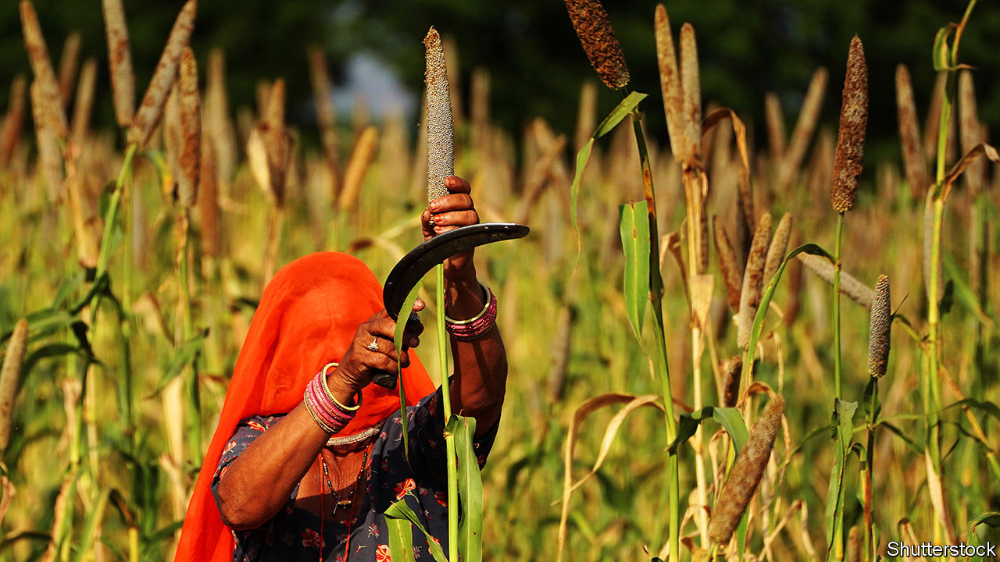

###### Too much butter, not enough chicken

# Indian food is great. Perhaps too great 

##### Long associated with hunger, India is now confronting an epidemic of obesity and lifestyle diseases 

 

> Mar 7th 2024 

IN 1999 Chittaranjan Yajnik, an Indian doctor and researcher, was photographed with his friend and collaborator, John Yudkin, a British professor of medicine. Then in early middle age, both men appear trim and healthy. Indeed, the two had the same “body-mass index”, a widely used if imperfect measure of obesity: 22.3, around the middle of the ideal range. But further testing revealed a stark difference. Body fat made up just 9.1% of Dr Yudkin’s mass. The result for Dr Yajnik was more than twice as high, at 21.2%. This came to be known as the Y-Y paradox and helped popularise the concept of the South Asian “thin-fat” body type. 

“Thin-fat” is a metaphor for India today. The country suffers from a dual burden of poverty-induced undernutrition and a growing overweight population. According to the latest figures, among 15-to-49-year-olds, 19% of women and 16% of men are underweight. At the same time, 24% of women and 23% of men are overweight. India is replacing one problem with another: in the decade and a half to 2021, the proportion of thin women halved even as that of fat ones doubled. Among men, both the fall and the rise were even more pronounced. According to a new study by the , a medical journal, 9.8% of Indian women and 5.4% of men are obese, up from 1.2% and 0.5% in 1990. 

India is not alone in this dilemma. But with a population of 1.4bn, the scale of the problem is greater than anywhere else. Several factors, some of which are unique to India, make it fiendish to solve. 

The first of these is genetics. As Dr Yajnik demonstrated, Indians are genetically predisposed to adiposity, which is a gentle way of saying that they have less lean body mass and more fat. Worse, this fat tends to gather around the middle, which puts pressure on vital organs. 

The second culprit is the Indian diet. Though cuisines vary dramatically across India, certain things are common, such as a focus on grain. The centrepiece of a meal in the West tends to be protein, with carbohydrates and vegetables on the side, notes Krish Ashok, whose book “Masala Lab” explained the science of Indian cooking. “In India it’s the other way round…rice or wheat is the star of the show.” Grain is a carbohydrate, packed with sugars to provide energy. Among the middle class, sedentary lifestyles mean that energy expenditure is low and carbohydrates turn into deposits of fat. Overconsumption of grain affects the poor too, for whom meat, fruit and fresh vegetables are luxuries. Around 10% of the poorest quintile are overweight, compared with around 39% of the richest. Government welfare programmes that provide free or subsidised food to hundreds of millions of Indians chiefly distribute wheat, rice and sugar.

The third factor is the role of religion and caste, combined with the politicisation of food. Despite India’s reputation as a predominantly vegetarian country, 70% of women and 83% of men eat fish, chicken or meat at least occasionally, according to government figures. Yet animal protein is rarely prioritised in nutritional advice and attempts to introduce it are sometimes met with hostility, says a nutritionist who has sat on various government committees. Several states refuse to serve eggs as part of a programme that provides free school lunches to poor pupils. 

Food chauvinism is a growing problem. A professor at one of India’s most prestigious universities says that his students are unwilling to accept that animal protein can have benefits: “Some say, ‘We are the best, we are vegetarian, all [the] others are dying of cancer.’” They take pride in what they think is a traditional Indian diet, much of which, such as potatoes, tomatoes and green chilies, only arrived from the Americas in recent centuries. Mr Ashok, who also runs a popular YouTube channel, says he encounters food nationalists daily. 

Adding to the specific Indian problems are more common ones. As India grows richer and urbanises, sales of packaged and processed foods are booming. Among the urban middle class, per-person purchases of calorie-dense foods such as sweet snacks, salty snacks and edible oils rose rapidly between 2013 and 2017, according to analysis of commercial data by Cherry Law at the University of Reading and colleagues. New consumption data released in February show that Indians are now spending less on cereals, pulses and vegetables and more on processed foods than they did in 2011-12. Eating out and takeaway are on the rise, too. 

Food-delivery platforms have broadened access to sugar- and salt-heavy foods. But they are exacerbating existing habits rather than creating new ones. “Sugar is an important component of our socio-cultural fabric…success and sugar are synonymous,” says Ganji Kamala V. Rao, the boss of the Food Safety and Standards Authority of India (FSSAI), a regulatory body. 

Ultra-processed nation

The result of all this is a growing health crisis. Cardiovascular disease alone is responsible for around 27% of deaths in India, more than all infectious diseases, according to the Global Burden of Disease, a big study. Another 3% of deaths are directly attributable to diabetes (and many more indirectly). As India gets fatter these problems grow bigger. Between 2009 and 2019 the proportion of deaths and disability caused by heart disease grew by 30%. Those caused by diabetes grew by a staggering 60%. A recent survey by the Indian Council of Medical Research estimated that 101m Indians live with diabetes. Another 136m are pre-diabetic. 

Politicians and policymakers have been slow to wake up to the changing nature of the problem. But they are at last starting to take action. FSSAI is working on a food-labelling scheme that will rate the healthiness of a product on a five-star scale. Narendra Modi has also thrown his weight behind improving Indians’ diets. The prime minister has for years been extolling the virtues of millets, grains that are cheap and more nutritious than rice or wheat. A dinner hosted by India’s president at the G20 summit in Delhi last year went big on millets and, at India’s urging, the UN declared 2023 the year of the millet. 

It is unclear whether consumption has really risen as a result, but anecdote suggests Mr Modi’s campaign has had some effect on the flours used in homes. Whatever effect his millet movement has had, however, is unlikely to reverse the rising tide of obesity in India. ■


