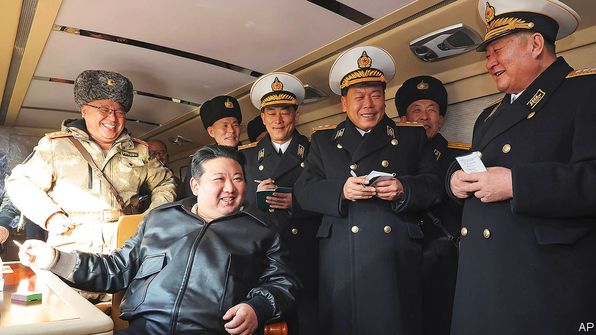
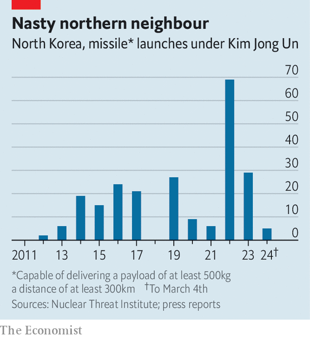

###### Armed and autocratic

# North Korea is arming Russia and threatening war with South Korea 

##### Kim Jong Un likes to provoke. The risks of miscalculation are rising 

 

> Mar 5th 2024 

If North Korea’s state news agency is to be believed, Vladimir Putin, Russia’s president, will soon visit the hermit kingdom for the first time in over 20 years. The two countries are becoming more friendly, which is helping Russia in its war on Ukraine and is emboldening the North Korean regime. It comes at a time when Kim Jong Un, the country’s hereditary dictator, is embarking on a new round of bellicosity towards South Korea. Some serious observers think that Mr Kim means to launch some kind of military provocation against the South soon. Politicians in Seoul, South Korea’s capital, promise a ferocious response. Given the North’s nuclear weapons, any kind of war talk raises jitters throughout the region. 

Mr Kim has sabre-rattled before. Shortly after he became the heir-apparent in 2010, North Korea sank a South Korean ship and then shelled an island controlled by the South off the west coast of the peninsula. He has also ramped up North Korea’s military arsenal. In the past decade more than 224 ballistic-missile tests have taken place, compared with 16 between 1997 and 2011. The country now possesses enough fissile material for 35 to 63 nuclear devices, according to the Institute for Science and International Security, an American think-tank, up from five to 13 in 2005. The North currently has almost 1,000 long-range artillery pieces trained on Seoul. 

 


Several trends make Mr Kim’s recent rhetoric worrying. For a start, in a speech on December 31st he renounced the policy, to which North Korea had paid at least lip service for decades, that reunification through co-operation with the South was the regime’s ultimate aim. Henceforth, inter-Korean relations were as “between two hostile states”. Since then Mr Kim has called for the South to be classified as the “permanent enemy”. He warned that a South Korean encroachment into the North’s territory, waters or air space “by even 0.001mm…will be considered a provocation of war”. 

In February Mr Kim described the maritime boundary as a “ghost line”, asserting that North Korea’s territorial waters extend beyond it. He may hope to assert this by force—deadly incidents have taken place there before. Analysts, such as Michishita Narushige of the National Graduate Institute for Policy Studies in Tokyo, think North Korea might do something risky, for example firing on South Korean ships or territory, this year. It could occur either before April 10th, when South Korea holds parliamentary elections, or in the run-up to America’s election. 

A megalomaniac with nukes

Mr Kim’s regime is backing up his verbal belligerence by continuing to test and improve its weapons. In November it launched its first military spy satellite, and has promised to put up three more this year. In December it again tested an intercontinental ballistic missile (ICBM) with solid fuel, which allows it to be launched more quickly than the sort with liquid fuel. Five cruise-missile tests followed in January and February. 

In January, too, the regime claimed to have tested a solid-fuel manoeuvrable “hypersonic” missile, which would be better at evading American or South Korean air defences. Satellite imagery suggests that North Korea has prepared its nuclear testing site for a seventh test. It will probably test a low-yield warhead that could be used on the battlefield.

The second trend is . Russia’s president has turned to North Korea for artillery shells and anything else the North can spare. Last month America said that North Korea had sent some 10,000 containers of “munitions or munitions-related materials” to Russia. North Korea is presumably getting cash, food and oil in return. More worryingly, it may be getting military aid, potentially ranging from spare parts to missile technology. 

Mr Kim can now brag that North Korea is part of an “. Once, both Russia and China signed up to UN sanctions on North Korea for pursuing nuclear programmes; today they help it evade them. Despite unease over Mr Kim’s nuclear capabilities, China demurs from criticising recent missile tests and speaks of North Korea’s “reasonable security concerns”. It continues to buy sanctioned coal from North Korea and has even provided it with old boats to smuggle it in. 

Another factor is the possible return of Donald Trump to the White House in January. In 2018 Mr Trump became the first sitting American president , leading to a pause in North Korean belligerence as the peninsula was swept up in a whirlwind of summitry. Those talks broke down in 2019, and Mr Kim returned to weapons-testing. Mr Trump appears to harbour no ill will. In January he boasted about how famously he got on with the dictator. Mr Kim may hope that a second Trump term will allow him to reopen negotiations.

But despite Mr Kim’s posturing—and the support of his new friends—by nearly every measure North Korea’s armed forces remain vastly inferior to those of South Korea and America. The number of North Korean servicemen and women, at over 1.1m, is huge. But many are employed as labourers rather than combat troops, and recently some have been sent to toil in impoverished parts of the country. 

South Korea has greatly superior air power, sea power and missile defences. North Korea has nukes, but America has many more, and over the past year has sought to reassure South Korea by making a bigger show of its nuclear forces in the region—last summer an American nuclear-armed submarine turned up in Seoul for the first time in 40 years. 

Mr Michishita argues that all the bluster and aggression is tactical cover for the regime’s deep-seated defensiveness, which stems from insecurity. That insecurity must be viewed in the context of strengthening security ties among South Korea, America and Japan. The day after the North tested a solid-fuel ICBM in December the three countries announced that “real-time” military intelligence-sharing had begun. America and South Korea regularly stage joint air, sea and land drills, with the latest ones starting on March 4th and stretching over 11 days. 

Feeling bound to respond in kind to allied exercises, Mr Michishita points out, could strain the North’s military resources. Meanwhile, shipping ammunition to Russia does not suggest an imminent intent to launch a full-blown attack. 

To discount the odds of an all-out war, however, is not to rule out the possibility of some limited military adventurism. With such a move, Mr Kim may hope to drive a wedge between South Korea and America. In January South Korea’s conservative president, Yoon Suk-yeol, said that his country would respond “with a punishment multiple times more severe”. 

The two Koreas recently tore up a military agreement intended to tamp down flashpoints, while the hotlines that link their armed forces have fallen silent since last April. With too few guardrails, things could escalate quickly, warns Andrew Yeo of the Brookings Institution, a think-tank in Washington. That would be bad not just for the region, but for the world. ■

