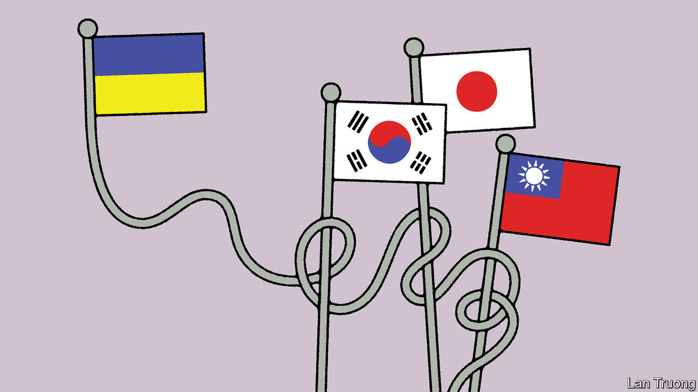

###### Banyan

# What the war in Ukraine means for Asia 

##### Peace in East Asia hangs to a worrying extent on the outcome of the conflict 

 

> Mar 7th 2024 

When Russia invaded Ukraine it jolted the democracies of East Asia—Taiwan, Japan and South Korea, all allies of America. A trip to Japan suggests to Banyan that, as the conflict in Ukraine enters its third year, its implications for East Asian policymakers grow only starker. In Europe the talk is of whether Ukraine can hold on despite dwindling American financial support and the spectre of a second Trump presidency. The consequences for peace in Asia would be devastating if Ukraine loses. A win for President Vladimir Putin might embolden China to reshape the regional order on its terms.

The implications are greatest for Taiwan. China wants to absorb it, by force if necessary. To Taiwanese the parallels between what Mr Putin is doing to Ukraine and what China’s Xi Jinping might do to Taiwan are stark—especially as the two men claim a friendship with “no limits”. China has been upping the military tempo with incursions into Taiwan’s air and sea space. In response, in August the Taiwanese government unveiled a record defence budget, equivalent to 2.6% of gdp—not enough to deter China, yet bigger proportionally than most of Europe. 

The incoming president, William Lai Ching-te, promises to increase spending further. Joseph Wu, the outgoing foreign minister, makes clear that American support for Ukraine is critical for Asia, signalling that America will also support Taiwan. This steely sense of realism is found elsewhere. After the Ukraine invasion, Kishida Fumio, Japan’s prime minister, jettisoned a policy of rapprochement towards Russia and embraced Western sanctions. Japan plans to almost double defence spending over five years. Despite being formally pacifist it is closer than ever to being committed to help America defend Taiwan. Military ties have been growing among America, South Korea and Japan. South Korea’s president Yoon Suk-yeol has been coy about shipping munitions to Ukraine, in part so as not to drive Russia and North Korea closer. But with North Korea now sending artillery shells to Russia, some in Seoul argue for a firmer pro-Ukraine stance.

One threat is that Congress fails to fund Ukraine, and that Europe fails to make up the difference. That could lead to a Ukrainian defeat, undermining the credibility of American deterrence in Asia. The other scenario involves Donald Trump, the Republican Party’s all-but-inevitable presidential candidate, who has repudiated America’s guarantees to nato. He admires Mr Putin, dislikes Ukraine and cares little for Taiwan. The Japanese portmanteau phrase —if Trump [returns, then what?]—is the key question. 

From Banyan’s discussions there are two possibilities. The most extreme scenario is that a future President Trump shreds America’s security guarantees to its Asian allies. In response they would beef up their own security further. Although defence spending is soaring there is little chance of them being able to counter China’s conventional military threat without America. Instead they might pursue nuclear weapons over the medium term in order to deter China. In South Korea Mr Yoon spoke openly about acquiring nuclear weapons, but stopped doing so partly after America adopted a policy of enhanced deterrence, in which its nukes are more ostentatiously on display in the region. 

Similarly, following abandonment by Trump 2.0, America’s democratic Asian allies could decide they have little choice but to pursue an accommodation with autocratic China, ending seven decades of the American-led security order in the region and creating a Chinese sphere of influence. It is the nightmare scenario. 

The second—and for now far more probable—possibility is that Asian politicians hug America even closer in the hope this raises the odds of a Trump administration sticking with its Asian security commitments. The master at this was Abe Shinzo, Japan’s prime minister from 2012 to 2020. He worked Mr Trump perfectly, from being the first foreign leader to meet him in 2016, when he was president-elect, to giving him a gold golf club. In Abe’s memoir he recalls emphasising to Mr Trump how important American military power in Asia was. Some on the Trumpian right in America argue Ukraine is a distraction from the real threat: China. America’s main Asian allies might seek to tap into this MAGA mindset and also raise defence spending further to defuse the charge they are free-riders. What is happening at one end of the vast Eurasian landmass is shaping calculations at the other.■


