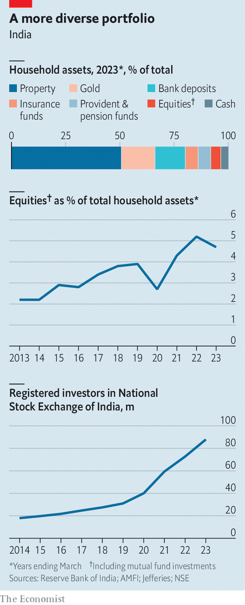

###### Stock and awe

# Why are so many Indians piling into stocks? 

##### The country is in the middle of an unprecedented retail-investment boom 

 

> Mar 7th 2024 

BY THE END of March 2020 the number of individuals registered to trade with India’s National Stock Exchange (NSE) totalled just 31m (of a population of 1.4bn). In the months that followed, even as a new virus upended global society, another bug was quietly spreading among the Indian middle classes: an infectious enthusiasm for investing. Within 12 months the number of investors had expanded by a third to 40m. Today there are more than 90m unique accounts registered with the exchange. An alternative measure, that tries to gauge nationwide stock trading accounts, has nearly tripled between 2019 and 2023, from 41m to 140m. The Nifty 50, NSE’s benchmark index, routinely hits all-time highs, most recently on March 7th. 

The deluge of retail investors in equities represents a sea-change in middle-class India’s culture of saving. Indians have long parked their money in low-risk, low-return assets, chiefly gold, which at nearly 16% accounted for the biggest share of household wealth in 2023 after property, at 51% (see chart). Bank deposits and insurance funds together made up another 20%. Equities (directly held or through funds) still represent a small share of the pie, but one that is growing rapidly: from 2.2% in 2013 to 4.7% a decade later. Americans, in comparison, have 40% of their household assets in equities. 

What explains this dramatic shift in behaviour? Four factors worked together to make it happen. The first is the  built by India over the past decade or so. Since 2016 there has been a  in internet access. This has been buttressed by government-backed tech, which reduces the time taken to open bank and trading accounts from days to minutes, along with a friction-free digital payments system that enables instant transfers. 

The second factor is the pandemic. In India, with no furlough schemes or stimulus cheques to shield professionals from lay-offs and wage cuts, households were forced to take a hard look at their finances and decide how to make their savings work harder. Equities were an obvious answer. 

 


Moreover, investment apps such as Groww and Zerodha made it a cinch to sign up and get started. Zerodha, for instance, had 1.3m customers before covid-19 hit. By the end of 2022 that number was nearly 10m. “The numbers were crazy,” says Karthik Rangappa, the company’s head of education. “I don’t think India has seen this kind of enthusiasm in equities [before].” 

Third, years of advertising by the mutual-fund industry had established the idea in the minds of Indians that equities were a way to grow wealth. Assets invested in mutual funds trebled between 2009 and 2020; they grew by another 33% in the next three years. It was a small step from investing in a mutual fund to experimenting with other products and individual stocks. Last, the market itself provided plenty of reason to dive in. A pandemic-induced downturn proved short-lived. Impressive GDP numbers and a sense domestically that India’s economic rise is unstoppable have added to the euphoria. In January India’s stock market became the fourth-largest globally, after its total market capitalisation exceeded that of the Hong Kong Stock Exchange. 

This worries some market observers. The Securities and Exchange Board of India, the market regulator, is said to have asked asset managers to caution investors about the dangers of piling into less-liquid small-cap firms. Analysts worry that many public companies are overvalued. They also fret that social-media “finfluencers” are creating unrealistic expectations. The number of new entrants in the market every month is at its highest level ever, exceeding the peaks in the pandemic. Between November and January 58m new investors registered with the NSE, compared with 33m in the same period the previous year. 

For industry insiders the chief risk is not just a correction. It is that many first-timers with no experience of taking losses may be so scarred by the experience that they never return to the equity markets. That would be a much bigger loss. ■


