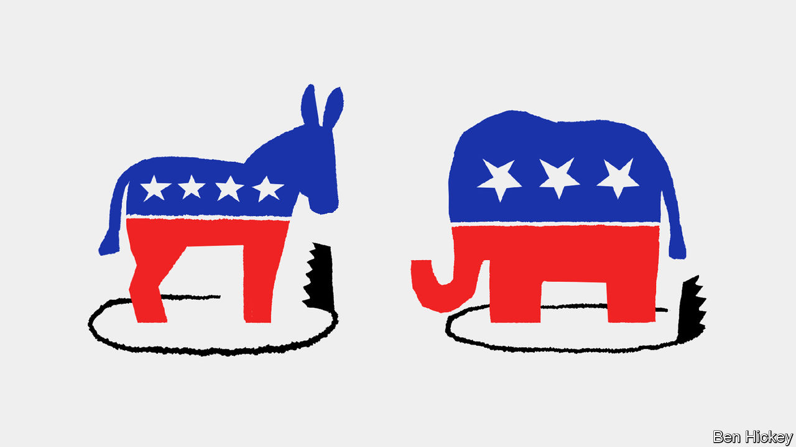
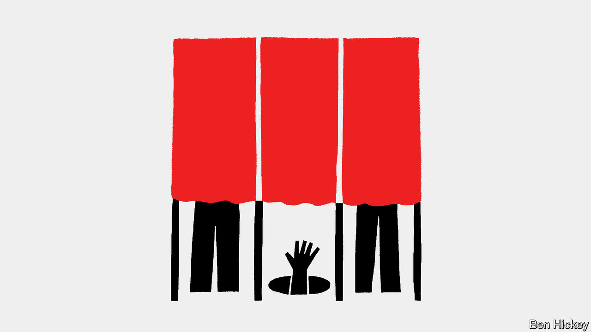

###### Spoilers

# Third-party candidates could tip America’s presidential election 

##### But they have to get on the ballot first 

 

> Mar 7th 2024 

WHEN the Democratic candidate, Al Gore, narrowly lost the presidential election of 2000, , a senator at the time, directed his fury at one of the also-rans, Ralph Nader. The left-leaning Mr Nader won 97,488 votes in Florida, far more than Mr Gore’s losing margin of 537. “Nader cost us the election,” Mr Biden concluded.

Nearly a quarter of a century later, Mr Biden is the Democratic candidate in a race that is also likely to be close. With Nikki Haley, ’s final adversary in the Republican primaries, suspending her campaign this week, he has in effect . That sets up a rematch between Mr Biden and Mr Trump. But several other candidates have also vowed to run and are trying to get themselves on the ballot. Given the closeness of the polls, it is quite possible that these third parties could tip the election either way. 


Mr Nader, for one, appears worried. He has always rejected the idea that he was responsible for Mr Gore’s loss and remains a critic of America’s two-party system. He says he would never tell a third-party candidate not to run, but also seems resigned to the fact that one cannot win in 2024. He certainly cannot bring himself to endorse Mr Biden, whom he calls “Genocide Joe” over his support for Israel. Nonetheless, he says, “The singular goal is to stop the Trumpsters and the fascism that they bring with them.” For a repeated and unrepentant third-party candidate, that almost sounds like reluctance to cast a vote that might help return Mr Trump to the White House.

Land of, say, three

Americans often say they are unhappy with their limited political options and would like a wider choice. This year two-thirds of them are “tired of seeing the same candidates in presidential elections and want someone new”, according to a poll conducted in January by Ipsos. The same survey showed only a quarter of Americans “satisfied” with the two-party system. 

Yet third-party candidates never win American presidential elections. The Republicans and Democrats have had a lock on the office since the civil war. No third-party candidate has so much as won a state since George Wallace carried five southern ones with a segregationist platform at the height of the civil-rights movement in 1968. Only two third-party candidates have taken more than 5% of the national vote in the past 50 years: John Anderson, a Republican congressman, who won 6.6% in 1980, and Ross Perot, a Texan businessman, who won 19% in 1992 and 8.4% in 1996.

It is not that voters are lying to pollsters about their openness to alternatives. The problem is America’s first-past-the-post electoral system, which makes life much more difficult for smaller parties than a proportional system would. Rational voters must consider not only how much they like a candidate’s policies, but also how likely he or she is to win. Although some voters may cast protest votes for third-party candidates, the vast majority opt for someone who has a real chance to govern. In presidential elections, that is always the Democrat or the Republican.

But even if third parties can’t win the presidency, they can still influence the outcome of an election. Their ability to do so depends on two variables in addition to how many votes they receive: whether they draw support disproportionately from one side and how close the race between the two main parties is.

Even when third parties do well, they do not necessarily determine the result. For instance, although Mr Perot won a far higher share of the vote in 1992 than Mr Nader did in 2000 (19% v 3%), it is not clear that he swung the election. He ran as a centrist, and seems to have taken votes in roughly equal measure from both the Republican candidate, George Bush senior, and the Democrat, Bill Clinton. By the same token, in 2016, even though votes for two third-party candidates easily exceeded the winning margins in the handful of swing states that decided the election, the interlopers do not seem to have determined the outcome. That is because most of their supporters would probably not have bothered to vote at all if they had not been on the ballot and because the pair largely cancelled one another out, with one on the left and one on the right. 

Mr Nader, in contrast, ran squarely to the left of Mr Gore. Although he doubtless attracted some voters who would not have cast a ballot if he had not been running, most of them would have been natural Gore supporters. What is more, the election was extraordinarily close. Only 0.55% of his backers in Florida would have had to have voted for Mr Gore to change the outcome. Had Mr Nader not been on the ballot, Mr Gore would almost certainly have become president.

Through the populous fight

A similar upset is possible this year, for several reasons. First, polling suggests the election is likely to be close. ’s  has Mr Trump ahead of Mr Biden by less than two percentage points, well within the margin of error. Second, there are plenty of third-party candidates in the race. The Green and Libertarian parties are both planning to field a candidate. So might No Labels, a well-funded group trying to counter partisanship in American politics. Cornel West, a left-wing academic, is running, too. And another independent candidate, Robert Kennedy junior, is polling especially highly, at as much as 18% in some recent soundings. 

It is hard to know whether Mr Biden or Mr Trump should be more nervous. On the one hand, other factors being equal, the greater uncertainty generated by the presence of third parties in the race should help Mr Biden, as the narrow but consistent underdog. On the other hand, only 23% of Democratic primary voters are enthusiastic about Mr Biden’s candidacy whereas 48% of their Republican counterparts are excited about Mr Trump, according to a recent /Siena College survey. The Democrats’ half-heartedness might mean that Mr Biden’s supporters are more likely to defect to a third party.

What is more, several of the third-party candidates are clearly left-leaning. Jill Stein, the Green candidate in 2012 and 2016 (when she was accused of depriving the Democratic candidate, Hillary Clinton, of victory), is running again. Jason Call, her campaign manager, insists that her goal is to become president, but acknowledges that even winning 5% nationally would “be a big thing for us in terms of gaining more major party status and getting some federal funds to come along with it for the 2028 election”. She is polling around 2%. So is Mr West, a public intellectual and first-time candidate, who has been attacking Mr Biden as too militarist, too soft on Israel and too close to corporate America, among other failings. 

Both Mr West’s and Ms Stein’s campaigns insist that if Mr Trump wins the election, the fault will not lie with their candidate, but with Mr Biden. Anthony Karefa Rogers-Wright of the West campaign fulminates, “You are managing to contemporaneously piss off your entire base in one election cycle. To go and then blame any electoral damage that comes from that on third parties is disingenuous and irresponsible.” In other words, third parties do not hurt mainstream candidates; bad mainstream candidates create an opening for third parties. What is more, both candidates hope to entice lots of new voters to cast ballots. Roughly a third of those eligible did not turn out last time, after all.

Nonetheless, it is hard to escape the conclusion that, to the extent Mr West’s or Ms Stein’s participation in the race hurts either main candidate, Mr Biden is more likely to suffer. The same cannot be said with certainty of Mr Kennedy, whose appeal seems to be much broader. As the son of Robert Kennedy, a former attorney-general and senator who was assassinated in 1968 while vying for the Democratic nomination for president, he is Democratic royalty. He ran initially in the Democratic primary himself, but pulled out in October, complaining that the competition was stacked in Mr Biden’s favour.

Mr Kennedy’s quixotic views seem more Trump-y than Bidenesque, however. He decries forever wars, vaccine mandates and unaffordable housing. BlackRock, the world’s largest asset manager, and Volodymyr Zelensky, Ukraine’s president, are recurring bogeymen in his stump speech. He speaks highly of Joe Rogan, a right-ish podcast host, and can sound like Mr Trump when decrying the media. Although he is an environmental activist, he has attracted attention in recent years mostly for propagating conspiracy theories about vaccines. 

In January ’s regular poll with YouGov found that neither Republicans nor Democrats see Mr Kennedy as one of their own. Only 14% of Democrats consider him a liberal while 34% describe him as a conservative. Yet only 10% of Republicans call him a conservative, while about a third think of him as a liberal.

For the moment, however, Mr Kennedy is more popular with Republicans: 61% view him favourably, compared with just a third of Democrats. Last year he even received an invitation to speak at the Conservative Political Action Conference, a big fixture in the Republican calendar. But that may simply be because he had been making Mr Biden’s life difficult by mounting a primary challenge. Some surrogates for Mr Trump have taken to attacking him since he withdrew from the primary.

Even harder to gauge than the effect of Mr Kennedy is that of No Labels, which is due to decide on March 8th whether to field a presidential candidate. For months it has been promising “to ensure Americans have the choice to vote for a presidential ticket that features strong, effective and honest leaders”. In practice, that means conjuring up a bipartisan ticket to challenge the main parties’ duopoly. The group has published a “commonsense agenda” with 30 ideas meant to appeal to the political centre.


But No Labels seems to be having a hard time finding a standard-bearer. Larry Hogan, a former Republican governor of heavily Democratic Maryland, was a contender but chose to run for the Senate instead. Joe Manchin, who is about to retire as a Democratic senator from heavily Republican West Virginia, has decided against joining the ticket. So has Mrs Haley. Chris Christie, a former Republican governor of New Jersey, has expressed interest, but may have difficulties in some states owing to “sore loser” laws, which bar candidates from running for president after losing a primary. The group seems to have plenty of money (since it is not a political party, it does not have to disclose donations), so could conceivably have an impact. But without a candidate, it is impossible to judge what the impact will be.

One way to test which of the main candidates is harmed by all the also-rans is by comparing surveys that only feature Mr Trump and Mr Biden with those that also include third-party candidates. In our head-to-head average Mr Biden trails Mr Trump by 1.9 percentage points. When named third-party candidates are included in the polling this gap grows to 4.6% points (see chart 1). Should this effect persist, Mr Biden will struggle to win the election.

This far out from the voting, however, polls are typically poor predictors of the final result—and that is especially true for third-party candidates. Scarlett Maguire of JL Partners, a polling and research firm, expects Mr Kennedy’s support, in particular, to wilt. The intractable arithmetic of the two-party system presumably becomes harder for voters to ignore as the election looms. At any rate, support for third-party candidates tends to dwindle in the polls or to end up lower than the polls predicted or both (see chart 2). In 2016, for instance, 11% of Americans told pollsters that they would vote for third parties. When push came to shove, however, only 6% did. 

So proudly we railed

This year this effect may be especially strong. The widespread dissatisfaction with the choice of Mr Biden or Mr Trump may cause voters to consider other candidates, such as Mr Kennedy. Yet when they actually cast their ballots, the sense that the race has especially high stakes may induce them to stick with one of the main candidates after all. In the five/ YouGov polls conducted since the end of January, the average support for a generic third-party candidate was only 5.7%. And unlike 2016, support for such a candidacy is uniformly low across age, race, education and sex. Voters may dislike both Mr Trump and Mr Biden, but most appear to dislike one a lot more than the other—and are willing to vote for whomever they consider the lesser of two evils. 


America’s electoral system not only saps support from third-party candidates; it also makes it hard for them to get on the ballot. States have a bewildering assortment of deadlines for the necessary paperwork and require different and sometimes dizzying numbers of signatures of local voters to qualify. So far, Mr Kennedy, for instance, has made it onto the ballot only in Utah, Nevada, New Hampshire and Hawaii, according to his campaign.

Derek Muller of the University of Notre Dame reckons that “it’s not difficult” to get on the ballot in 30 states. The next ten are harder, and the final ten are truly daunting. “Ross Perot was able to do it pretty flawlessly in ’92,” he says, but some states have increased the number of signatures needed and moved up deadlines in recent years as the bigger parties try to exclude potential spoilers. The requirements in California, Florida, New York and Texas—which together account for some 28% of the votes in the Electoral College that ultimately decides the election—are among the most onerous.

Winning the backing of an established political party makes gaining access to the ballot easier. Ms Stein, as the Green candidate, was on the ballot in 44 states and the District of Columbia in 2016. Gary Johnson, the nominee of the Libertarian party that year, appeared on the ballot in all 50 states, as well as in DC. Doubtless for that reason, Mr Kennedy is flirting with the Libertarians, despite his interventionist views about economics, among other awkward policy stances. “I feel very comfortable with most of the values of the Libertarian party,” he recently told CNN. The party holds its nominating convention in May. No Labels, for its part, has already secured a line on the ballot in 16 states.

 


Perhaps the best indication that third-party candidates may indeed sway the race are the frantic efforts Democrats, in particular, are making to keep them out of it. In February the Democratic National Committee filed a complaint with the Federal Election Commission accusing Mr Kennedy’s campaign and a well-funded group that supports him of breaking the law by co-ordinating efforts to get him on the ballot. In January it hired a communications adviser to campaign against third parties. Some Democratic groups are trying to dig up embarrassing information on third-party candidates, while at least one is urging candidates to drop out of the race in swing states if they do not reach certain polling milestones.

Third Way, a centre-left think-tank, is leading a charge against No Labels. “No Labels’ fantasy electoral map defies every rule of political physics in order to claim they can win 286 electoral votes,” says a recent memo from the group. “They are putting our democracy at risk if they go forward with this doomed plan that will re-elect Trump.” No Labels, for its part, has filed a complaint with the Justice Department over alleged intimidation from groups like Third Way which, it claims, are trying to keep No Labels off the ballot.

So far Republicans have been less vocal about the threat of third parties, presumably because they see the current lot as helping Mr Trump. But if Mr Kennedy shows signs of peeling away his supporters, Mr Trump will doubtless let rip. Much will depend on whether No Labels decides to put up a candidate and whether it recruits a strong one, on whether Mr Kennedy manages to secure the Libertarian nomination in May and so on. 

Above all, however, what will determine how important third parties are to the race is how close the competition between the two main candidates gets. If the margins widen in swing states such as Arizona, Georgia, Michigan and Pennsylvania, third parties will have been little more than a distraction (or, from the view of the campaigns, a source of unnecessary anxiety). But minor candidates could easily tip the balance in a close election.

This is not lost on many third-party voters, who are aware of the risks of their decisions. Chris Nelson, 29, attended a recent rally for Mr Kennedy in Charleston, West Virginia. Mr Nelson, a public defender, says he has already decided to support Mr Kennedy despite voting for Mr Trump in the past. Although a Trump victory is nearly guaranteed in West Virginia, he acknowledges that, should Mr Kennedy’s campaign attract enough support, it could help usher Mr Biden into office. That, he says, is just part of the democratic process: “That’s kind of what makes this country great, you know. That’s the risk you take when you go to the ballot box.” ■

