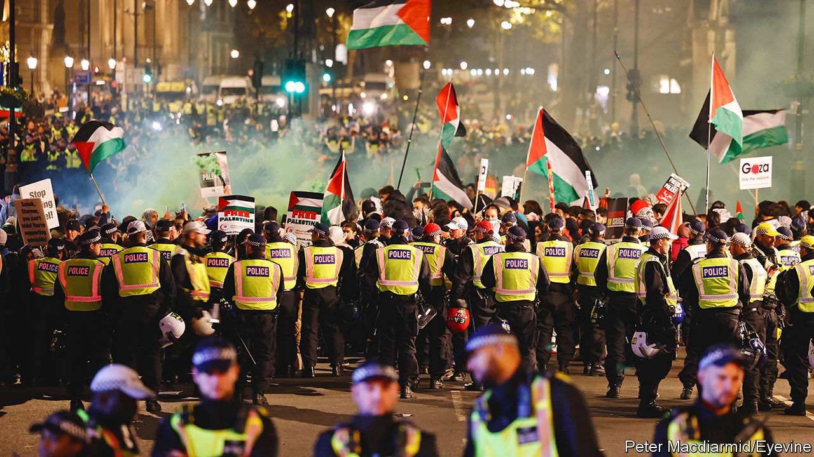

###### Policing

# Rishi Sunak’s crackdown on protests is misguided 

##### The British government calls it mob rule. Others know it as free speech 

 

> Mar 5th 2024 

“Out of the road, please,” said a Metropolitan Police officer to a protester in Camden, a neighbourhood in north London. The protester, an older man with a long grey beard, had not been trying to stop the traffic. He had simply been distracted by crossing the road in misty rain while carrying a large banner that read “Do I look like an extremist?” and talking intently to the officer, who was being painstakingly courteous back. “Here we are chatting and you’re going to get run over,” he said, as he guided the man to the pavement. 

Pro-Palestinian protesters have marched through London most Saturdays since October, when Israel began bombarding Gaza in retaliation for a murderous attack by Hamas. The protests have varied in size, from the hundreds to the hundreds of thousands. On March 2nd a crowd had assembled outside Mornington Crescent Tube station to march to a nearby branch of Barclays bank, which the Palestine Solidarity Campaign (psc), an activist group, claims has financial ties with suppliers of weapons to Israel. A psc representative checked that police, waiting in a van, knew the planned route. (He had submitted his plan to the Met online, he said, but wasn’t sure they had received it.) 

Minutes later the marchers took off, a band of young and old of myriad ethnicities. One man wore a sandwich board that read: “This son of a Holocaust survivor says: Stop the genocide in Gaza.” When the marchers reached the Barclays branch and the police ordered them to cross the road, citing Section 14 of the Public Order Act, they did so without much complaint.

Rishi Sunak seems not to approve of this sort of behaviour. Long before the pro-Palestinian marches began the government had introduced  designed to deter protesters. On March 1st the prime minister said that “on too many occasions recently, our streets have been hijacked by small groups who are hostile to our values and have no respect for our democratic traditions”. Days earlier he had characterised this as “mob rule”. The home secretary, James Cleverly, meanwhile said that the protesters had “made their point” and should stop, because they were putting too much pressure on the police. 

Large, frequent protests do cost a lot in police time and money. But that is no reason to try to stop them. The right to protest is a pillar of British democracy. The police, especially in London, are skilled at dealing with protests. Arrests do take place but the Met consistently describes the vast majority of demonstrators as peaceful; the biggest single wave of arrests at the pro-Palestinian marches was of far-right counter-protesters in November. 

Yet two other worries associated with the marches bear closer examination. The first is that protesters (not just against Israel’s bombardment of Gaza but also against the oil industry) have targeted politicians’ homes. That crosses a line, but it can be dealt with using existing laws.

New guidance published by the Home Office on February 28th made this clear. It said that protests at the homes of politicians should be considered “intimidatory”, meaning police should use existing laws to stop them. Further recommendations, like making sure that police understand existing laws, were also sensible. But the guidance also asked “every Police and Crime Commissioner and Chief Constable to report back on how they have implemented these measures by April”. This strikes an authoritarian tone: the police are supposed to be independent. 

The second worry is the prevalence, at pro-Palestinian marches, of chants that are antisemitic. “From the river to the sea” is the most common of these. It refers to the destruction of Israel. Although some who chant it say they do not understand it this way, many Jews do. At a time of rising antisemitism this is a problem. In February Community Security Trust, a charity, said 2023 had seen the highest-ever number of reported anti-Jewish hate incidents, chiefly because of a sharp rise following Hamas’s attack (but before Israel’s response). 

Anti-Muslim feeling is on the rise, too. It is likely to have been fanned by politicians like Lee Anderson, who was suspended from the Tory party last month for saying that Sadiq Khan, the mayor of London, was under the control of Islamists.

The government is mulling a broader definition of extremism that would block some groups from getting official funding. And in 2021 a report co-written by Sir Mark Rowley, now the commissioner of the Met, said that the government should “develop a legal framework to counter hateful extremist activity”. The report focused on the power of social media to amplify hate but said little about protests. 

Sunder Katwala of British Future, a think-tank, says that laws are not the only way societies deal with hateful views. Legal yet despicable speech, like Holocaust denial, is best stigmatised by society. (Mr Katwala believes that “from the river to the sea” falls into this category.) Politicians should take the lead in such efforts. But that is hard when they are also trying to undermine free speech. ■


