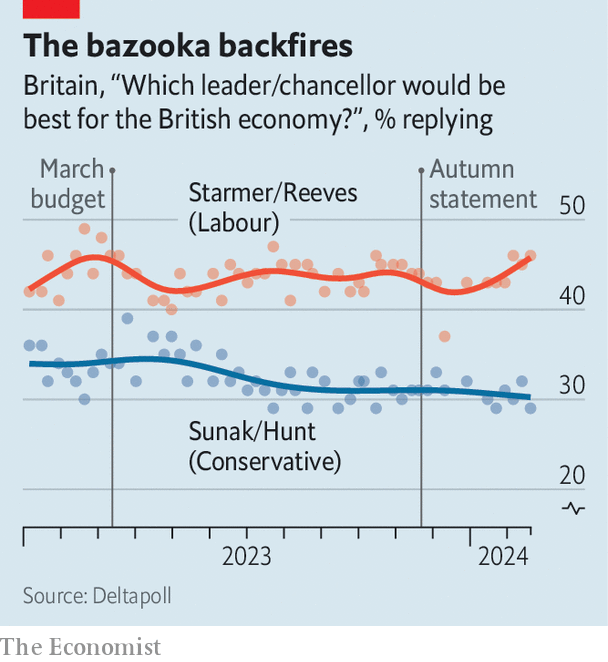

###### Briefcase encounter

# The British budget mixes sensible tinkering and fiscal fantasy 

##### Both the Tories and Labour are making promises they cannot keep 

 

> Mar 6th 2024 

An election-year budget is meant to provide the incumbent party with a springboard to the campaign. Jeremy Hunt, Britain’s chancellor of the exchequer, who  on March 6th, needed a circus trampoline.

The governing Conservatives  by 20 points in the polls. Voters reckon Labour is the better party at managing the economy (see chart). According to Ipsos,  has a personal approval rating of -54, the worst recorded for a prime minister (including the benighted Liz Truss) since Sir John Major in 1994. Mr Hunt trails Rachel Reeves, the shadow chancellor, by 15 points.

 


That left Mr Hunt facing a difficult choice. Would he scrape together a package of tax giveaways, based on dubious fiscal assumptions, to give the party a fighting chance at the next election? Or, with the prospects of re-election diminishing, would he make legacy-burnishing reforms that removed some of the distortions in Britain’s tax and welfare regimes? In the end, he tried to do both. But some sensible tinkering cannot mask  that underpin the government’s plans. 

One fiction concerns spending plans. Mr Hunt emphasised his promise to maintain 1% real-terms growth in day-to-day spending on public services from 2025 onward. But because budgets in some departments, like health, education and defence, are protected, the Office for Budget Responsibility (OBR), the fiscal watchdog, reckons this commitment translates into cuts of 2.3% elsewhere in government. Only through an implausible bout of austerity to pared-back public services does Mr Hunt meet his rule that public debt start falling relative to GDP within five years.


The fiscal rules are not pure fantasy. The “headroom” available to Mr Hunt prior to this week’s budget had fallen marginally, from £13bn ($17bn) in November to £12.2bn. As a result the budget’s big giveaway—a cut to national insurance, a payroll tax, worth £11bn—had to be part-funded by a list of smaller revenue-raising measures rather than only by more borrowing. 

But his remaining headroom, of just £8.9bn, is a make-believe kind of cushion: chancellors since 2010 have averaged £26bn. The revenue-raisers mostly take effect well after the spending they are meant to offset. In 2024-25, for instance, the budget’s tax-cutting measures will cost £14bn but the tax-raising measures will raise only £0.4bn. And the OBR is obliged to take at face value the chancellor’s claim that freezes on fuel duties are temporary when they have not budged for more than a decade.

Within this tapestry of fiscal fiction, Mr Hunt did weave in a . National insurance is a better target for cuts than income tax. It applies only to income from work, not from sources like savings or pensions. That may marginally improve the labour supply. 

 


His plan to phase out child benefits more gradually and at a higher income level smooths an unfair kink in the system that charged some parents marginal tax rates of over 60%. The longer-term aspiration to equalise tax treatment for families regardless of how earnings are divided between parents is also a good one. For businesses, plans to extend permanent full expensing to leased equipment should improve incentives to invest. Changing the , a tax shelter for rich foreigners, is also sensible. The new plans, for clearer residency-based rules, bring Britain more in line with global norms. 

A productivity plan for the National Health Service (NHS) is welcome in theory. The NHS definitely needs staff who are more productive, not just more staff. Less clear is whether budgets for capital spending and “digital transformation” will be ring-fenced: both have been raided in the past to cope with strikes and winter crises. 

Creating a “British ISA” that permits an additional tax-free £5,000 in investments in British-listed equities (on top of the £20,000 allowance already available to savers) is unlikely to quickly improve the poor recent performance of domestic shares. Despite Mr Hunt’s claim that Britain is “on track to become the world’s next Silicon Valley”, the more significant millstone around the public markets is that companies listed in Britain are over-represented in mature, low-growth industries like energy and financial services. A de facto increase in the ISA threshold, which had not risen in line with recent inflation, is a good thing, even if the requirement to buy British smacks of protectionism.

Other changes are more foolish. The chancellor increased the revenue threshold for firms to pay VAT from £85,000 to £90,000. It would have been better to lower it: Britain’s VAT threshold is unusually high and incentivises businesses to avoid expansion (or to misreport sales) rather than be forced to grapple with the tax.

The budget is not likely to change the government’s electoral prospects greatly. Its overall record on income taxes is decidedly ambiguous: according to the Resolution Foundation, a think-tank, the net impact is to slightly lower taxes for those earning between £26,000 and £60,000 a year and, because of freezes to income-tax thresholds, to slightly increase them for everyone else. Chatter has already begun about yet another fiscal event in June if forecasts move in the government’s favour. As inflation falls, gilt yields and thus government borrowing costs could drop; there is still time for a pre-election bonanza.

But even if Mr Hunt has not changed Tory fortunes, he has made life more difficult for Labour. Ms Reeves has so far adopted a strategy of sticking to the government’s tax-and-spending plans while endorsing a small number of tax raids on popular targets. Reforming non-dom treatment was one such tax rise: Labour had set aside the proceeds for increasing the number of family-doctor and dental appointments, among other things. If it does not reverse the national-insurance cut and does not want to see taxes increase on “working people”, its promises to improve straining public services become more fantastical.

That may not matter for the campaign, which the Labour Party would like to be a referendum on what it terms “14 years of economic failure”. But it will matter if the opposition makes it into office. Some of Mr Hunt’s assumptions may be fiscal fictions; the same increasingly goes for Labour. ■


