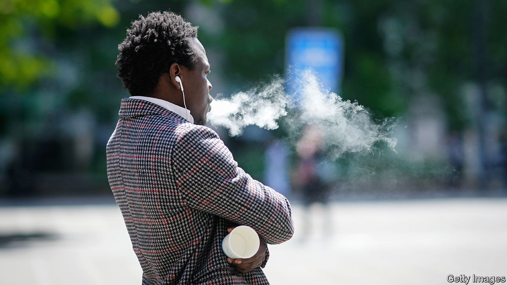
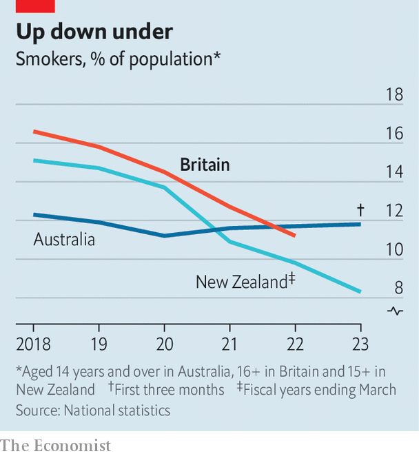

###### Tough on puffs

# The holes in British plans to ban cigarettes and disposable vapes 

##### One policy is contentious, the other stupid 

 

> Mar 7th 2024 

Rishi Sunak, the prime minister, may be wildly unpopular but some of his policies still command support. Mr Sunak plans, for example, to ban young people from puffing on things. One proposal, to prohibit anyone born after 2008 from ever buying cigarettes, is backed by 71% of voters. Another, to ban disposable vapes, is supported by 83%. 

These two ideas could form part of Mr Sunak’s legacy, particularly since the devolved governments and the Labour Party support them. But the experiences of two countries on the other side of the world suggest caution. On February 27th New Zealand’s new centre-right government repealed a pioneering anti-smoking law—the inspiration for the British plan—before it could be enacted. In Australia an attempt to ban disposable vapes has been a failure.

The proposal on smoking is the more sensible. Though rates have long been falling, the habit still kills around 76,000 Britons a year. Most start as teenagers and get hopelessly addicted. “Young people have the right to be protected from a product that kills two-thirds of its long-term users,” says Janet Hoek, a professor of public health at the University of Otago in New Zealand. Its cloud does not spread over society equally: in New Zealand smokers are disproportionately Maori; in Britain they are more likely to be poor. 

Starting in 2027, the British government proposes to raise the smoking age (currently 18) by one year every year. The law would not criminalise an individual for possessing or consuming cigarettes, nor impinge on the rights of current smokers. The result, the government’s modelling suggests, is that by 2040 hardly any 14- to 30-year-olds would light up. 

In practice, however, there are concerns about how the ban might work. A ban on proxy purchases, whereby an older person buys cigarettes for a younger person, would be almost impossible to enforce. There would be nothing to stop travellers stocking up on duty-free cigarettes in Europe. In Malaysia a similar bill was recently withdrawn on the ground that a rising age of sale would be unequal—and therefore unconstitutional. 

In New Zealand the anti-smoking law contained measures to reduce the number of shops permitted to sell cigarettes and to lower the amount of nicotine the latter could contain (thereby making cigarettes less appealing). But the government has just repealed the legislation, citing concerns that it might fuel a rise in illicit trade. 

That worry is greater in Britain, which is not planning to take the same comprehensive approach as New Zealand and where smoking rates are higher. Rising taxes and stricter regulation on tobacco (including raising the age of sale from 16 to 18) have not previously led to a rise in illicit sales in Britain, but there has never been a ban of this kind. The black market already seems to be growing because of the cost-of-living crisis. In the north-east of England 14% of tobacco bought in 2023 was illicit, compared with 11% in 2022, according to Ailsa Rutter of Fresh, a regional tobacco-control programme. 

In a pop-up mini-mart in Darlington, your correspondent watched a young man in a puffer jacket pocket two packs of counterfeit cigarettes for a third of the price of the real thing (the items were surreptitiously delivered to him via a backdoor). With a rising age of sale, “people will use these shops even more,” says Major Singh, whose own legitimate store has seen its cigarette sales slump. Young smokers are the ones most likely to buy illicit tobacco.

The smoking ban is debatable: Ms Rutter and plenty of public-health experts are in favour. The proposed ban on disposable vapes is more straightforwardly stupid. The government initially pledged to reduce youth vaping by restricting vape flavours marketed to children, such as bubble gum, and by regulating how they could be displayed and packaged. In January, however, it succumbed to a moral panic about children vaping, even though they are already prohibited from doing so. The government is currently pursuing a ban on the sale and supply of disposable vapes through secondary legislation; refillable products will continue to be legal.

 


There are good reasons to worry about disposable vapes. Some 5m are littered or thrown away every week and schoolchildren are more likely to buy them (one in five have vaped). But Australia, which made all vapes prescription-only in 2021, offers a warning about the risks of a retail ban. The policy has seen a low uptake of prescription vapes and coincided with a rise in smoking rates (see chart). Vaping rates have also gone up, which suggests that the illicit market is growing; in the fight for that market, gangs down under have firebombed tobacco shops and murdered rivals.

Similar outcomes are easy to imagine in Britain. More than half of smokers in England incorrectly believe that vaping is more harmful or as harmful as smoking: some may well return to the cancer sticks. Britain is already the second-biggest market for illegal vapes after America. Without banning importation, as Australia initially failed to do, disposable vapes will remain cheap and easy for young people to get hold of, says Deborah Arnott, the boss of ASH, an anti-smoking group. ASH would prefer them to have a minimum price. 

The government remains outwardly committed to both policies, but there are hints that its enthusiasm is cooling. Legal things can be taxed. In his spring budget on March 6th, Jeremy Hunt, the chancellor of the exchequer, announced a duty on vapes (as ASH had also been calling for). He also further increased tobacco duty. A first reading of the smoking bill in Parliament has been delayed several times. 

If both bans do go ahead, the government has pledged an extra £30m a year to enforce them. It is unlikely to be enough. “We’ve been under severe financial pressure for ten, 15 years,” says Ian Harrison, a trading-standards manager in Durham. Around him are some of his team’s recent seizures in clear plastic bags: several packs of counterfeit cigarettes and thousands of colourful vape pens. Will the proposals help? On this, Mr Harrison is diplomatic: “It’s for the policymakers to decide.” ■


