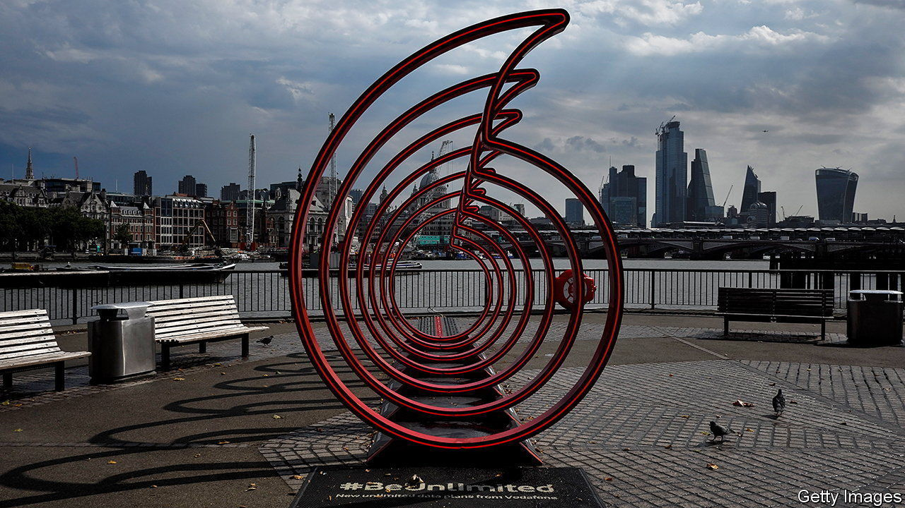

###### Newbury’s finest

# Vodafone tries to slim its way back to health 

##### At the start of the century, the British telco was worth more than Apple. What happened? 

 

> Mar 7th 2024 

At the turn of the millennium Vodafone, a British telecoms company, had become one of the most valuable firms in the FTSE 100 index. On December 29th 1999 it had a market capitalisation of $152bn; Apple’s was $16bn. Today  is worth $2.6trn and Vodafone just $24bn, back at levels last seen in 1998 when the mobile ringtone was introduced (see chart).

Under its newish CEO, Margherita Della Valle, the beleaguered group is accelerating efforts to shed unwanted international assets. On February 28th Vodafone confirmed that it was in talks to sell its Italian arm to Swisscom; last year it agreed the sale of its business in Spain. Over the years the company has left America and China, cut ties with France and quit Japan and New Zealand; it may abandon Australia, too. Piece by piece Vodafone is dismantling its once-sprawling empire, leaving Germany and Britain as its main markets.

 


Online services like WhatsApp have eaten into telcos’ revenues everywhere. Fierce competition, squeezed margins and costly infrastructure roll-outs have left the European industry in particular struggling to make money. Average revenue per user (ARPU), a key industry metric, was €15 ($16) in Europe in 2022, compared with nearly treble that amount in America. Investment in 5G networks trails that in other regions as a result. Around 80% of Europe’s population enjoyed superfast network speeds at the end of 2023, compared with near-universal coverage in America, Japan and South Korea. 

But Vodafone’s woes are also largely self-inflicted. Many analysts criticise its history of acquisitions. The company has been poor at cashing in on demand for mobile and internet services. By 2014 calls made by Vodafone’s customers had ballooned to 1.2trn minutes each year, the equivalent of every person on the planet speaking for two-and-a-half hours. Data traffic has exploded, and continues to rise. Vodafone seems to have fallen short on many of the basics: its reputation for customer service is patchy and it has been slower than some of its rivals to bundle together its mobile-phone offering with broadband and streaming services.

Its performance has lagged behind that of its European counterparts as a result. Shares in Vodafone have plunged by nearly a third over the past year, compared with declines of around 2% at Orange and Telefónica, and gains of almost 4% at Deutsche Telekom (driven by its stake in T-Mobile, an American telecoms firm). 

Vodafone is now pinning many of its hopes on a merger with Three, a rival British mobile network. It has made a host of promises to convince the Competition and Markets Authority (CMA), Britain’s competition regulator, of the merits of the deal. The CMA is due to complete its initial investigation into the proposed tie-up later this month. Ms Della Valle is also cutting 11,000 jobs, more than a tenth of Vodafone’s workforce, as it seeks to maintain generous dividends for its long-suffering investors. Break-ups always hurt. But sometimes there really is no choice. ■


