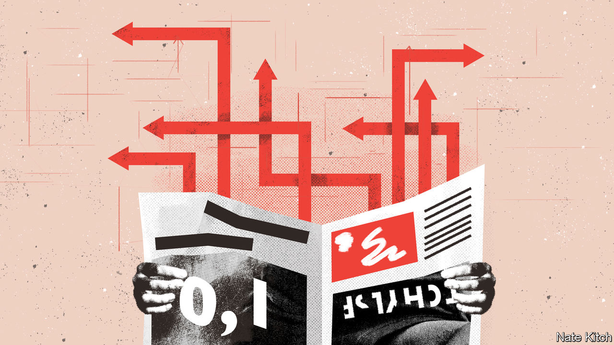

###### Bagehot

# What the softening of the Sun says about Britain 

##### Two-speed liberalisation remakes a tabloid newspaper 

 

> Mar 6th 2024 

ON ROLLS of microfilm, in the archives of the British Library, lie the remnants of a lost civilisation. Twenty years ago, in March 2004, the  was Britain’s bestselling newspaper, shifting 3m copies a day. It was also bleak, bigoted and cruel. Europeans with hiv and tuberculosis would swamp British hospitals, one front page from that month warned. An item on gay characters on “The Archers”, a radio drama, satirised the theme tune: “Bumti-bumti-bumti-bum.” Women were in turn “tarts”, “hussies”, “mingers” or “crumpet”. On and on it went.

Today the  is still staunchly conservative, agitated by soft judges and high levels of migration. But its pages are lighter, brighter and gentler. Gone are the topless “page 3” models, the paparazzi shots outside nightclubs and the humiliating undercover stings. It runs campaigns on the menopause and for disabled children; it has devoted front pages to women’s football. Many of the ’s critics, its editor, Victoria Newton, recently complained, cannot have read it in decades.

The remaking of the  is a case study in the remarkable liberalisation of British society. Between 1990 and 2022 the share of Britons who said they wouldn’t live next door to someone with AIDs fell from 23% to 4%, according to a survey led by Bobby Duffy of King’s College London; the proportion who would not want a neighbour of a different race fell from 9% to 1%. The share of Britons who think a woman’s job is to look after the home has gone from 48% to 9% since 1987, according to the British Social Attitudes (BSA) survey. Support for same-sex relationships has soared; that for the death penalty has slumped. (Though support for a permissive legal regime for transgender people has fallen since 2016.)

But some groups liberalise more quickly than others. Britons born before 1945 have come to accept casual sex at a slower pace than members of Generation X. The BSA, which ranks respondents on an axis of liberalism to authoritarianism, finds that since 2008 Britons with degrees have liberalised by much more than those with fewer educational qualifications. Support for elective abortions has risen by 36 percentage points among graduates since 1985 but by just 13 points among those with no qualifications. 

It is this “two-speed liberalisation”, a term coined by Mark Pack, a Liberal Democrat bigwig, that helps explain Britain’s culture wars. It may seem as though the combatants are pulling in opposite directions. But it is better to think of a camel train in the desert: arguments break out when those at the front of the caravan pull ahead of the stragglers. The tension is over pace rather than direction, and it suffuses the  today.

Gay footballers are now “courageous and inspiring” rather than “nancy boys”; Ms Newton is proud to regularly put black players on the front page. Yet the  also vents at the “wokerati” with their “virtue-signalling” symbols and diversity initiatives. It is precisely because all sides now agree that racism is an evil that disputes over its definition are so bitter, argue Rob Ford and Maria Sobolewska in “Brexitland”, a book. They note that it can be frustrating for people whose views have changed vastly over their lifetimes to hear they have not changed far enough. 

A liberalised Britain is tricky territory for a tabloid. In July 2023 the newspaper alleged that a BBC star had paid a vulnerable teenager for explicit images. The  cast this story in the language of “MeToo”—a tale of abuse of power and institutional cover-ups. To its critics it was more reminiscent of an earlier era of tabloid prurience. A weakening commercial model—the  reported pre-tax losses of £127m ($161m) in 2022, in part driven by costs related to phone-hacking allegations—leaves it more exposed to the wishes of advertisers and their increasingly liberal customers. “In the current set-up, if I lasted 1.2 seconds I would be amazed,” says Kelvin MacKenzie, a former editor not known for his sensitivity.

Freddie Starr ate my electoral wedge issue

Those who fret about the advance of the cultural right can take two lessons from the softening of the . The first is to relax. Rather than being under siege, liberals are winning battles at an astonishing clip. The Tory party’s brewing leadership contest is a case in point. Kemi Badenoch, the front-runner in any post-election battle to succeed Rishi Sunak, is a determined crusader against wokery. The fact she describes herself as “to all intents and purposes a first-generation immigrant”—she was raised in Nigeria—reflects a broadened idea of Britishness among activists. 

Although 136 Tory MPs voted against same-sex marriages in 2013, espousing a “biblical view of marriage” relegates Miriam Cates, an MP, to the party’s fringe today; even she insists the law is settled. On the BSA’s scale the views of Tory voters aged over 55 in 2022 were roughly where their Labour equivalents were in 2012. 

The second lesson is to show some humility. Political parties are good at recalling how regressive their rivals were, bad at recalling how their own attitudes have changed. The Labour Party’s membership today would blanch at New Labour’s tabloid-friendly musings on sending asylum-seekers to Tanzania, or the fecklessness of single mothers. The party now proposes mentoring boys in school on misogyny to counter the influence of figures such as Andrew Tate, a YouTuber, some of whose views on women would have been at home in the mid-noughties . 

What is true of parties can also be true of papers. The  has long regarded itself as the antithesis of the . But until 2003 it ran a column by Rod Liddle, who would fleck his pieces for effect with phrases such as “spazzy”, “bint”, “poof” and “What about nuking the Belgians?”. Today Mr Liddle writes for the , where his tone has become starchier: “Make a child with a smartphone as shocking a sight as a child with a cigarette” ran a recent effort. What passed for edgy humour in a liberal broadsheet in 2003 has, mercifully, become unprintable in a redtop in 2024. Some civilisations are best lost. ■


