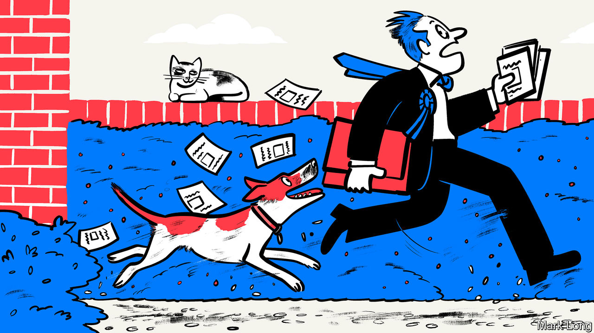

###### Unnatural selection

# Why on earth would anyone become a British MP? 

##### Sanity, at least, is no longer a formal requirement. But watch out for the letterboxes 

 

> Mar 4th 2024 

To understand what it is like to try to become an MP you could read memoirs, learned tracts or rule books. It is better to ask MPs about letterboxes. Every MP will have spent hours leafleting, and few topics arouse stronger passions. For Lord Mandelson, a former MP, the most hateful letterboxes are “the ones that don’t open” or those that “snap shut on your fingers”. For Tristram Hunt, another former MP who is now head of the Victoria and Albert Museum, the ones that “caught your fingers” were “devastating”. For Baroness Davidson, a former member of the Scottish Parliament, people with letterboxes at ground level are “next to murderers in…the hierarchy of bad people”. 

Being an MP is a hard job. Becoming one is arguably harder. After the next election, 650 of them will be entitled to sit in Parliament. They will have sacrificed days to door-knocking, evenings to flyering, and weekends to turning up at fetes and smiling at jam. They will have spent thousands, probably tens of thousands, of pounds of their own money on the individually small but cumulatively large costs of campaigning—travel, leaflets, accommodation, assessment days, conferences, dinners and coffee after coffee. The quest for a seat may be, as Isabel Hardman, the author of “Why We Get the Wrong Politicians”, has put it, “the most expensive and time-consuming job interview on earth”.

When seen en masse at the opening of Parliament, MPs may—like political flying ants—provoke momentary interest in where they have all come from. But most voters barely pause to ask this question, and very few think of becoming MPs themselves. Understandably so. The career route is opaque, MPs’ jobs are not openly advertised and “school careers advisers rarely say ‘MP’,” says Ms Hardman. Why would they? The hours are long, the pay (relatively) bad and the redundancy process brutal. The threat of physical violence also lurks: two MPs have been murdered in the past decade; many face routine harassment. A better question than how to get such a job, says Sir Anthony Seldon, a historian, is “why would anyone want to become an MP?”

Yet they do. Which is just as well, as Parliament needs them. Ninety-five have so far said they will stand down at the next election. Prospective MPs have been vying to replace them, which generally means winning not one vote but two. Most voters imagine MPs’ toughest task is election. Selection, when parties choose their candidates to contest a seat, is often far harder. 

First, would-be MPs must get onto a longlist of contenders. Labour draws up its lists centrally; for the Tories they are compiled by local party bureaucrats with some national hand-holding. Interviews with local party members turn the longlists into shortlists. Then the locals hold hustings and vote. Or that is the theory: parties often streamline this process, drawing up shortlists of three, or even of one, and forcing favoured candidates onto local members. 

Before a would-be MP can even apply to be a constituency’s candidate they must meet some explicit criteria. These vary between parties, and can be stringent (Tories have to complete checks and assessments to win a place on the “approved list”) or less so: Labour hopefuls generally just need 12 months’ party membership and to be in a trade union. Parliament adds more. It demands that MPs be over 18 and not be bankrupt, convicted of treason, sit in the House of Lords or be the monarch. It used to require that they not be insane. No longer. Make of that what you will. 

Candidates must also meet their party’s implicit criteria: in other words, their faces must fit. Here, it helps to start young. Attending party conferences (which can cost up to £250, or $317, a pop) in your 20s is ideal. Being active in your student union (and for Tories, in the Oxford Union, a posh debating society) is better yet. A tough childhood can be movingly milked throughout a career. Sir Keir Starmer, the Labour leader, makes much of his not-very-grim pebbledash semi; other Labour MPs write prosier-than-thou memoirs rich in women who are “strong” and men who are “proud”. 

In truth, it is best to start before you are born, as whether or not a would-be MP has local connections is now a “very powerful decider” in who gets selected, says Michael Crick, a broadcaster. One Labour MP is said, perhaps apocryphally, to have bragged that he was conceived in his constituency. 

Stand for a seat

Candidates who make it through to the final rounds in a constituency will find their fate determined by startlingly few people. If the 172,000 Tory party members were evenly divided between constituencies (which they aren’t) and all turned up to selection votes (which they don’t), 250-odd people would choose each candidate. More often they are chosen by the handful who turn up to the village hall that night and vote. The attendees are also idiosyncratic. Rory Stewart, a former Conservative MP whose selection was held in a cattle market, won voters over in part by going on an “incomprehensible” ramble about Richard III. People, someone suggested later, “liked the fact you weren’t patronising them”.

Then, once a candidate has won over the selectorate, they simply have to woo the electorate. Which means more flyering, more letterboxes—and more pain. Not just from the letterboxes, either: as Mr Hunt points out, it’s important not to “forget the bloody dogs” who come for the soft, vulnerable fingers of would-be MPs leaving their leaflets. With flyering, as with being an MP, getting through the door is often the hardest part. ■


