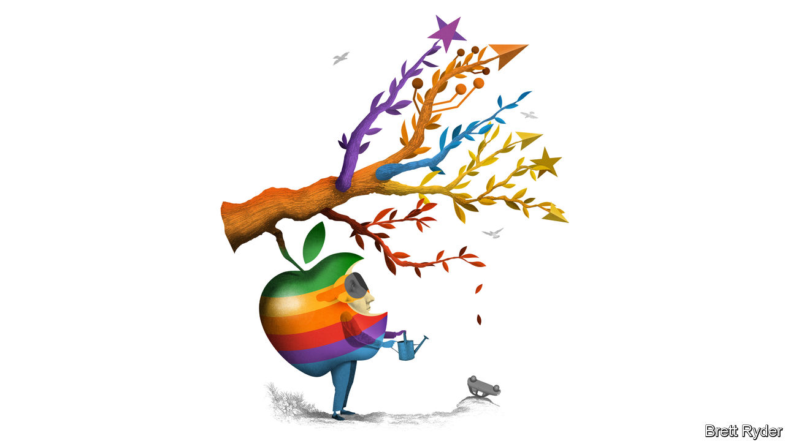

###### Schumpeter

# Apple is right not to rush headlong into generative AI 

##### One day the Vision Pro could exploit the technology to the full 

 

> Mar 3rd 2024 

If you think Tim Cook has always led a charmed life at the helm of Apple, think again. The years straight after the death of Steve Jobs in 2011 were a trial by fire. First there was antitrust: America’s Department of Justice (DoJ) sued Apple for conspiring to fix e-book prices. Then there was competition: Samsung, a South Korean rival, went to war with the iPhone with bigger, sleeker models. Then came broader concerns. Apple’s new voice assistant, Siri, made rookie errors. Ditto Apple Maps, which went as far as relocating the Washington Monument to the Potomac river. At the time, the question hanging over the company was existential: could Apple’s creative spark survive the death of its founder? One of Mr Cook’s lieutenants was so miffed at the criticisms that he publicly retorted in 2013: “Can’t innovate any more, my ass!” 

A decade or so later, Mr Cook may be feeling . On all three counts—, Asian competition, the existential question of innovation and growth—there are parallels between then and now. Competition watchdogs in the EU are demanding compliance from March 7th with rules that for the first time breach the “walled garden” which keeps users and developers bound within Apple’s playpen. On March 4th they fined the company €1.8bn ($2bn) for allegedly stifling competition in music streaming. In America the DoJ may soon launch a case against Apple. In China, Huawei, a domestic mastodon, is seizing market share. Hanging over everything is the nagging concern, amid a levelling off in iPhone sales, that Mr Cook is missing the chance to pull another rabbit out of the hat with  (gen AI). 

In short, with its market value down by 10% since mid-December, and Microsoft, thanks to gen AI, vaulting past it to become the world’s most valuable company, sceptics wonder if Apple is now so dominant it has lost its mojo. So jaded is the narrative that many pay little heed to the buzz about the , Apple’s snazzy—though lavishly priced—mixed-reality headset. What hopes they have are pinned on the company’s annual developer conference in June, when they want Mr Cook to announce whizzy gen-AI upgrades proving that Apple can join the chatbot hypefest. That, though, is not how the company does things. Nor should it be.

Go back to the threat from Samsung in Mr Cook’s early days. Back then investors pestered Apple to come up with a bigger phone, just as now they want it to match Samsung’s models with gen-AI bells and whistles. But Apple doesn’t rush things. It wasn’t until the launch of the iPhone 6 in 2014 that it produced a large-screen device. When it came, it was a smash hit. Its modus operandi remains the same. It is rarely first with a product. It seeks to improve what is already out there, learning from others’ mistakes and eventually trouncing the competition. Of course, that poses a risk. In theory, a scrappy upstart may produce new technology products cheaper and faster, pulling the rug from under the market leader. Perhaps a young company building a killer gadget for the gen-AI era already has Apple in its sights. 

Yet you do not have to be a true believer to see why Apple may be right to take its time. First, there will be more to gen AI than chatbots. They appear revolutionary. But so far they are just a better (and accident-prone) way of putting in a query and getting an answer. That is not Apple’s forte. “They are features, not products,” as Horace Dediu, an expert on Apple, puts it. Nor does Apple compete with other tech giants, such as Microsoft, Amazon and Alphabet, to run cloud-computing platforms with AI models on which customers can build gen-AI apps. Instead of relying on the cloud, it seems to be working on ways to embed gen AI in its own devices, bolstering its ecosystem. Since 2017 it has been using homemade chip technology called neural engines to handle machine-learning and AI functions its gadgets use behind the scenes. 

In late February it emerged that it was scrapping its ten-year project to build an Apple car and redirecting the engineers towards gen AI. No doubt it is moving up a gear—though not from an idle start. Apple will reveal nothing about its intentions. But one of the options it has is hiding in plain sight: the Vision Pro. The most recent gen-AI launches, such as OpenAI’s Sora, which converts text to video, and Groq, which speaks at humanlike speed in response to questions, suggests that eventually something other than written words could be the main gateway to gen AI. The Vision Pro is all about sounds and images. 

Known unknowns

In the short term none of this will resolve the growth question. In fact, the regulatory onslaught in the EU via the Digital Markets Act, which will henceforth apply to big-tech “gatekeepers” including Apple, could potentially crimp its biggest growth engine, services. For the first time Apple will be forced to allow third-party app marketplaces and alternative payment systems outside its App Store on devices in Europe. It has made no secret of its disdain for the rules. It calls them a threat to safety and privacy, and has introduced complex new fees for those who dare bypass its protective walls. Some developers have slammed its compliance measures, but they are likely to work: inertia means that many will probably stick with the status quo. As for a possible DoJ antitrust case, it would be a headache. But its scope is not yet clear. 

China is a bigger problem with no clear solution. Huawei has become a formidable competitor, though in the long run it may be constrained by an America-led ban on sales to it of high-end chips. However big the geopolitical risks, Apple and China are so co-dependent that they may be stuck with one another.

Still, don’t give up on Mr Cook yet. Apple is bound to be working on gen-AI products that do not leave egg on its face—just, as is its way, not in the open. At this stage, the vast sums needed to train AI models favour deep-pocketed incumbents over scrappy upstarts, which will work to Apple’s advantage. You can almost hear Cupertino muttering, “Can’t innovate anymore, my ass!” ■


