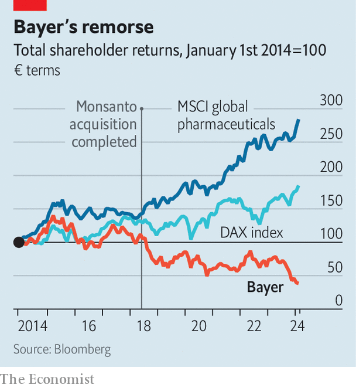

###### More than a headache

# Can Bayer recover from its chronic pain? 

##### The Aspirin-maker is suffering from complications of its acquisition of Monsanto 

 

> Mar 7th 2024 

ON MARCH 6TH 1899 acetylsalicylic acid, better known as Aspirin, was registered at the imperial patent office in Berlin. The first-ever synthetic drug went on to become one of the world’s most successful medicines. On Aspirin’s 125th birthday its maker, Bayer, is in no mood for schnapps. In the run-up to the presentation of its new strategy and annual results on March 5th, analysts and investors speculated about the radical surgery that Bill Anderson, the newish chief executive, might announce in order to quell chronic crises facing Bayer. Would he, perhaps, split its drug and crop-science businesses? Or spin off the consumer-health unit, which makes Aspirin and other non-prescription staples? “Not now,” Mr Anderson said. But, he clarified, this does not mean “never”. 

Bayer certainly needs more than a painkiller. Last year it made a net loss of almost €3bn ($3.2bn). Sales fell by 6%. It has torched 70% in shareholder value since June 2018, when it completed the acquisition of Monsanto, an American agrochemical giant (see chart). If the company is to recover, Mr Anderson must first and foremost undo that deal’s toxic legacy.

 


The $63bn Bayer splurged on Monsanto turned out to be just a downpayment. Lawsuits from Americans who claim that Monsanto’s blockbuster weedkiller, Roundup, causes cancer have forced Bayer to disburse $9.5bn in settlements with more than 100,000 plaintiffs. It has set aside $6bn for further payouts. The deal also saddled the company with stomach-churning debt. It owes creditors a net €35bn. 

All this may have made it harder to replenish its dwindling drug pipeline. The patents for two bestsellers, Eylea, an eye drug, and Xarelto, a blood-thinner, expire in 2025 and 2026 respectively. In November Bayer stopped testing an anti-clotting drug it had hoped could generate more than €5bn in annual sales, after trials showed disappointing efficacy. Another bet, Elinzanetant, a menopause medicine in late-stage testing, looks more promising. But even if it is approved it would rake in only a fifth as much as Xarelto. 

To start the healing process, Mr Anderson has trimmed dividends by 95% and announced large job cuts. He wants to do away with chunks of a 1,326-page book of internal rules for managers and halve the number of management layers from 12 to six. “We hire brilliant people. They don’t need baby-sitters,” he says. The organisational changes may cut annual costs by €2bn, or nearly as much as Bayer spends on administrative expenses, by 2026. Given that its share price fell after Mr Anderson unveiled his plan, investors may think that amputation is in order, after all. ■


