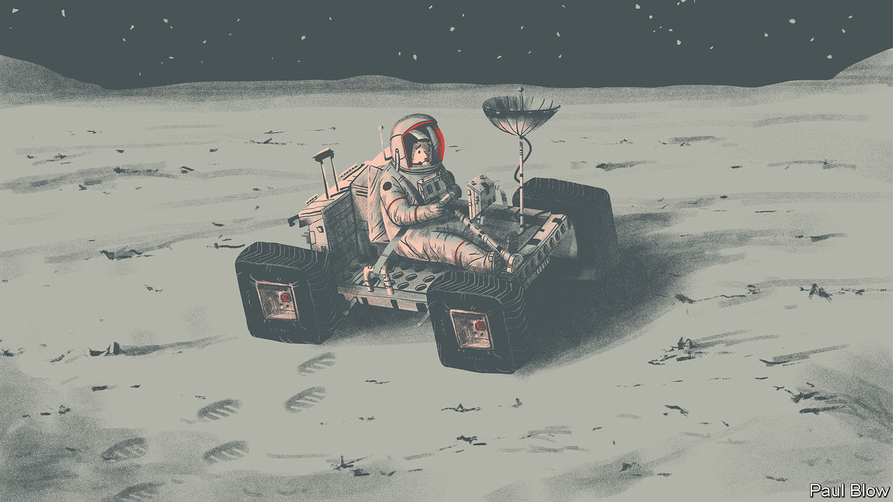

###### Bartleby

# How can firms pass on tacit knowledge? 

##### The problem of knowing what your co-workers know 

 

> Mar 7th 2024 

AST MONTH  became the first American spacecraft to land on the surface of the Moon in more than 50 years. The mission, a collaboration between NASA and a private firm called Intuitive Machines, can be counted a partial success: the craft did send back images even though its landing did not go to plan. Things might have gone better still if it had not been so long since NASA last visited the Moon. Experience usually makes things go more smoothly.

NASA does have an archive of materials from the Apollo missions. Sometimes, however, knowledge is lost for good. Gino Cattani of NYU Stern School of Business and his co-authors have looked at the violin-making family dynasties of Antonio Stradivari and others in Cremona, in Italy, in the 17th and 18th centuries. Modern players still laud the sound of the instruments made by these craftsmen. But there was a gap of about a century between the heyday of these dynasties and the rise of the public performances that showcased the instruments’ qualities. In that time the techniques of the Cremonese luthiers were lost. 

Most organisations do not routinely blast into orbit or wait a century for customer feedback. But all organisations face the problem of storing and transferring knowledge so that newcomers know what’s what, lessons are learned from successes and failures, and wheels are not constantly being reinvented. An ageing workforce adds to the urgency of training inexperienced hires before the old hands leave the building. 

Some knowledge is easier to codify than other. In the 1960s Corning, a glassmaker, had developed a particularly strong glass that was christened Chemcor. Plans to commercialise this material faltered—among other reasons, it turned out that this was not a great windscreen for motorists to hit at speed—and Chemcor was put on the shelf. 

There it remained until 2005, when the firm started to wonder whether mobile phones might provide a use for Chemcor, which was renamed Gorilla Glass. In 2007 the boss of Corning took a call from Steve Jobs, who was hunting for the right kind of glass for a new smartphone. You presume that no one at Corning has since questioned the value of keeping good records. 

The tougher task is capturing “tacit knowledge”. This is the know-how born of experience, which cannot easily be documented in the manuals and is not much thought about by those who have it. 

Working alongside experienced colleagues is the best way to transfer tacit knowledge but it is not always possible. Sometimes you only want your very best people working on something, especially if the stakes are high. The most valuable employees are usually the ones with the least time to mentor others. When NASA was working on a Mars rover programme in the 2010s, it gave younger engineers a smaller, parallel project: to build a rover for use in educational programmes on Earth. It wasn’t the real thing, but it was a way to give them some hands-on experience. NASA also has an emeritus programme that gets retired veterans to mentor junior staff.

Technology is both an answer and a barrier to the transfer of tacit knowledge. It is easier than ever to record and disseminate the wisdom of older hands. Unfortunately, it is easier than ever to record and disseminate the wisdom of older hands: the podcast episodes proliferate, the hours of unwatched training videos pile up. Watching someone on a screen is often less stimulating than hearing from them face-to-face. A recent study by Niina Nurmi and Satu Pakarinen, two Finnish researchers, found that participants in virtual meetings feel drowsier than those meeting in person, which is saying something. 

Christopher Myers of Johns Hopkins University is a fan of informal storytelling as a way of passing on tacit knowledge. He spent time with the crews on an air medical transport team in America, whose jobs include flying patients by helicopter from the scene of an emergency to a hospital. Crew members routinely shared stories—on shift changes, at mealtimes and at weekly meetings—in order to learn how to respond to unusual situations. (Top tip: in the event of a poisonous-snake bite, the local zoo is a good bet to get antivenom.) 

Some stories are more gripping than others: people don’t sit round camp fires telling each other how to get the printer to work. But managers everywhere should think about how to capture tacit knowledge. That starts by recognising the importance of retaining workers. You can’t share experience if no one has any. ■


