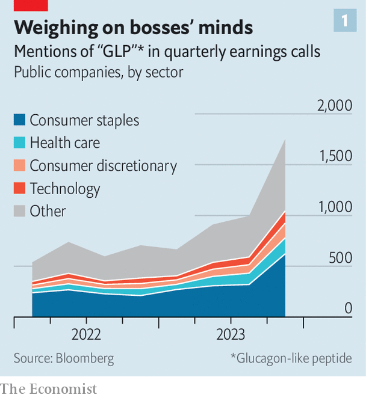

###### Slim pharma

# The battle over the trillion-dollar weight-loss bonanza 

##### Novo Nordisk and Eli Lilly are making blockbuster drugs. Can they maintain their lead? 

 

> Mar 4th 2024 

WEIGHT-LOSS drugs called GLP-1 agonists help users shed fat, and with it the negative health effects of obesity. This can have life-changing effects for the people who take them. It is also increasingly affecting the lives of corporate citizens. Since June 2021, when Wegovy, the first GLP-1 slimming jab, was launched in America, the market value of WW (formerly Weight Watchers) has crashed by 90%. On February 28th Oprah Winfrey announced that she would leave the dieting firm’s board and sell all her shares in order to avoid a conflict of interest around her use of GLP-1s. Food giants such as Nestlé are already planning for a future where the drugs dampen demand for sugary snacks. Bosses of consumer-goods firms brought up weight-loss drugs twice as often in the last full set of quarterly earnings calls, in late 2023, as they had in the previous one (see chart 1). 

 


The drugs’ biggest impact so far, though, has been on their makers. Sales of Wegovy, developed by a Danish firm called Novo Nordisk, swelled from $876m in 2022 to $4.5bn in 2023. The company expects double that this year. Zepbound, introduced in America in November by Eli Lilly, an American pharma giant, is expected to generate $2.9bn in sales in its first full year. Bloomberg, a data provider, predicts that by 2030 yearly sales of weight-loss medications will reach a staggering $80bn, putting them among the biggest classes of drugs in history. Eli Lilly and Novo Nordisk are expected to corner more than 90% of the market (see chart 2). 

Investors’ appetite for the duopoly’s shares has been as insatiable as dieters’ for its products. In the past three years Novo Nordisk’s market capitalisation has expanded more than threefold, to $560bn, turning it into Europe’s most valuable company. Eli Lilly is worth $740bn, more than twice what it was at the start of 2023 (see chart 3). They are now the world’s two biggest pharma firms by market value. There is excited talk of the industry’s first trillion-dollar company—and the second. To live up to those lofty expectations, however, Eli Lilly and Novo Nordisk must make enough of the drugs to meet demand, widen the pool of patients and fend off a clutch of challengers.

 


GLP-1 agonists are extremely effective and relatively safe. Originally introduced to help diabetic patients by promoting insulin production, they regulate the body’s response to eating and create a feeling of fullness that suppresses appetite. Patients who take them lose more pounds than people on other weight-management plans. In clinical trials users of Wegovy shed about 15% of their body weight on average. Those on Zepbound lost around 20%. 

Given that 2.7bn people, or 38% of those aged older than five, are obese or overweight, according to the World Obesity Federation, the drugs are also in high demand. Because the injections must be taken weekly rather than just once, the more people start treatment, the faster total demand rises. And it is already rising so fast that Eli Lilly and Novo Nordisk are struggling to meet it.

 


The drugs require two main components: the active ingredient and the “skinny pens” that patients use to inject the medicine. Right now both are hard to find. Neither the Danish firm nor its American rival has explained why they cannot get hold of more of the necessary chemicals, but it is clearly a problem. A shortage of semaglutide, which gives Wegovy its powers, has forced Novo Nordisk to push back the launch of a pill version of Wegovy, which works as well as the shot, is easier to make and less unpleasant to administer, but which requires 20 times the amount of the active ingredient. 

Making enough of the skinny pens for Wegovy and Zepbound has also been a challenge. The devices come from specialised “fill-finish” factories. Eli Lilly and Novo Nordisk are pouring out billions of dollars to boost supply by teaming up with manufacturers or building their own capacity. In November the American firm announced it would spend $2.5bn on a new factory in Germany, and Novo Nordisk said it would invest $6bn in expanding capacity at its Danish site. In February Novo Nordisk’s parent company agreed to pay $16.5bn for Catalent, a big American manufacturer, to boost production for America’s gargantuan market. Despite these investments, analysts expect demand to outstrip supply for at least a few years. 

The limited production capacity has helped the companies in one way, by masking another problem. So far only half of the 110m obese Americans have access to the drugs through their health insurance. To hit the rosy revenue forecasts, Eli Lilly and Novo Nordisk need to make their treatments available to a wider group of patients. Medicare, a government health-care programme for the elderly, is prohibited by law from covering weight-loss drugs. Private health insurers are put off by the medicines’ costs. Even though discounts mean they typically pay around 60% of Wegovy’s list price in America of some $16,000 a year, many insurance firms are reluctant to cover an expensive drug that must be taken indefinitely.

To bring insurers on board, the duo are running trials to prove that GLP-1s do more than just help people lose weight. A trial by Novo Nordisk found that Wegovy lowers the risk of major heart problems by 20%. Eli Lilly is conducting a giant trial with 15,000 participants, set to finish in 2027, which studies the effect of tirzepatide, the active ingredient in Zepbound and Mounjaro, a related diabetes medicine, on the overall health and lifespan of obese adults. There is evidence to suggest that GLP-1s also help with conditions such as sleep apnea, chronic kidney disease, Alzheimer’s disease and fatty liver disease. The use of GLP-1 drugs to treat these illnesses has not yet been approved by regulators. But David Risinger of Leerink Partners, an investment bank, believes that as more health benefits emerge, it will become hard for insurers to deny coverage. 

Eli Lilly and Novo Nordisk may in time deal with their capacity and coverage problems. That still leaves a third challenge: competition. The booming market has unleashed a flood of wannabes, from big pharma to biotechnology startups. Bloomberg estimates that close to 100 candidates for weight-loss drugs are in various stages of development. Most imitators are refining the GLP-1 approach to craft drugs that outdo existing ones by delivering more weight loss or easier use.

Combo meal

One idea to boost efficacy is to combine GLP-1 with other agonists. Zepbound already uses one called GIP along with GLP-1 to increase energy expenditure, decrease fat accumulation and reduce nausea. Viking Therapeutics, an American biotechnology company, uses a similar cocktail. On February 27th it shared trial data which showed that its anti-obesity medicine helped patients lose more weight even than Zepbound. Viking’s share price more than doubled. A drug in development by Boehringer Ingelheim, a German drug company, and Zealand Pharma, a Danish biotech firm, uses another agonist called Glucagon in combination with GLP-1 to ensure weight loss and fight liver diseases.

Other rivals, such as Pfizer, an American drug giant, and Carmot Therapeutics, a biotech startup which in December was scooped up for $2.7bn by Roche, a Swiss behemoth, are focusing their efforts on doing away with needles. Besides being cheaper to make and easier to pop, oral drugs do not need refrigeration as many injectables do. This makes them more suitable than jabs for patients in poorer countries, many of which also face an obesity crisis but lack robust “cold-chain” logistics. Ray Stevens, chief executive of Structure Therapeutics, another biotech firm pursuing oral weight-loss drugs, believes that it is still “early innings”. It will be a while before pharma’s weight-loss winners are decided, he says. 

The two pioneers have a head start, however. The patents for Wegovy and Zepbound expire only in 2032 and 2036, respectively. No rival product is about to go on sale. Developing a new drug takes on average nine years, and even those now in early trials are unlikely to be available before 2027. Most important, the prospect of years of healthy profits has not turned either leader into a couch potato. On the contrary, the two companies are innovating furiously in order to maintain their edge over potential competitors—and to steal a march over one another. 

Already Eli Lilly has closed Novo Nordisk’s early lead thanks to Zepbound’s greater efficacy. The American drugmaker’s share price relative to its forecast profits in the coming year is almost twice that of its Danish rival. Novo Nordisk’s fortunes are much more closely bound up with GLP-1 than those of Eli Lilly, which also has money-spinners in cancer and immunology treatments. Novo Nordisk hopes its pill and seven other related drugs in various stages of trials will help it regain its lead. Eli Lilly, for its part, has six drugs in the works, including a promising pill of its own in late-stage trials that, if all goes well, could be in pharmacies by 2026. Only one of them can be the first to a trillion dollars. But as they race, millions of patients will be the real winners. ■


