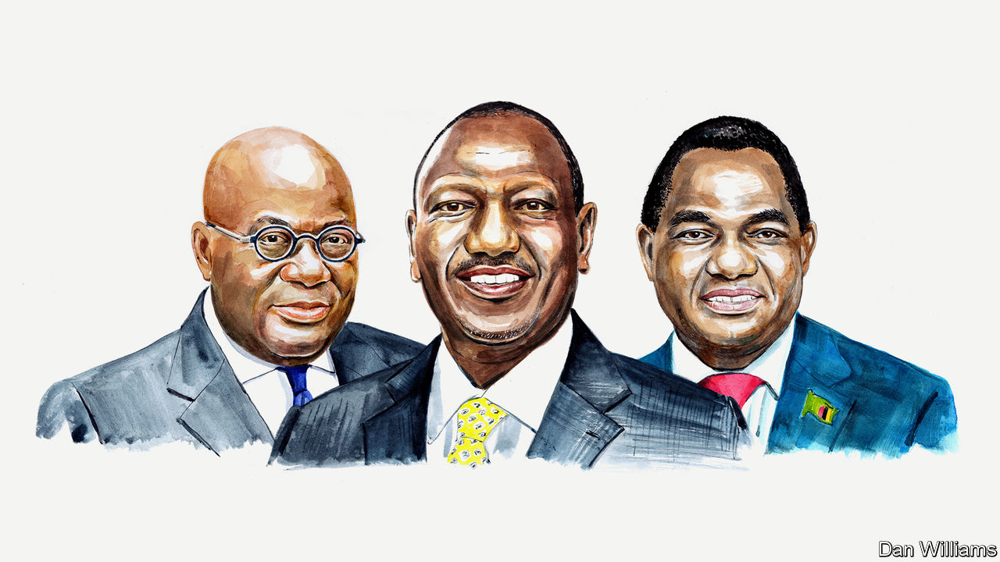

###### Finance and development

# Three presidents on how to make global finance work better for Africa 

##### The continent needs a stronger voice and more help to help itself, say Nana Akufo-Addo, William Samoei Ruto and Hakainde Hichilema 

 

> Mar 6th 2024 

THE CONVERSATION on reforming the global financial architecture has often felt more like Africa against the rest of the world, but the tide is turning. Governments north and south agree that there is something fundamentally wrong with the system and it must be fixed. As the leaders of Ghana, Kenya and Zambia, we have first-hand experience of the precarious financial situation facing many African countries, especially when it comes to debt and development finance. And we are all too familiar with the flaws in the system that is in place to confront these challenges. 

The current system needs more than just adjustment—it needs an overhaul. Africa must be at the centre of these reforms, but our criticisms have for too long fallen on deaf ears. Now that the world is beginning to listen, we must go beyond criticism and do what is needed for our economic development and emancipation. Several things are critical to this agenda.

First, African leaders must be bold in promoting their ideas and participating when decisions are being made that affect the continent. The three of us have made it clear that we will not sign on to global regulations and agreements that are not shaped with our input. 

We are committed to being a strong voice for Africa. We need to ensure that lower-income countries have sufficient access to concessional finance through the World Bank’s International Development Association (IDA). 

To that end, Kenya has agreed to host the IDA21 conference in April and we are working hard to drive the fundraising for this critical form of finance. Kenya has also agreed to co-lead two bodies to tackle the climate challenge in developing countries. The first, in conjunction with the African Union (AU), Antigua and Barbuda, Barbados, Colombia, the European Commission, France and Spain, looks at opportunities to tax sectors, activities and transactions that could yield billions in climate finance for the countries most affected by climate change, many of which are in Africa. The second is a coalition of experts convened with Colombia, France and Germany, looking at how unsustainable debt is keeping many developing countries from investing in climate and conservation, and what can be done about it, including innovations like “debt-for-nature swaps”: debt relief in exchange for green initiatives. 

Second, Africa must look within for solutions. We must invest our borrowing in the continent’s growth, job creation and revenue generation rather than in consumption that will not pay us back in the long run; make sure development projects are high-quality, priced correctly and finished on time; and start looking to each other as major trading partners rather than overseas. 

It is time for a serious conversation about the high cost of capital that burdens Africa, which is based on unfair risk premiums and inaccurate valuation of our economies. Many African countries have assets that are not reflected on our balance-sheets. We have to strengthen African institutions, and we expect those strengthened institutions to assist in valuing our economies correctly, working with international financial institutions to get this right. 

The three of us recently helped to launch the Africa Club, an alliance of African multilateral financial institutions that will serve as a powerful negotiator on behalf of the continent, co-ordinate with global financial institutions and leverage African countries’ balance-sheets to increase investment and jobs. It is critical that these institutions have the full weight of AU member states behind them and the appropriate capital to continue serving Africa’s development. To this end, Ghana has proposed that each African country go beyond its existing paid-in capital and invest a minimum of 30% of its sovereign reserves in African multilateral institutions. 

Third, we must bring the world to Africa. We have spent the past few years attending summits in a variety of countries that want to do business with our continent. Now it is time for our fellow world leaders to come to us. In that spirit, Ghana has proposed, and we all support, an annual African Economic Summit involving heads of state and government from around the world. Our hope is that this becomes the fulcrum around which we will deal with our major growth-and-development issues. Kenya will host the first summit in 2025, then Zambia in 2026 and Ghana in 2027.

Finally, we must speak with one voice on our reform agenda. Over the past three years a coalition of African policy institutes, the AU, the UN, finance ministers and civil society have been working together to define and advocate a collective African agenda for improving the global financial architecture. This coalition has identified key areas for action. They include charting a green growth-and-investment path for the continent; increasing concessional finance; channelling special drawing rights currently held at the IMF to African financial institutions so they can be leveraged for development finance; finding a robust solution to the debt crisis, which will require overhauling the Common Framework, a debt-restructuring blueprint introduced by the G20 in 2020; and increasing Africa’s role in global decision-making. 

These are ambitious but achievable targets. We have already seen progress, for example in gaining a seat for the AU at the G20, making it the G21. It is up to Africa to use that seat wisely and present a clear vision for global reform.

There is a line in scripture: “Faith without works is dead.” You cannot believe in something and do nothing about it. 2024 is the year to move from talk to action, and to insist on a fairer global system that works for Africa. ■


