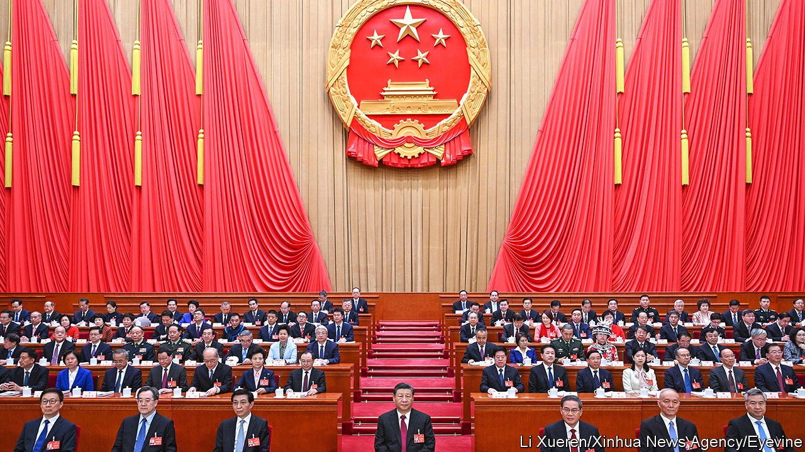
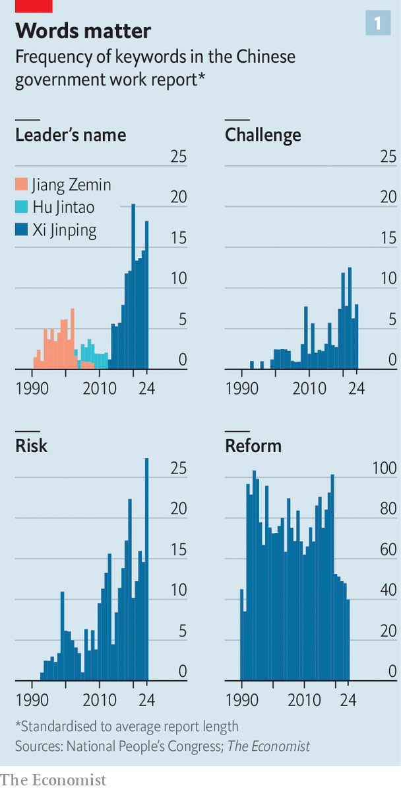
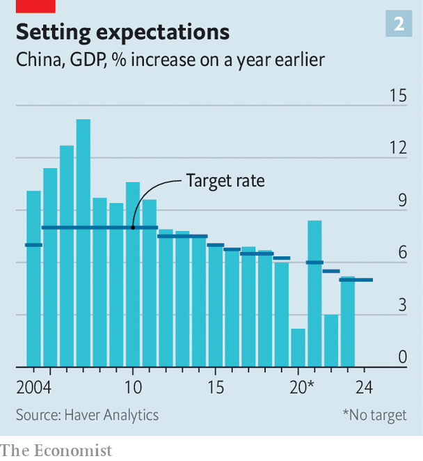

###### Xi’s show

# China’s parliament is being used to highlight Xi Jinping’s power 

##### The gathering reveals much about the woeful state of the country’s politics and economy 

 

> Mar 7th 2024 

The annual meeting of China’s parliament, the National People’s Congress, is a rubber-stamp affair. But the week-long session that began on March 5th is important. After a year of grim news about the country’s economy, investors want to know that the leadership has good ideas for steering it out of trouble. Citizens want reassurance that the . The gathering’s message, however, will satisfy few. Even more than in previous years, the congress is being used to show off the absolute power of China’s leader, Xi Jinping. It is revealing a growing disconnect between his policymaking and the country’s urgent needs. 

Mr Xi has no high-profile role in the congress. But it was made abundantly clear that this was to be his show. To universal surprise, it was announced on March 4th that the prime minister, Li Qiang, would not give a press conference at the end of the event, nor in subsequent years except in “special circumstances”. Thus ended a tradition dating back to the 1980s—the only occasion on which wide-ranging questions could be put to a member of the Communist Party’s innermost circle. These live-broadcast encounters with journalists were carefully stage-managed. But prime ministers sometimes used them to reveal something of their personalities and policy preferences. The point is clear: only one personality is now allowed in Chinese politics. It is Mr Xi’s. 

 


This was underscored in the state-of-the-nation speech that Mr Li gave on the opening day. It was his first since he was appointed as prime minister at last year’s session. He larded it with references to Mr Xi, whom he credited for China’s “achievements” in 2023 (see chart 1). He told officials at every level to acquire a “deep understanding of the decisive significance of establishing Comrade Xi Jinping’s core position”. 

It had been thought that Mr Li, who was supportive of foreign investors and private entrepreneurs during leadership stints in the provinces, might use his close relationship with Mr Xi to champion their cause as prime minister. Mr Li is being wheeled out to charm the private sector—in January he was China’s front-man at the World Economic Forum. But it is now clearer that he wields no great clout in economic decision-making, as was the case with his predecessor, the late Li Keqiang, who was nudged out of playing that role by Mr Xi. 

 


Businesspeople will draw little comfort from Mr Li’s setting of a GDP growth target of “around 5%” for 2024 (see chart 2). This is ambitious. China set the same target last year and managed to achieve it, with growth of 5.2%. It will be harder this time. China will not enjoy the one-off benefits of removing covid-19 controls, as it did in 2023. And the government is reluctant to crank up stimulus, even though the economy faces “many lingering risks and hidden dangers”, says Mr Li. 

That is putting it mildly. Consumer and producer prices fell in January by 0.8% and 2.5% respectively, compared with a year earlier. A property crisis is now in its third year, with no end in sight. Some of China’s biggest trading partners have turned wary, limiting the country’s access to lucrative markets and high-end semiconductors. China’s stockmarket has lost about $4trn in value since its peak in 2021, despite the government’s recent efforts to arrest its slide. And consumer confidence remains near the low to which it slid during the pandemic-related lockdowns of 2022.

The government has a plan to fix things, just not one that is likely to work. To help meet the growth target, Mr Li said that the central government would aim for a headline budget deficit of 3% of GDP. It will also slightly increase the quota for “special bonds” issued by local governments that are spent largely on infrastructure. On top of that, the central government itself will sell 1trn yuan-worth ($140bn) of long-term special bonds this year, with more to come in the next few years. The increase in the fiscal deficit amounts to about 1% of GDP.

This modest fiscal push will not be enough to keep deflation at bay, according to Robin Xing of Morgan Stanley, a bank. He expects the government to stimulate demand further later in the year, once it realises growth is falling short of its target.

A more lasting recovery for China’s economy would require a revival in consumers’ spirits and their spending. In a welcome move, Mr Li said the government would raise the minimum state pension by 20 yuan a month, a small sum in itself, but a big jump relative to the paltry level of existing payments. Mr Li also mentioned a scheme to encourage households to trade in old goods for new ones. Shoppers’ rights would be strengthened through a “worry-free consumption” initiative, he added.

The government’s own worries also loomed large in Mr Li’s speech. China’s leaders are determined to liberate the country from its technological dependence on hostile foreign powers, such as America. Mr Li described the global environment as “more complex, severe and uncertain” and said it was important for China to attain “greater self-reliance and strength” in science and technology. A draft budget delivered to the congress said the central government’s spending on this in 2024 would increase by 10%, to over 370bn yuan. That is well over the nominal 7.4% rate of economic growth (ie, real growth plus inflation) that is implied by the government’s fiscal projections, and even greater than the nominal growth that China is likely to achieve with its economy sputtering and prices falling. The declared military budget is slated to rise by 7.2%. 

With an American presidential election looming, in which the front-runners want to look tough in their dealings with China, Mr Xi may be keen to avoid clashing with the superpower. Clearly referring to American behaviour, Mr Li said China would be “firm in opposing all hegemonic, high-handed and bullying acts”. But his language on Taiwan was similar to the mixed messaging of previous such speeches. He said China would “resolutely oppose…external interference” there, another obvious reference to America. It would also pursue the “peaceful development of cross-strait relations”. On trade matters, Mr Xi appeared to acknowledge the concerns of America and other Western governments that China is building excessive subsidised capacity in green technologies such as electric vehicles and solar panels, putting Western markets at risk of a flood of cheap products. “We must…oppose irrational, blind investments that create bubbles,” he told a group of delegates. 

America may be looking elsewhere for signs of China’s intentions. As the congress got under way, the Philippines—an ally of America—accused China of “aggressive actions” in the South China Sea, after Chinese vessels blocked a Philippine mission to the disputed Second Thomas Shoal. A day earlier, officials from the Maldives announced that they had signed a “military assistance” deal with China, amid a push there to reduce the influence of India, to which America has been drawing close. 

Foreign policy, however, is unlikely to be a topic to which Mr Li devotes much attention. The role of the prime minister has always been mainly to manage affairs at home. That role, too, has been whittled away by Mr Xi as he puts the party more clearly in charge of everything. During this session, the congress is expected to approve legal revisions that will tighten party control over Mr Li’s cabinet, the State Council. They require it to “resolutely safeguard” the party’s leadership and “resolutely implement” its decisions. What is actually needed is a candid discussion among officials about how to fix the economy. But it is hard to think of a forum where that might happen. ■


