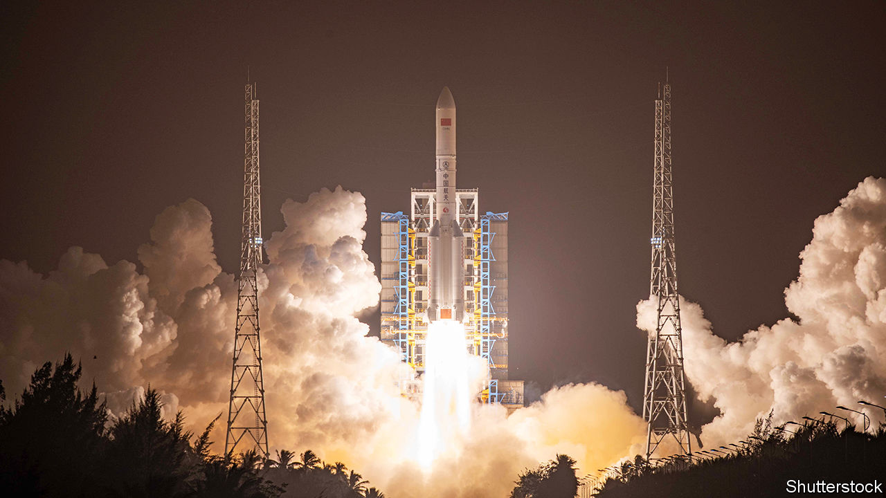
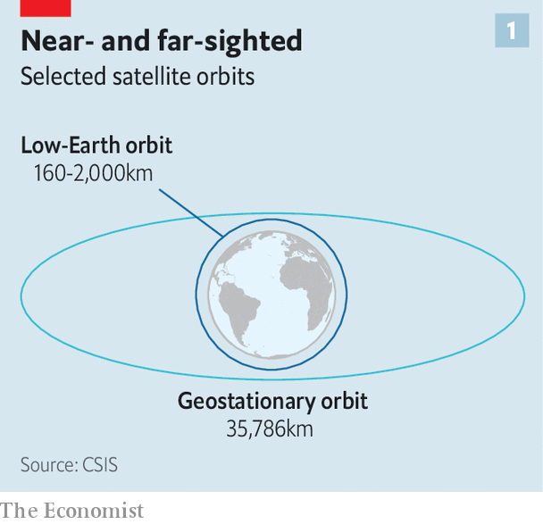
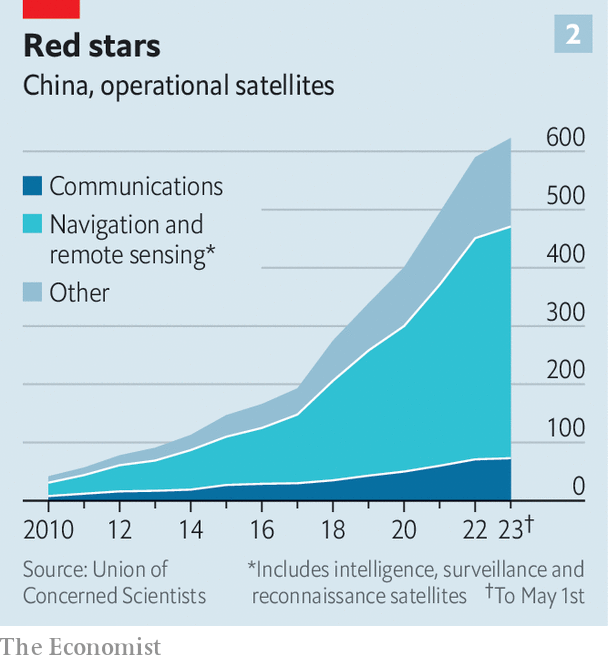

###### Eyes in the sky

# China’s satellites are improving rapidly. The PLA will benefit 

##### Watch out, American warships 

 

> Mar 7th 2024 

When China launched the Yaogan-41 satellite into space late last year, it travelled further than most such objects. Reconnaissance satellites tend to sit in low-Earth orbit (LEO), whizzing around the planet between 11 and 16 times a day (see chart 1). But Yaogan-41 headed for higher ground, some 36,000km from the Earth. There, in geostationary orbit (GEO), the point at which a satellite circles the planet slowly enough to remain above the same point, it began watching. 

 


China says Yaogan-41 will be used for benign activities, such as estimating crop yields and meteorological forecasting. But it is positioned over an area that includes Taiwan, the South China Sea and other potential flashpoints. Pairing its sharp eyes with artificial intelligence (AI) and information from other satellites could give China a unique ability to keep tabs on vehicles and vessels in the region. That would come in handy in the event of war, suggests a new analysis by the Centre for Strategic and International Studies in Washington.

The launch of the Yaogan-41 is part of a larger Chinese push into the cosmos. China spends more on its space programme than any country bar America. In 2019 China landed a rover on the far side of the moon. Two years later it deployed one on Mars. Those efforts seem innocuous enough, but much of its activity has potential strategic value. An area of particular concern is satellites. 

 


Over the past decade China has massively increased the number of satellites it has in operation, to a total of over 600 today (see chart 2). Of those, more than 360 are intelligence, surveillance or reconnaissance (ISR) satellites, which observe the Earth using sunlight, infrared waves or reflections from radar pulses. China’s ISR fleet is second in size only to America’s, and its capabilities are finding appeal in the global marketplace. America recently sanctioned two Chinese firms for allegedly giving satellite images of Ukraine to the Wagner Group, a Russian mercenary outfit. 

Most of China’s satellites are of the LEO variety. Being closer to Earth, they tend to produce images with a higher resolution than those captured by GEO satellites. In terms of coverage, China’s growing constellation of LEO satellites has gaps of less than 30 minutes between images of any one spot, says Juliana Suess of the Royal United Services Institute, a think-tank in London. GEO satellites have no gaps at all. Yaogan-41, for example, can watch over Asia without interruption. When used with other technologies, it could give China “an unprecedented ability to identify and track car-sized objects throughout the entire Indo-Pacific region,” writes Clayton Swope, a former CIA analyst now at CSIS.

When covering such a large area, it is often difficult to know where to look. Modern software may help. In a paper published in , a journal linked to China’s state defence industry, researchers noted that AI technology applied to images from the country’s Jilin-1 satellite, in low-Earth orbit, had achieved a 95% success rate in identifying small objects, including those that are moving. Such claims ought to be viewed with some scepticism. How the technology performs when objects are camouflaged or hidden is an open question. Optical satellites such as Yaogan-41, which sense visible light, can also be defeated by clouds.

Still, as AI technology matures, it could give the People’s Liberation Army (PLA) the ability to quickly find American targets, such as warships at sea or bombers on runways, that are beyond the range of coastal radar. The concept is nothing new: the Soviet Union used both radar and radio-frequency satellites to track NATO ships and American aircraft-carriers, which sought to hide themselves physically and electronically. But it poses a serious challenge to American military planners. China has “optical, multispectral, radar and radio-frequency sensors,” says Jason Schramm, the deputy commander of America’s space forces in the Indo-Pacific. “Those increase its ability to detect US aircraft-carriers.”

Mr Swope points out that optical satellites can even spot stealthy objects that are designed to deflect radar waves. In time, the combination of space-based sensors and advanced software might even allow the PLA to find and target small units of soldiers dispersed over a wide area, of the sort that America hopes to deploy in countries such as Japan and the Philippines. America “should be under no illusions about the potential for China to detect and locate” most of their forward-deployed forces, in peacetime or in war, writes Russell Hoole, a Marine Corps intelligence analyst. 

But this is all harder in practice than in theory. Even America is struggling to build a battle network which can shunt data seamlessly from satellites to ships to guns. On the Chinese side, satellites like Yaogan-41 would probably still find it hard to locate and track a warship in the middle of the ocean with enough precision to enable a strike. And there is a lack of agility in the chain of command, meaning good intelligence may not get to the right people at the right time. Add in American countermeasures and the result is a lot of misses. This could “potentially exhaust” China’s arsenal if the PLA were to target a large number of American ships, said the International Institute for Strategic Studies, a think-tank in London, in a recent report.

China, though, is moving forward. In the past it invested heavily in counter-space weapons which could blind or destroy the satellites that America’s armed forces depend on to see, communicate and fight. Now it is on a path to recreating America’s vast and sophisticated network of capabilities in the cosmos. As it catches up, it will become increasingly exposed to the same sort of satellite-killing strategies with which the PLA has long threatened America. The result might be an era of mutually assured vulnerability in space. ■


