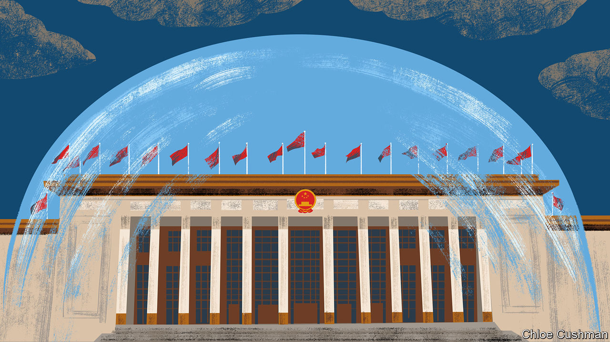

###### Chaguan

# Why China’s confidence crisis goes unfixed 

##### In 2024, to acknowledge public gloom is to doubt Xi Jinping 

 

> Mar 7th 2024 

A curious absence could be felt in Beijing this week. When the annual session of the National People’s Congress (NPC) began on March 5th, China’s unhappy people were missing. 

These are anxious, confusing times for ordinary Chinese. A once-unstoppable economy is slowing. Consumer confidence is weak. The savings of many Chinese, particularly those who own property, are losing value. Youngsters must swot into the night to enter good schools, but now struggle to find jobs when they graduate. Travel to almost any corner of China, and the same lament is heard time and again—, life’s a grind.

Yet when China’s prime minister, Li Qiang, addressed the NPC—delivering his first work report since becoming head of government last year—his tone was chilly and defensive. He did not assure his fellow Chinese that the Communist Party feels their pain. He offered no promises to millions of homebuyers who have paid for apartments that indebted property firms have yet to deliver. Rather, he boasted that last year the government had made it easier to buy homes and “ensured the delivery of housing projects”. He offered no solace to businesses still struggling after three years of pandemic lockdowns. Instead, addressing delegates in the Great Hall of the People, beneath the impassive gaze of Xi Jinping, China’s supreme leader, Mr Li praised the authorities for “a smooth transition” from the strict rules of China’s “zero-covid” regime. On the rare occasions that Mr Li did nod to the troubled national mood, it was to explain how planners can use public opinion to craft the policies that China needs. In his dry, bureaucratic words, as the government pursues this year’s economic targets, it should “foster new growth drivers in the course of solving pressing difficulties and problems that concern the people most”.

For all that China is a one-party state which stifles dissent without pity, Mr Li’s tin ear is a surprise. China’s rulers will use force to keep power if they have to. But they prefer to be aligned with what they deem to be mainstream opinion and the majority interest, because that makes controlling a large country easier. 

The party devotes vast resources to shaping and monitoring public opinion, and claims to be guided by it, too. That being so, modern prime ministers have enjoyed some licence to act as the human face of the top leadership. Mr Li’s two immediate predecessors, Li Keqiang and Wen Jiabao, were known for scolding officials or employers who abused the poor and weak. They visited scenes of disasters and, on occasion, expressed regret when government policies misfired.

Just one year ago, in Li Keqiang’s final work report to the NPC before he retired as prime minister, he admitted that many businesses and self-employed Chinese had experienced “acute distress” during the pandemic, and hailed “our people in their hundreds of millions” for making great sacrifices to help the government beat the virus. A decade earlier, in 2014, his work report struck a distinctly populist tone. He talked of slashing spending on government banquets, official cars and foreign travel, and using the proceeds “to improve people’s lives”. And he catalogued the many problems that made the Chinese public unhappy. These included issues involving “housing, food and drug safety, medical services, old-age services, education, income distribution, land expropriation and resettlement, and public order”. Jump back another decade, to Wen Jiabao’s work report in 2004, and witness his pledges to tackle such ills as unlawful detentions and “the illegal use of coercive measures” by the police. 

To be clear, the empathy of previous prime ministers did not always make much difference in practice. The same promises appear repeatedly in old work reports. In 2004 Mr Wen, known as Grandpa Wen to admirers of his folksy style, promised to “basically solve” the problem of construction companies failing to pay migrant workers on time and in full, and to achieve this within three years. The very same problem persists to this day.

Still, the public remembers previous prime ministers fondly for their candour, especially during the annual press conferences that marked the end of each NPC session. When Li Keqiang died of a heart attack last October, a wave of popular grief swept China. Mourners praised his humble origins and concern for the masses. Sensing a veiled criticism of Mr Xi’s imperious ways, police cleared away many flowers and candles left as memorials to the former prime minister, and censors deleted online tributes. Those commemorations that survived often recalled specific NPC press conferences. Some recalled Li Keqiang’s meeting with reporters in 2020, when he startled many urbanites by reminding them that some 600m Chinese still live on barely 1,000 yuan ($139) a month. Others remembered the NPC session of 2017, at which he called for an end to the “arbitrary use of government power”.

In a storm, who dares to argue with the helmsman? 

Nothing about China’s current prime minister, Li Qiang, suggests that he would use his own NPC press conference to denounce unaccountable uses of power. Since taking office he has been a model of caution and deference to Mr Xi. In any event, that question will not be resolved soon, because the prime minister’s NPC press conference has been cancelled this year, without explanation, and for several years to come.

China is in a funk. Many people lack the confidence to spend or invest, and do not quite understand what has gone wrong. Senior officials cannot acknowledge this, because power is so centralised in one man. The online reaction from Chinese netizens was harsh when Li Qiang was heard to declare in his work report: “We owe our achievements in 2023 to General Secretary Xi Jinping, who is at the helm charting the course.” In truth, lots of ordinary Chinese worry that the ship of state is drifting, rudderless. But this cannot be admitted without seeming to doubt Mr Xi, the great helmsman. In the China of 2024, that is simply not allowed. ■


