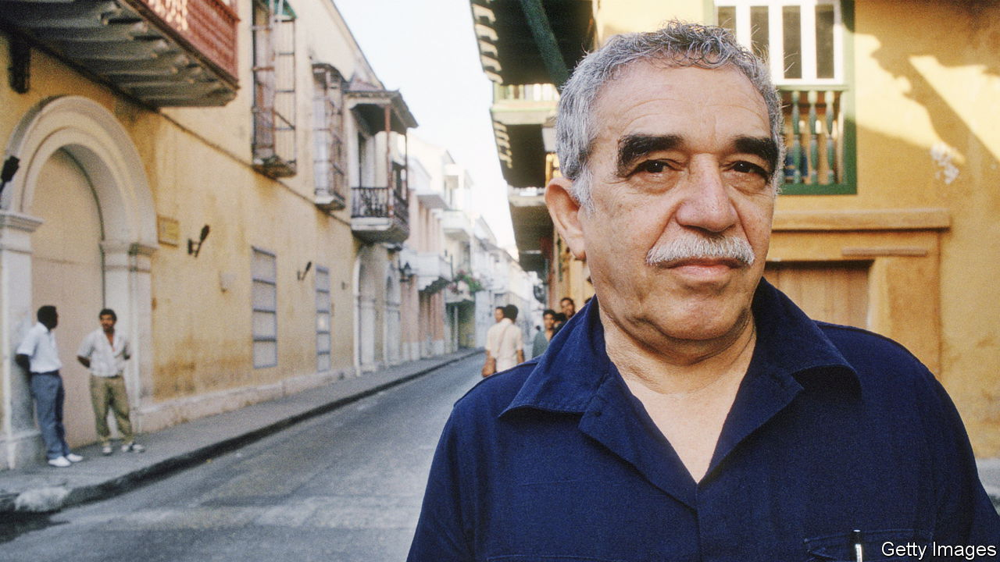

###### No solitude

# Gabriel García Márquez’s novella was published against his wishes 

##### “Until August” raises questions about authors’ consent and the literary afterlife 

 

> Mar 6th 2024 

By Gabriel García Márquez. Translated by Anne McLean. 

A seemingly happily married, middle-aged woman, Ana Magdalena Bach, makes an annual pilgrimage to an offshore island to lay a bunch of gladioli on her mother’s grave. She does this every year on August 16th, staying on the island for only one night and following the same routine, until one year she meets a stranger in the hotel bar and goes to bed with him. This, in turn, becomes a routine, with a different, random man each year, a ritual that begins as controlled but turns her inner life upside down.

She comes to realise that her marriage was sustained “by a conventional happiness that avoided disagreements in order not to stumble over them, the way people hide dirt under the rug”. Her husband, too, has been unfaithful, she discovers, but they stay together. It sounds like a conventional plot, but this slim novella is by Gabriel García Márquez, the Colombian Nobel laureate (pictured). It has been published—against his express request—to mark the tenth . 

An act of defiance of a dead person’s wishes happens to appear at the end of the novella. But is it justified in life? In a brief preface, the author’s two sons recall that their father’s judgment, as he declined into dementia, was: “This book doesn’t work. It must be destroyed.” Confessing “an act of betrayal” in deciding to publish it, they speculate that just as their father’s decline prevented him finishing the book, so it may also have prevented him realising how good it was. Are they right?

The master’s voice can certainly be heard in “Until August”. Unusually for García Márquez’s works of fiction, it is set in the present. The unidentified place is the  as nobody else can conjure it, with its blue herons, palm-fringed lagoons, squalor and sensuality, and the sea, sometimes sleepy, sometimes terrifying. (It is also the setting of his greatest works: “One Hundred Years of Solitude” and “Love in the Time of Cholera”.) It is a world peopled by silver-haired dandies in white linen suits and imperiously beautiful women crooning bolero. 

Music occupies a central place in Latin American life, as it does in both “Until August” and, by a curious coincidence, in the latest novel by Mario Vargas Llosa, García Márquez’s friend (until they fell out), who also won the literature Nobel. Mr Vargas Llosa, who is 87, has said that “Le Dedico Mi Silencio” (“I Give You My Silence”) will be his last book. 

García Márquez sketches the complicated complicities and compulsions of love and sex, his favourite subject matter. With his precise, vivid prose, beautifully translated into English, García Márquez creates an atmosphere as few other writers can. But here he does not do as much with it as he might have in his prime. García Márquez worked intermittently on the text of “Until August”, which was originally conceived as a long novel, over many years. He published two fragments in magazines. But despite several drafts, he was unable to finish the slimmed-down story to his satisfaction before he died.

Whether a dead author’s wishes regarding unpublished material should always be respected is a vexed question. Few today would quibble with the decision of Max Brod, ’s friend and literary executor, to publish “The Trial” and “The Castle” against the writer’s instructions. More questionable were the actions of Ernest Hemingway’s publishers in marketing four works assembled from unfinished material, some many years after the author’s death. “You think something is in shape to be published or you don’t, and Hemingway didn’t,” complained , an American writer, speaking for many creators.

García Márquez’s Spanish editor, Cristóbal Pera, claims to have hewed closely to the original, approaching it as a “restorer facing a great master’s canvas”. Diehard fans will rejoice at this posthumous bonus track. But others will find it hard to banish a slight queasiness—much as Ana Magdalena Bach felt on the return ferry from the island—at the commercial opportunism surrounding its publication. ■


