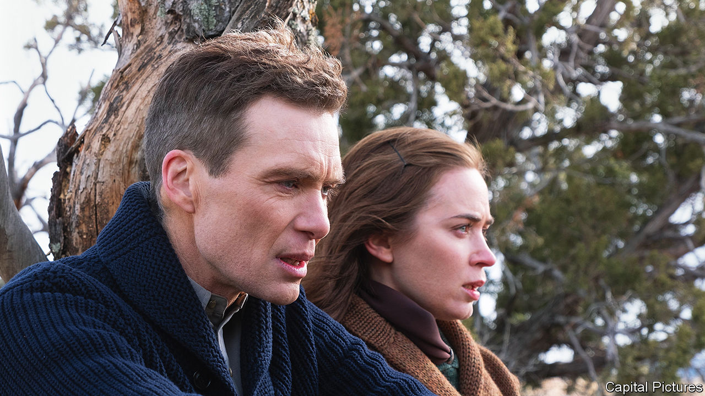

###### Back Story

# Infatuation, kids, adultery: marriage is the theme of the Oscars 

##### Together the nominees sketch a composite picture of marriage. Here it is 

 

> Mar 7th 2024 

Immediately, you know. You meet a famous physicist at a party in California and ask him to explain quantum mechanics. As he describes the “forces of attraction” between particles, your fingers interlace with his, and you know he is talking about you. Or you are a musical , whimsically playing the piano at a soirée in New York. A young woman approaches and—wham! You know she is your destiny.

At least it can work like that in the movies. Ostensibly, the nominees for Best Picture at the Oscars on March 10th have themes ranging from nuclear physics in “” (pictured), to Leonard Bernstein’s music in “”, to the  and migration. They span biopic, comedy, courtroom drama and fantasy. But at the heart of most is a marriage story. Together they sketch a composite picture of marriage as it is seen today—giving you a couple’s-eye view of this most intimate relationship.

Similarity and difference, need and admiration: the forces of attraction between people are paradoxical. In “Past Lives”, you meet a Korean-born writer at an artists’ residence on Long Island and find you and she like the same books. In “Killers of the Flower Moon”, you are steered towards a rich Native American woman by your villainous white uncle. Yet you love her sincerely for her frankness and sly humour. In the first flush of infatuation, you are each other’s worlds. 

After the knot is tied, though, life isn’t all galloping on horseback in New Mexico (as the lovers do in “Oppenheimer”). You have ambitions, and, initially, marriage helps to power them. You share and revel in each other’s successes. When your husband detonates the world’s first atom bomb, he lets you know in a cryptic message. “We’re living how we dreamed we would,” your wife exults in “The Zone of Interest”. She cherishes your house and garden, which abut the wall of Auschwitz, where you are commandant.

But if marriage can fuel ambition and achievement, it can also be scorched by them. That may be especially true if, as in “Anatomy of a Fall”, you are a feted woman and he is a thwarted man. Once you felt the atmosphere change when he entered a room. Now he is 40, unfulfilled, and needs an alibi for his failures. In “Poor Things”, you are young and adventurous, but the men around you are stiflingly possessive. Sure, you are an oversexed, reanimated corpse, but your plight is familiar.

Then there are the interlopers in your marriage: the children. You adore them, they are a delight, but if there is a crack in your relationship, they will find it. And they are exhausting. In “Zone”, you must read them bedtime stories after a hard day of mass murder. In “Oppenheimer”, genius and infants don’t mix; knowing you are “selfish, awful people”, you ask friends to take in the baby. If something bad befalls a child, as it does in “Anatomy”, you may never forgive yourselves, or each other.

Perhaps you seek solace in another’s arms (like love at first sight, adultery is over-represented in cinema). In both “Maestro” and “”, a satire of publishing, the sneaking around scars the kids as well as the betrayed spouse. In “Past Lives”, you are gaming on the sofa when your wife returns from a day out with her childhood sweetheart. Visiting from Seoul, he is an emissary from a life without you. “It’s not like you’re gonna run away with him,” you say, joking, but not really. “Are you?”

So you drift apart. Secrets and grievances accumulate. Foibles that you once overlooked come to seem intolerable. You bicker over chores and child care, petty rows that are a form of mourning for the alternative lives you never lived; for the subsuming of your solo self into this wearying double act. As you put it in “Anatomy”, a couple can become “kind of a chaos”, in which you fight one another as well as taking on the world.

In that film, the result might—or might not—be murder. If you are saved, it is through honesty, with each other and yourself. In “Maestro”, your wife concedes that she wanted more of your attention than she admitted. After you confess in “Killers”, your beloved almost forgives your role in the slaying of her relatives. In “Past Lives”, you see that the past is real but gone. The old flame leaves; you hold your wife as she cries.

With luck, you conclude that your choice was right all along. Attuned to your spouse’s moods, indulgent of their failings, you are there for their ultimate triumphs—a rapturous symphony, a presidential medal. By now, as the physicist puts it in “Oppenheimer”, you have “walked through fire together”. You are married until the bittersweet end.■

“


