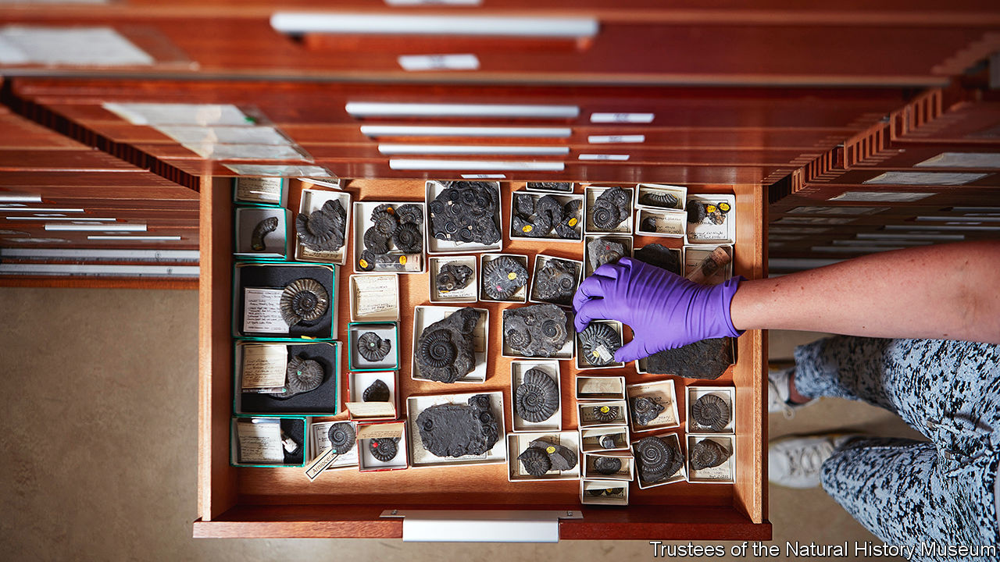

###### What’s in store?

# Museums have a hoarding problem 

##### Museums’ moves highlight how little of their collections are actually on view 

 

> Mar 7th 2024 

BENEATH THE gothic main hall of the Natural History Museum (NHM) in London is a labyrinth of curiosities. Only a tiny fraction of the museum’s collection is on display—around 40,000 objects out of some 80m. Much is consigned to the dim, crowded basement. Here is a tortoise once owned by ; there are hundreds of jars of giant fish and thousands of rare shells.

“We’ve outgrown this space,” says Clare Valentine, head of NHM’s life-sciences collection. (In addition to the basement, the nhm also relies on storerooms in undisclosed sites.) Many museums have a hoarding problem. The British Museum exhibits just 1% of its treasures; the Smithsonian National Museum of Natural History in Washington, DC, only 0.007%. In storage treasures are usually protected, but the old vaults are dangerously full. 

One solution is to move house. The NHM is undertaking the world’s biggest relocation of a collection, as 28m objects are shifted to a new centre in Reading. If you think packing up crockery and old photographs is tricky, imagine moving taxidermy: the bears, giraffes and lions require fibreglass moulds to protect their fur, as well as bespoke wooden frames. On arrival, they will be frozen for three days before being transferred into pristine, sanitised rooms. Ms Valentine reckons the whole move will take seven years. 

The British Museum has already shifted some of its large sculptures and mosaics to a new storage centre, also in Reading. The Victoria and Albert Museum, Science Museum and Ashmolean Museum have been ferrying objects to fresh buildings, too. In France curators at the National Museum of Natural History in Paris are grumbling over a plan to move their collection to Dijon. Across the Atlantic, the MIT Museum is in the final stages of shifting 1.5m objects.

Moving may be stressful, but it can also afford the chance to rediscover, reassess and reorganise possessions. The  of Art in New York admitted that its curator of Islamic art had never seen its collection of Persian rugs because they are trapped at the back of a storeroom. 

And if no one knows what items are there, it can take a while to notice if some go missing. Last year it was revealed that a light-fingered curator had stolen up to 2,000 objects from  and sold some of them on eBay. Wales’s seven national museums are missing 2,000 artefacts; the Imperial War Museum in London more than 500.

Some institutions might never miss the odd coin or pottery fragment. Catalogues of goods are outdated and incomplete even at the most august museums. Teams employed to fill inventories are dwindling: the number of staff at the NHM has almost doubled in the past 50 years, but the proportion caring for and researching collections has dropped from 55% to 15%. With the current staff, the NHM reckons it would take 172 years to catalogue everything. But a new team, brought in for the move, will create a detailed database to register the relocated objects.

Modern buildings will shrink to-do lists in other ways. At one museum in Britain, a curator spends half their time checking that objects have not been infested with bugs. New facilities, by comparison, are climate-controlled and have quarantine zones to protect artefacts from pests.

For some, elaborate new storage facilities amount to window dressing. Museums are keeping too much, says Christopher Marinello, an art lawyer. He thinks the objects that are not on display should be donated or sold. The Indianapolis Museum of Art used a ranking system to get rid of a fifth of its collection. Objects were given a score from “A” to “D” (denoting a scale from “rare” to “inferior”) and stowed, sold or scrapped. 

This sort of exercise could work for any collection. But it helps if objects are attractive in the first place. Selling a pickled fish is harder than a painting. For now, the priority for many museums is getting treasures to safer, more spacious ground. ■


