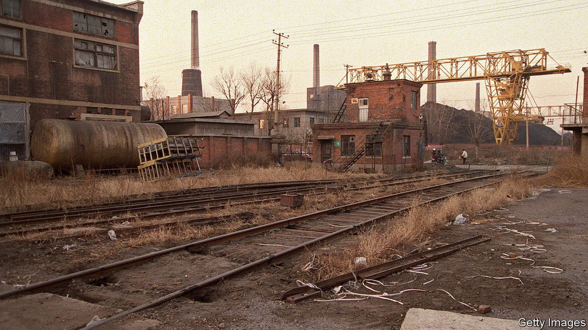

###### Hillbilly elegies

# Stories about the Dongbei rust belt are resonant in China 

##### Noirish books, films and TV shows depicting hardship are popular 

 

> Mar 7th 2024 

IT DOES NOT sound like an easy place to live. Scorched cars litter a desolate landscape. The city’s factories are struggling; workers are being laid off in droves. Worst of all, a serial killer is sowing terror. 

“Moses on the Plain”, a novella of 2016 by Shuang Xuetao, offers an unsparing portrait of life in China’s industrial north-east in the 1990s. It inspired a film adaptation in 2021 and a television series in 2023. (It has also been translated into English in a collection called “Rouge Street”.) In its various formats, the story is part of a phenomenon called the “Dongbei renaissance”. Dongbei is a collective term for China’s rust belt: the provinces of Heilongjiang, Jilin and Liaoning. The region, once known in the West as Manchuria, has become a byword for urban decay. Yet precisely because of that, it is pushing to the forefront of Chinese popular culture. 

The provinces were once the country’s main manufacturing hub. In the 1950s a third of China’s biggest industrial projects originated there; workers enjoyed job security and good wages. But in the 1980s economic reforms broke the region’s monopoly on production; state-run outfits downsized to make way for private firms. Mass redundancies followed in the 1990s. In 2001 8.3% of the north-east’s labour force was unemployed. 

Many Dongbei storytellers witnessed these ruptures firsthand. Mr Shuang, Ban Yu and Zheng Zhi, the genre’s most prominent novelists, all grew up in Liaoning and have chosen disaffected workers as protagonists. Their stories focus on hardscrabble lives shaped by crime, poverty and unrest. Mr Zheng has adapted one of his own novels about the murder of teenage girls into a television series, “Nobody Knows” (2022). Last year “The Long Season”, a drama about a murder case, was hugely popular. “The fascinating part of the story,” said one reviewer on Douban, a website, is “the destiny of factories and the north-east.” 

The trend echoes the rise of Hollywood noir in the mid-20th century, which evoked Americans’ anxieties in the wake of the Great Depression. As Kevin Grant, a film historian, has noted, the genre was characterised by its “misanthropic ethos and strong sense of fatalism; persistent motifs including entrapment and inescapability, treachery and retribution”. 

Dongbei fiction also articulates wider concerns about the social and economic malaise that millions of Chinese are experiencing. Characters are listless; some find solace in the bottle. Family relations are strained. In this way, the stories also share themes with , a memoir of growing up in a depressed steel town in Ohio by J.D. Vance, who elegised his way into the US Senate.

Though set in the past, these tales resonate today. Decades later, people in Dongbei still struggle. It has the lowest birth rate of any region in China. The north-east’s GDP accounted for only 5% of the country’s total in 2023, compared with 13% on the eve of reform in 1978. And China’s whole economy is slowing, with a  and shrinking consumer demand. Youngsters are disillusioned: the youth-unemployment rate in cities reached a record high of 21% last June. “We have started to understand losers,” Huang Ping, a professor at East China Normal University, has said.

Mr Ban has suggested that literature offers a way to “look back and reflect on the trauma people might have experienced”. Recently a bookshop in Quanzhou, in the south-eastern province of Fujian, hosted an event dedicated to the genre. “We hope to use reading to battle forgetting,” the flyers read. For many Chinese, the things depicted in the pages of books are not distant memories but vivid and realistic.

Dongbei stories are very different in tone, therefore, to those set in present-day China, which are often upbeat and embody the positivity and national pride demanded by Xi Jinping. Yet censors have left books and shows about the travails of Dongbei alone, perhaps because the government has also talked publicly for years about the . The Dongbei renaissance draws attention to places left behind by the nation’s rise but also points to demand for  accounts of the real China. ■


