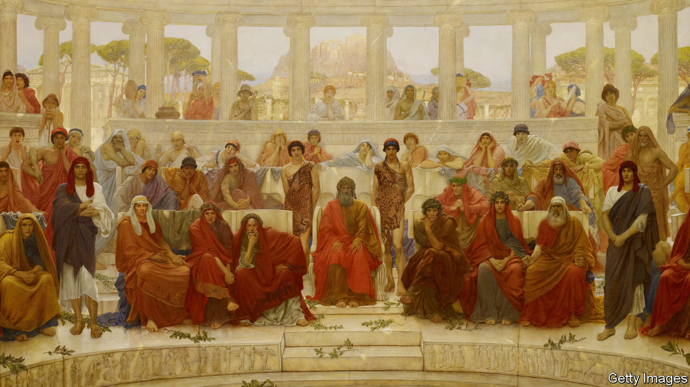

###### And you call yourself civilised?

# The history of the West is not quite what you learned in school 

##### Josephine Quinn’s new book re-examines what people think they know about civilisations 

 

> Mar 1st 2024 

By Josephine Quinn. 

Asked what he thought of Western civilisation,  is said to have quipped that such a thing “would be a good idea”. (The West, he suggested, was not so enlightened.) But as Josephine Quinn makes clear in her new book, Western civilisation has always been a bad idea, or at any rate a wrong-headed one. To compartmentalise history into a set of distinct and essentially self-contained civilisations is a misguided quest that has dangerously distorted our understanding of the world, Ms Quinn asserts: “It is not peoples that make history, but people, and the connections that they create with one another.”

Ms Quinn, a historian and archaeologist who teaches at Oxford, does not spend 500-odd pages trashing what generations of schoolchildren have been taught to take pride in as European achievements. Instead, she demolishes the underlying concept of what she calls “civilisational thinking”. Her argument is simple, persuasive and deserving of attention. 

The idea of civilisation, Ms Quinn points out, is relatively recent. The word was first used only in the mid-18th century and did not take hold of Western imaginations until the late 19th century. In that imperialist age, historians found that Greek, Roman and Christian civilisations made nice building blocks that could be stacked into a grand-looking construct, which they labelled “Western” or “European” civilisation. To this they attributed a host of inherited “classical” virtues: vigour, rationality, justice, democracy and courage to experiment and explore. Other civilisations, by contrast, were regarded as inferior. 

It does not take much unpacking by Ms Quinn to expose the folly of this approach. Behold, for instance, , a philosopher in the 19th century, claiming that the Battle of Marathon, Persia’s first invasion of Greece in 490BC, was more important to English history than William the Conqueror’s triumph at Hastings in 1066. (Without an Athenian victory, the logic goes, the magical seed of Greek civilisation might never have grown into Western civilisation.) Or consider “The Clash of Civilisations” (1996) by Samuel Huntington, an American historian, who declared it impossible to understand history without classifying humanity into mutually hostile civilisations between which, “during most of human existence”, contact has been “intermittent or non-existent”.

What is non-existent is any truth to that notion. Ms Quinn’s brisk, scholarly romp across the arc of European history shows that, far from being rare, contact across and between cultures, often over surprisingly long distances, has been the main motor of human advancement in every age. Rather than being prickly and inward-looking, most societies have proved receptive to ideas, fashions and technologies from their neighbours. 

Ancient Greece, for example, was less a place of origins than of transmission from Egyptian, Sumerian, Assyrian and Phoenician cultures, which themselves had mixed and exchanged ideas. And rather than being the wellspring of democracy, Athens was “something of a latecomer” to a form of governance that appears to have been first tried in Libya and on the islands of Samos and Chios. Persians, eternally cast as Greeks’ polar opposites, actually imposed democracy on the Greek cities they ruled, suggesting “considerable Persian faith in popular support for their own hegemony”, Ms Quinn notes.

This retelling of the West’s story scintillates with its focus on the unexpected and on the interstices between realms and eras rather than on history’s big, solid bits. But it is also an admirable work of scholarship. Ms Quinn’s 100-plus pages of footnotes reveal that she relied not only on a wide range of primary sources, but also on scientific studies on climate change and very recent archaeological research. 

Even seasoned history buffs will find much that is new and fascinating. “How the World Made the West” joins a growing sub-canon of works that explores the broad sweep of history using new intellectual framings, such as Yuval Noah Harari’s “Sapiens” (2011), Peter Frankopan’s  (2015) and “Fall of Civilisations”, a forthcoming book by Paul Cooper, a British journalist, based on his popular podcast. Anyone who thought history was passé could not be more wrong. ■


