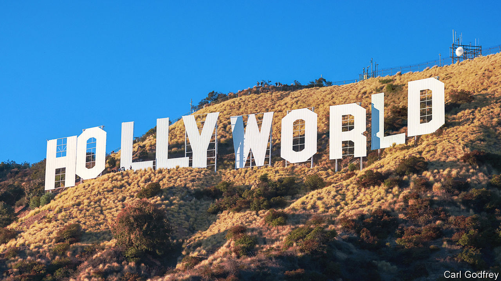

###### Zones of interest

# Whoever gets the Best Picture Oscar, international films are winning 

##### Hollywood’s growing love of foreign films says a lot about the insular industry 

 

> Mar 7th 2024 

“The Oscars are not an international film festival. They’re very local,” Bong Joon-ho, the director of “Parasite”, a South Korean film, declared in 2019. “Parasite” went on to win four Oscars, , in 2020. It was the first time a foreign-language film took Hollywood’s top prize, breaking what Mr Bong called the “one-inch-tall barrier of subtitles”. 

Films made outside America are often relegated to the Best International Feature category (known as Best Foreign-Language Film until 2020) and have been nominated for the top award only 14 times since “Z”, a French-Algerian film, made the shortlist in 1970. (To be considered “international”, a film must be produced outside America and have more than half its dialogue in a language other than English.) In the 2010s foreign films were nominated for an Oscar fewer than six times each year on average, but since 2020 there have been around 15 nominations a year (see chart).


This year’s winners will be announced at a live ceremony on March 10th; the nominees are the most international yet. For the first time, two of the ten Best Picture contenders are foreign features: “Anatomy of a Fall” and “”. (Their directors are also both nominated for Best Director, first won by an international film in 2019.) A third, “Past Lives”, is an American production but mostly in Korean. Nearly half of this year’s nominees across all categories are not American, including directors of four of the ten films up for Best Picture. 

The rising profile of international and foreign-language films at the Oscars is the start of an overdue correction to Hollywood’s incestuousness and inflated self-image. It is also one of the most important—but least discussed—consequences of the ceremony’s parent organisation, the American Academy of Motion Picture Arts and Sciences, trying to become more diverse and global.

That process began in 2015 with a hashtag, , which was coined by an activist after all 20 nominated actors were white. It struck a chord with a public energised by the first Black Lives Matter protests. The Academy has long favoured well-connected, older men in need of extra-strength sun cream. In 2015 the Academy’s membership was estimated to be 92% white and 75% male.

Eager to deflect negative publicity, the Academy took steps to move beyond the demographics of the 90210 postcode. (It also instituted a controversial set of diversity requirements for films to be eligible for Best Picture; in some cases 30% of minor roles must be filled with actors from at least two under-represented groups.) The Academy’s governors weeded out inactive voters and invited a greater diversity of film-makers to join. Membership has since grown from around 6,000 in 2014 to more than 10,800 today. The share of members from under-represented races and ethnicities has doubled, and nearly a fifth of them now live outside America. 

“The Academy as a voting body is less invested in Hollywood as a place and as a centre of the industry,” says Michael Schulman, author of “Oscar Wars”, a book about the history of the Academy Awards. Louis Mayer, who co-founded the Academy in 1927, would probably not approve, since the trade group was partially intended to shore up American film companies beset by labour troubles and to “project their image” worldwide, he says. 

After #OscarsSoWhite, the look and feel of a Best Picture film began to change. Last year Stephen Spielberg’s “The Fablemans”, a story about a young film-maker that is the kind of thing Hollywood has always favoured, was bested by, a film marketed as a breakthrough in the representation of Asians on screen. The message is clear: the Academy does not look like it used to—and does not think like it, either.

Many Hollywood films feel “foreign” to the non-Americans who are voting. Hence the supposed snub of the director of “”, Greta Gerwig, an American who was not nominated for Best Director. A similar explanation has been offered for why a former American favourite, Alexander Payne, was passed over for “The Holdovers”, set at a boarding school in New England. The swing towards non-American films has been most marked in the documentary category; for the first time not a single American production was nominated for Best Documentary Feature Film. 

 


Changing tastes may please arthouse habitués. But some think that the Academy does itself no favours when it crowns foreign, independent and niche films like those that have started winning Best Picture. If the Oscars stay on this course, “it’ll be some version of BAFTA,” predicts one veteran film publicist, referring to the British Academy of Film and Television Arts, whose annual ceremony is watched mainly by film aficionados. Viewership of the Oscars has been on a downward trend for 20 years. Whereas some 57m people watched when “” was up against “LA Confidential” in 1998, only around 19m tuned in to the Academy Awards in 2023. Compare that with the Super Bowl, which 83.7m Americans watched in 2023, about 30% more than in 1998.

Academy members pride themselves on the Oscars’ artistic bona fides, and research suggests that the awards are an incentive for studios to make serious movies that might not otherwise be commercially viable. “All those people who want to make money want to be in the front row and thanked from the stage,” says one Oscar-winning producer.

But the divide between Oscar-winners and Oscar-watchers can only be so wide. “Would you watch the Super Bowl if you had never heard of the two teams that were playing?” Gabriel Rossman, a sociologist at the University of California, Los Angeles, asks. He argues that, “From the perspective of maximising the long-term value of the Oscars brand, these micro-budget films are essentially parasitic. They draw fame from the Oscars without contributing fame.” 

Unlike American football, however, Hollywood relies on audiences outside America for profits. As streaming breaks down national borders, and audiences get used to reading subtitles, the film industry is only becoming more global. “All films are international films today,” says Tatiana Detlofson, a publicist for foreign productions. However, she notes that the international titles lucky enough to be nominated for Best Picture have major distribution deals in America and marketing budgets much larger than average. Nominees also tend to be from western Europe.

A tour de force

The Academy’s boss, Bill Kramer, plans to push international expansion further. Already it has evolved into much more than a Hollywood trade association and annual awards ceremony. In 2021 it opened a museum in Los Angeles, designed by Renzo Piano, an Italian architect, that cost nearly $500m to build, and has established training programmes for young film-makers. It has built up net assets of $844m, including substantial property holdings. 

The Academy has started to look a lot more like a university, observes Walt Hickey, who wrote the book “”. As “everything that isn’t a ball-based sport shrivels and dies on American terrestrial television”, the Academy is trying to future-proof itself against further disruption to broadcast media.

, a film about the father of the nuclear bomb directed by Christopher Nolan, a Brit who lives in Hollywood, is poised to win Best Picture. But even if the Academy finally hands Mr Nolan a well-deserved victory, and traditionalists sigh with relief, it is impossible to ignore all the new faces that may soon admire themselves in the gold-plated, eight-and-a-half pound statuettes. No matter who takes home an Oscar this year, and whether they say “thank you”, “danke” or “merci”, international cinema has already won. ■

