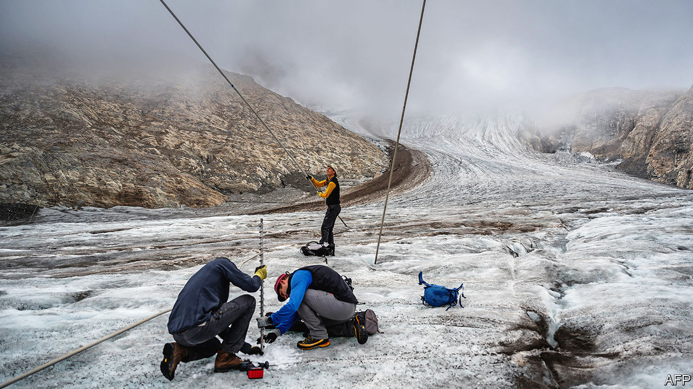

###### Climate change

# Europe’s new-look winter: floods, high sea levels and melting glaciers 

##### People are seeing extreme weather in action, but not voting to stop it 

 

> Mar 4th 2024 

MARK HARBERS has arguably the most important job in the Netherlands. As minister of infrastructure, he is responsible for making sure the enormous dykes and floodgates meant to protect the country against rising sea levels get built. This winter has made it clear how crucial that job will be. In early January there were high-water alerts all over the country. At Marken, an old fishing village north of Amsterdam, waves lapped just a couple of metres from the top of the dyke—well above the floors of the houses behind it. The Markermeer, part of a bay that splits the northern Netherlands down its middle, reached its highest level ever, 45cm above the national benchmark known as Normal Amsterdam Level.

The problem, Mr Harbers explains, was “a combination of three factors”: rain inside the country, rain elsewhere in Europe, and unlucky winds. The Netherlands forms the delta of the Rhine river, which drains much of Germany. Weeks’ worth of rain in central Europe was flowing north and building up in the Markermeer and the IJsselmeer (another bay), which are separated from the North Sea by dykes. The dykes’ spillways can only vent water when the sea is lower than the bays. But storm winds from the north were keeping the sea too high. As the water backed up, the authorities who run the country’s vast canal network opened locks, flooding farmland to disperse the load. Within days the waters ebbed.

The longer-term issue, of course, is climate change. The North Sea has risen about 19cm since 1900, and the rate has increased from about 1.7mm per year to about 2.7mm since the 1990s. This makes it ever harder for riverwater to flow into the sea. With a quarter of their country lying below sea level, one might think that Dutch voters would be exceptionally worried by global warming and choose parties that strive to end carbon emissions. Yet in a general election last November they gave first place to a hard-right candidate, , who wants to put global climate accords “through the shredder”. Mr Wilders’s party got 23.5% of the vote; a combined Green-Labour list got just 16%.

All across Europe this winter, as the effects of climate change grow starker, the parties that want to do something about it are getting hammered. In Germany, where the floodwaters hit first, the Green party’s popularity has plunged. Portugal’s Algarve is parched by drought, but with elections due on March 10th polls show the green-friendly left running well behind the centre- and far right. Southern Spain has declared a drought emergency, yet the pro-green Socialist-led government is teetering. Snowless ski resorts in Italy have done nothing for the fortunes of environmentalist parties; Italy’s Green party is polling at around 4%. In winter the Swiss Alps appear on heat-anomaly maps of Europe as a streak of red, 3°C above historical averages. But the hard-right Swiss People’s Party (SVP), the biggest in parliament, won even more seats in an election last autumn, while the Greens shrank.

It is not that Europeans have stopped caring about the climate. In a special Eurobarometer survey last summer they rated it the third-most important problem in the world, behind food security and armed conflict. Dutch citizens rated it the most important by far. A few months later they voted for Mr Wilders. Why the disconnect?

To some extent the problem is that partisanship outweighs evidence. Political scientists find that experiencing extreme weather events makes people more likely to support green policies—but not by much. In one study of thousands of Germans before and after , those who had been within a kilometre of a flood were a bit more likely to want to fight climate change. A study in Britain by Tobias Rüttenauer of University College London got similar results for both floods and heat waves. But as with Hurricane Katrina in America in 2005, the reaction faded with time, and there was little or no effect on convinced sceptics.

Another reason many Europeans’ reactions to extreme weather are muted is that their governments have done a decent job of protecting them so far. The Netherlands’ independent flood-control authority, the Delta Fund, lays out targets and budgets on a timescale of decades. It plans to spend between €15.7bn and €32.9bn ($17bn to $35.7bn) up to 2050 to upgrade 2,000km of dykes. A report last year said the country could in principle cope with three metres of sea-level rise, though it would require vast new infrastructure. “Water protection is anchored in the DNA of Dutch people and politicians,” says Mr Harbers. Even Mr Wilders does not deny climate change is happening; he just thinks the Netherlands should address it by raising its dykes.

For other Europeans, the consequences of climate-friendly policies for their pocketbooks are simply too dire. Germany’s Greens began to slide when they introduced an expensive mandatory heat-pump plan for homeowners, even as energy prices were skyrocketing; they are now polling at just 14%. For months,  have besieged Brussels with their tractors in an effort to roll back environmental measures included in the EU’s Green New Deal that eventually succeeded. Meanwhile, in Switzerland last year efforts to pass a climate law by referendum were opposed by a group one might expect to understand the threat of the Alps’ vanishing snow: hotel owners.

The Swiss climate referendum, which set a target of zero net emissions of greenhouse gases by 2050, was the country’s second try. A tougher version was voted down in 2020. The new one had fewer taxes and emphasised renewable energy and carbon offsets, and it passed comfortably. Supporters “put together a huge coalition”, says Artan Islamaj of Libero, a liberal activist group that backed the bill. The restaurant and hotel owners’ association was the only lobby that uniformly opposed it, and the SVP the only political party; both said it threatened energy security.

Hoteliers’ opposition at first seems mystifying. Climate change is an existential issue for the Alps’ $30bn-a-year . If global warming reaches 2°C above pre-industrial levels, more than half the ski resorts in Europe would risk having every year look like their worst years from 1961-90, one study found. The region’s glaciers are losing mass at a rate that leaves scientists dumbfounded; in the past two years “all the previous records were shattered,” says Matthias Huss, an expert at the ETH-Zurich university.

But for resort owners, climate change is simply something to cope with. Slowing it is beyond their control. One reason they might oppose expensive green-energy plans is that their ski lifts and snow-making machines make them vulnerable to high electricity prices. Aletsch Arena, a Swiss ski complex, bans cars and private snowmobiles and uses green hydropower from a nearby dam, but not all resorts have those options. Its owners hope their high altitude will protect them, since slopes above 2,000m are expected to have decent snow cover until at least the end of the century. 

Yet climate change is a huge threat to the resort’s other attraction: the Great Aletsch glacier, the biggest in continental Europe, a river of ice 22km long and 800m deep. Martin Nellen has been leading tours on the glacier for 45 years. When he started he could step directly from the ice surface into a mountain cabin where his groups eat lunch. Now that requires climbing a 460-step staircase. The Great Aletsch could lose half its mass by 2100. A bit of a mystic, Mr Nellen says he “used to talk to the glacier, and it would tell me ‘we don’t need you, but you need us’...Now, to see it melting, it’s really sad.”

One reason climate change is politically difficult is that it happens so slowly. Few Europeans have watched its effects over decades, as Mr Nellen has. Another is that it is so dispersed that no one country can affect it much. The Great Aletsch glacier flows south into the Rhone river, but on the far side of the ridge on its northern edge, snow melt flows north into the Rhine, beginning its 1,230km journey to the Netherlands. Dutch voters cannot control the choices Swiss ones make about climate change, and vice versa. But they will both have to deal with their consequences. ■


