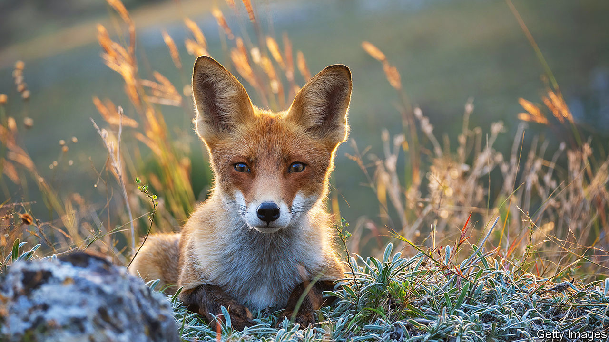

###### On the wild side

# Ukraine’s animals are also victims of the war 

##### Though foxes have thrived 

 

> Mar 7th 2024 

The war in Ukraine, now two years old, has affected animals as well as humans—but not equally. Military activity is almost certainly responsible for the deaths of tens of thousands of Black Sea dolphins; but Ukraine’s ban on wartime hunting has been good for foxes, whose numbers have exploded. The war has also caused untold ecological damage. Forests and steppe have burned and land and water have been contaminated by explosives and chemicals. At the beginning of this year the Ukrainian government claimed that the war had already caused some $56bn of damage to the country’s environment. 

Two years ago, as millions of Ukrainians fled, it seemed that theirs was the first exodus in history in which so many were accompanied by their pets. Heart-warming stories of how cute cats were saved from bombed-out tower blocks leavened the period’s grim journalistic fare. But, not surprisingly, when so many humans are being killed, the fate of Ukraine’s wildlife has gathered scant attention. 


The war’s effect on dolphins has been especially awful. Ivan Rusev, scientific director of the Tuzly Lagoons National Nature Park in Bessarabia, in the south-west, says that soon after the invasion began two years ago dead dolphins began washing up on the park’s beaches. Extrapolating from various sources of information, he believes that 50,000 dolphins died in 2022. He says he is “99% certain” that tests will confirm that the primary cause of death was Russian naval sonar, which “blinded” them, making it hard for them to hunt and prone to infection. Explosions and burns from white phosphorous bombs killed others. Last year, after the Russian navy had been driven back from the western Black Sea, the number of dead dolphins dropped drastically. 

On a cold morning in woods near the small town of Kvitneve, 100km west of Kyiv, 16 hunters pay silent homage to members of their fraternity who have fallen at the front. Then they fan out in search of foxes to shoot. Ever since the full-scale invasion began, hunting, with very few exceptions, has been prohibited in Ukraine. Today the group have a rare permit and have been called out by villagers angered by marauding foxes which have been stealing their chickens and biting their dogs. 

Viktor Chervonyi, the president of Ukraine’s hunting association, believes that thanks to the hunting ban, the country’s fox population has leaped from an estimated 200,000 two years ago to 500,000 or more now. As a result, he says, and also thanks to the fact that the war has prevented the normal distribution of edible rabies vaccines, which are often dropped from the air for animals to eat, the number of people bitten by foxes and feral dogs that have caught rabies has surged. In the first nine months of last year 40% more people than the year before sought post-bite rabies inoculations. 

Ukraine’s much smaller wolf and racoon-dog populations are also soaring. Increasing wild-boar numbers have led in turn to more cases of African swine fever, so local pigs have to be culled wherever it is detected. In the east, in ruined villages, abandoned dogs are hunting in packs, killing foxes and boars and spreading diseases they catch from them. ■


