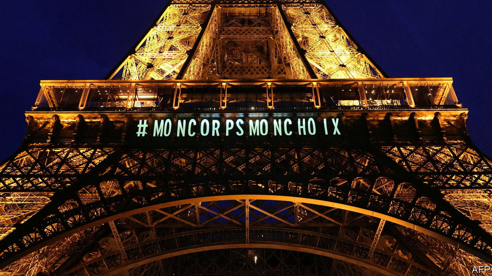
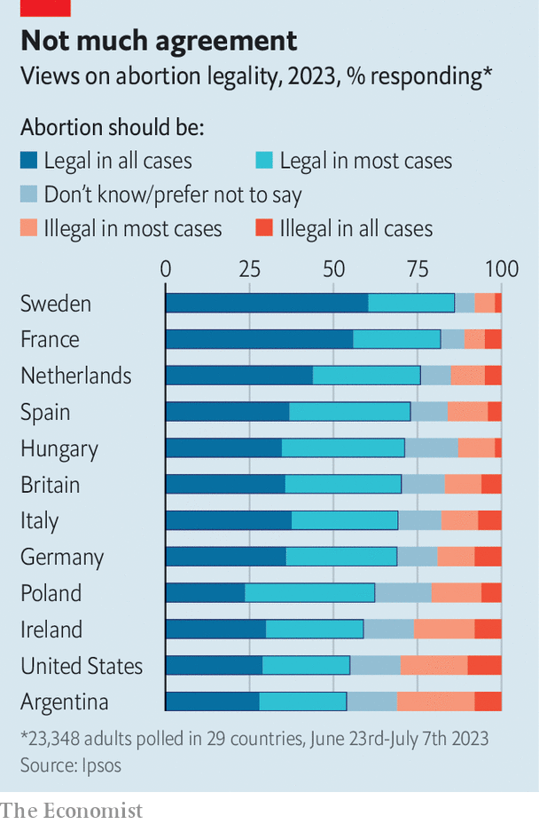

###### Abortion rules

# Why France has made abortion a constitutional right 

##### Lessons from America and Poland 

 

> Mar 5th 2024 

France, which signed the declaration of the rights of man in 1789, has not traditionally been at the forefront of securing the rights of women. They had to wait until 1944 to win the vote, 16 years after British women. France legalised abortion only in 1975. On March 4th, however, when the French parliament voted to make abortion a constitutional right, it became the first country to do so explicitly. “The place of women has changed because France has changed,” declared Yaël Braun-Pivet, the first female head of the National Assembly, who presided over the vote. That evening the Eiffel Tower was lit up with the words “My body, my choice”.

The overwhelming vote by French legislators, who backed the constitutional revision by 780 votes in favour to just 72 against, was a rare moment of cross-party unity. Pushed initially by the left-wing opposition, it last week secured unexpected backing in the Senate, which is controlled by the opposition on the right. The justice minister, Eric Dupond-Moretti, spent hours there trying to win over senators. Emmanuel Macron, the centrist French president, then seized the chance to send the revision days later to a joint sitting of the lower and upper houses in Versailles, where a three-fifths majority is needed to revise the constitution. That threshold was passed by a big margin.

 


Some French legislators, including the head of the Senate, Gérard Larcher, had argued that it was unnecessary to enshrine the right to abortion in the constitution, since it was already protected by law. The constitution, argued Mr Larcher, was not a “catalogue” of social rights. There was no imminent threat to those rights. Moreover, the French are among the strongest supporters of the legal right to abortion, with 82% in favour, far ahead of the 63% in Poland and 55% in America (see chart).

But French lawmakers on the left in particular had worried about how to protect the right to abortion from any future attempt to roll it back, particularly after America’s Supreme Court in 2022 overturned the longstanding ruling that barred the states from banning abortion there. Poland’s nationalist government severely restricted abortion in 2020. In France campaigners look ahead with trepidation to the next presidential election, in 2027, and the possibility of a hard-right victory. Although Marine Le Pen, the nationalist leader, does not campaign against the right to abortion and backed the constitutional revision this week, 42 of her 87 fellow deputies voted against, abstained or did not take part. Unveiling the proposal last year, Mr Macron said that he wanted to make sure that the right was “irreversible”.

Many French legislators this week made a further point: that the vote was a message of support to women elsewhere. It was a campaign “for those who resist Trump, Bolsonaro, Orban, Milei, Putin, Giorgia Meloni”, declared Laurence Rossignol, a Socialist senator who had lobbied for the revision, to a cross-party standing ovation. For Mr Macron, who runs an unpopular minority government that has recently veered to the right on immigration, it is also a way to shore up support on the left—and, for once, win the momentary approval of the majority of the French. ■


