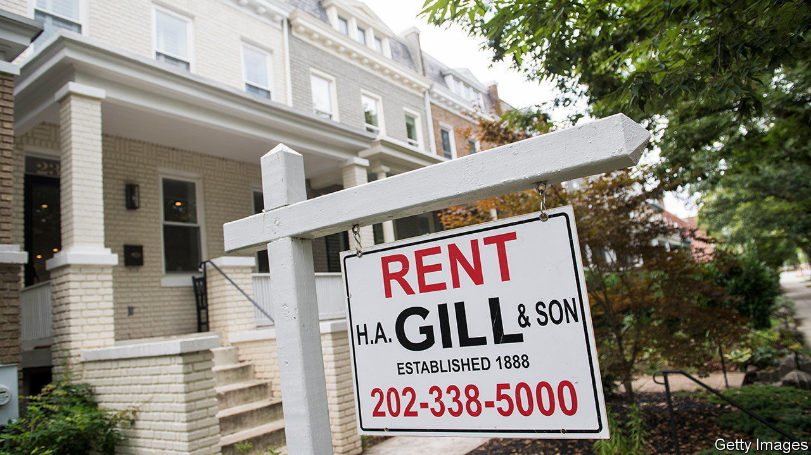
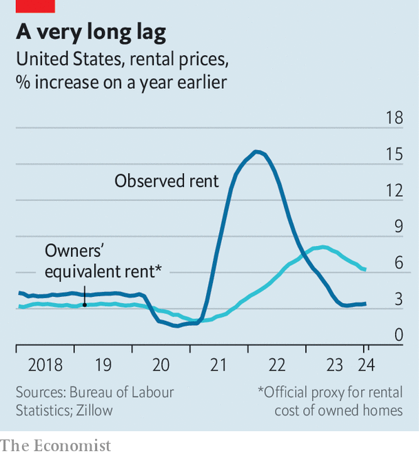

###### Housing costs

# America’s rental-market mystery 

##### And why it may deter the Federal Reserve from cutting interest rates 

 

> Mar 7th 2024 

During the past few years of inflation, sceptics have insisted that governments are undercounting price rises—usually without much evidence to support their claims. But a new controversy in American economics has highlighted the challenge of accurately measuring prices. Only this time the implication points in the opposite direction, suggesting that inflation may prove a more stubborn foe.

At issue is the manner in which housing fits into the consumer-price index. To the surprise of many casual observers, statisticians typically do not include property prices in their inflation gauges since they view housing as an investment good, perhaps a once-in-a-lifetime purchase for homebuyers. However, statisticians do know that housing is a big part of personal budgets and want to track regular changes in the price of shelter, much as they do for other consumer products. So instead of measuring property prices outright, their inflation indices factor in how much people pay for rent—or would pay for rent if they leased their own homes. The latter is known as owners’ equivalent rent (OER).

In America OER accounts for about a quarter of the consumer-price index, making it the single biggest component. Direct rent, by contrast, is just 8% of the index, because renting is less common: about two-thirds of American households own the homes they live in. Where things get tricky is estimating the OER value. It is not as simple as totting up all market rents and assuming that homeowners would pay the same. Rather, wonks assign a heavier weight to rental prices for single-family homes, which are similar to the kinds of houses that people own. The problem is that there is a relative dearth of single-family homes for rent, giving statisticians a small sample with which to work.

These intricacies have come to the fore as concerns mount about the persistence of inflation in America. In January the consumer-price index rose by 0.3% from a month earlier, above forecasts for a 0.2% increase, suggesting that the Federal Reserve is struggling to tame inflation. But nearly half of the broader inflation increase was attributable to a rise in OER alone. And strikingly, the rise in OER was much higher than the rise in market rents.

 


The question is whether OER is being estimated correctly. It is true that single-family homes have commanded larger rent increases than flats recently, a reflection of the fact that few such homes are available to tenants. Moreover, the Bureau of Labour Statistics, which compiles the consumer-price index, tweaked its methodology in January, lifting the weight of detached single-family homes in OER by about five percentage points, part of its constant efforts to capture changes in how people live. The combination of higher rents plus a larger weighting does explain much of the rise in OER. Added to that, though, is the inevitable volatility of extracting prices from the small sample of single-family homes for rent. This raises the possibility that at least some of the high OER reading was a fluke.

Still, the bigger picture is that OER inflation is running well above pure rent inflation (see chart). Continued tightness in the market for single-family homes ensures the divergence will probably continue for some time, and this in turn will place upward pressure on general measures of inflation. The details of how to calculate OER can seem abstruse. But the conclusion is clear: by feeding into stickier inflation, it may well deter the Fed from cutting interest rates any time soon. ■


