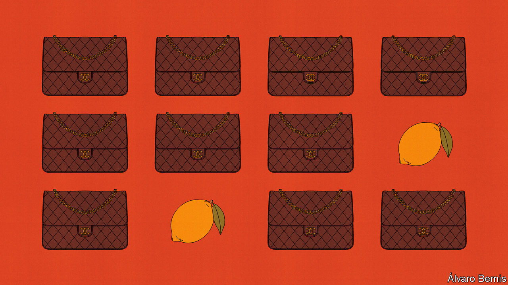

###### Free exchange

# An economist’s guide to the luxury-handbag market 

##### It is plagued by counterfeits—and information asymmetries 

 

> Mar 7th 2024 

You could spot a fake a mile off. The plasticky “Prado” wallets arranged on bedsheets on the pavements lining Canal Street in New York bore only a passing resemblance to the ones for sale in the Prada store in Soho. The fake Chanel bags they lay next to were lumpy, misshapen and smelled a little like petrol. An attempt to make a quick buck by buying one and passing it off as genuine—perhaps by taking it to a small local consignment store—would have been met with raised eyebrows and a chuckle.

What an innocent time. Now booming demand, technological improvements and sheer opportunism have transformed the market for buying and selling luxury bags. lvmh, a luxury conglomerate, sold about €10bn-worth ($13bn) of leather goods in 2013. By 2023 it was selling €42bn-worth—a 320% increase in just ten years. (The global economy, by contrast, grew by only 30%.) Dedicated reselling platforms, such as the RealReal and Vestiaire Collective, have expanded rapidly. Revenues from reselling luxury bags and clothing now add up to around $200bn a year. So producers of counterfeits have upped their game, too. Women now gather in Reddit groups to “QC” (quality check) bags they order from China via WeChat. Called “superfakes” by the  such dupes are often spot on—down to having the correct number of stitches on each side of the classic Chanel quilted diamond (up to 11, apparently). They cost about a tenth of the regular price. 

Thus the market for secondhand luxury bags is now vast, widespread and complicated enough that those interested in buying a genuine handbag risk being swindled. As a result, it ought to be of interest to economists, who have long been gripped by questions about how markets function when “information asymmetries” exist—when the seller of a good knows more about its quality than the buyer does. The topic was the subject of “The Market for ‘Lemons’”, a paper about the used-car market published by George Akerlof in 1970, for which he won a Nobel prize 31 years later.

In Mr Akerlof’s model there are just four kinds of car: new cars and used cars; good cars and bad cars. (In America bad cars are known as “lemons”.) New cars are worth more than used ones and good ones should be worth more than bad ones. Mr Akerlof assumes that a car’s owner will learn over time if it is a lemon. But this will not be obvious to a potential buyer. They will therefore offer the same price whether a car is good or bad, and the price will take into account the possibility that the car might be a lemon. Unable to fetch a fair price, sellers of good cars will withdraw, further driving down prices. Gresham’s law will assert itself: just as bad money chases out good, lemons chase out solid cars. As such, the market for decent used cars may vanish entirely.

It is not hard to spot the parallels with the market for luxury handbags: bags are either new or used; they are either real or fake. The seller will know if they bought their bag from a boutique on Fifth Avenue, ordered it via WeChat or even picked it up on Canal Street—but their potential buyer will not.

To help overcome situations like this, it helps to have independent third parties who are able to adjudicate quality. It is often easier to sell a used car to a mechanic or a dealer, for instance, who will then be able to provide a guarantee to a less knowledgeable buyer. Many luxury brands provide authenticity cards with bags when they are sold, so that customers can prove their purchase is real. Checking these and other markers of quality is precisely the kind of role that the luxury-resale platforms, which provide authenticity-checking services, are supposed to fulfil.

Yet the task is increasingly difficult. This became clear in January, when a lawsuit brought by Chanel, a French fashion house, against What Goes Around Comes Around (WGACA), a vintage store in New York, went to trial. Chanel provided evidence that wgaca, which markets itself as providing a “100% authenticity guarantee”, may have sold counterfeits. In 2012, 30,000 authenticity cards, which are included in every Chanel bag, were stolen from the warehouse of one the firm’s manufacturers. No bags went missing. Their serial numbers were then voided in Chanel’s database. Joseph Bravo, an executive at the firm, said that he was later asked by police in Florence, Italy, to identify one of these cards which had been tucked into a fake bag. Chanel provided evidence that 50 bags with voided serial numbers had ended up being sold by wgaca. On February 6th the jury sided with Chanel, awarding the firm $4m in damages, for copyright infringement and other infractions. Chanel is also suing the RealReal over counterfeit issues, which the reselling platform denies.

“Today’s verdict was not about not selling a counterfeit,” argued Seth Weisser, the founder of wgaca, but “selling items which were voided in Chanel’s database.” He stood by the firm’s 100% authenticity guarantee. But the decision plants a seed of doubt about what is being sold. If even the professionals cannot be trusted, then what? The theory of lemons suggests that the market for used handbags might collapse. 

A sour taste

Nobody should be happy with such an outcome. The reselling platforms lose out for obvious reasons. But brands lose out, too. A robust resale market provides an additional reason to buy a luxury bag. Whereas a white t-shirt is a pure consumption good, likely to be used until worn out and discarded, a fine handbag is closer to buying a car: the product is an asset that depreciates over time, yet still holds value. (It can also cost about as much as a vehicle.)

The collapse of the market would also be a blow to shoppers. Lemon problems vex economists quite so much because they prevent willing buyers and sellers of perfectly good cars and handbags from striking deals that would benefit each party. Chanel has proven its point about how hard it is for third parties to authenticate its products. It may now be wise for the company to use its ample resources to find a more robust way for them to do so. ■


