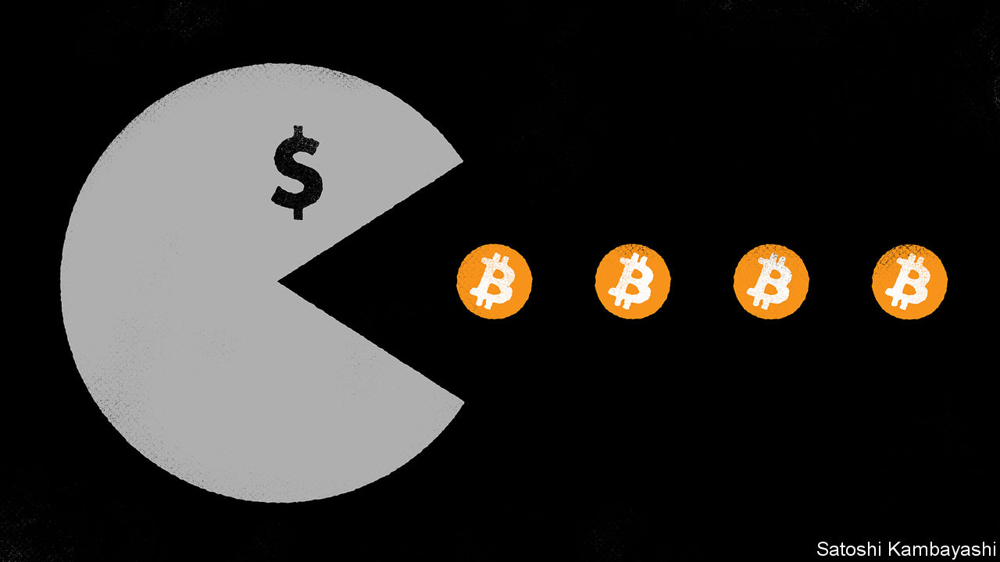

###### Back to the moon

# Bitcoin’s price is surging. What happens next? 

##### The cryptocurrency is up by 63% this year 

 

> Mar 6th 2024 

For a brief moment, everyone who owned bitcoin had made money from it. On March 5th the crypto token rose to an all-time high of just above $69,000—a level sure to delight the meme-loving crypto-crowd—before slipping back a little. The record capped a remarkable comeback from the dark days of November 2022, when interest-rate rises were crushing risk appetite and ftx, a crypto exchange, had just gone bust. Buying bitcoin on such exchanges seemed like little more than a fun and novel way to get robbed.

Bitcoin is hardly rallying in isolation: everything is going up. Stockmarkets all over the world are near record highs. So are gold prices. Even bond prices are climbing after a miserable two-year stretch. The catalyst is a combination of hype about artificial intelligence, joy at the state of the global economy and expectations of looser monetary policy to come. 

 


Still, bitcoin is doing better than most assets. On January 10th the Securities and Exchange Commission, an American regulator, approved applications by 11 investment firms, including BlackRock and Fidelity, to create bitcoin exchange-traded funds (ETFs). These make it easier for everyday investors to buy the cryptocurrency. Rather than setting up an account with a specialist exchange, creating a crypto wallet, making a bank transfer and then finally buying bitcoin, people can now simply log on to their brokerage accounts and purchase an etf. Assets in the ten largest bitcoin etfs now come to around $50bn. And the activity appears to be self-reinforcing: the more money is poured in, the higher the price goes, the more people chatter about bitcoin etfs, the more money pours in and so on and so on. 

Bitcoin has been in existence for 14 years. The elegant mechanism by which it validates itself and supply grows has never been hacked, meaning that the token is not going anywhere. Yet it is now obvious that it is of pretty limited use for payments, as it is restricted by both the high costs and slow speed of transactions. Those trying to build applications on top of blockchains are not doing so using bitcoin either. With the creation of etfs, bitcoin’s future looks to be as an investment asset and nothing more. So after this initial surge of interest, what will its returns look like?

It would be foolish to extrapolate from bitcoin’s entire history. Over the past 14 years the cryptocurrency has morphed from a niche cyberpunk idea into something approaching a mainstream financial asset. Its more recent price movements might provide some clues, however. There are two explanations for them. One is that purchases are basically a broad bet on technological progress, with variations that reflect prospects for crypto itself. For instance, even as tech stocks soared in the middle of 2021, bitcoin slumped after Elon Musk posted negative tweets about crypto payments. Prices were depressed in late 2022, too, even as stockmarkets were rallying, owing to ftx’s failure. 

The other theory is that bitcoin is a kind of digital gold. After all, supply is inherently limited, just as gold supply is restricted by the amount of the metal in the ground. Neither asset pays a yield nor earns profits. This theory fell out of favour in 2021 and 2022, as inflation soared and bitcoin collapsed, but last year the cryptocurrency once again moved in line with gold. 

Perhaps both theories contain elements of truth. And a hybrid tech-stock-crypto-vibes-gold-bet asset could be useful in even pedestrian portfolios, especially if it is only somewhat correlated with other assets an investor might hold. Diversification among uncorrelated assets is the foundational principle of portfolio management. Reallocating, say, 1% of a fund to bitcoin would be a low-stakes hedge. 

If investors buy this argument, bitcoin’s price is likely to rise for a while yet. What happens, then, when the cryptocurrency’s transition into a standard financial asset is complete? Assume that bitcoin has been added to most investor portfolios. Also assume that crypto tech does not really catch on. In this world, bitcoin’s returns probably do come to resemble those of gold: there is a fixed amount of it, and its price would rise over the long term roughly in line with the stock of money. That implies steady single-digit returns. The creation of a bitcoin etf may have set off a frenzy of eye-popping gains—but the future it portends could be slower and steadier. ■


