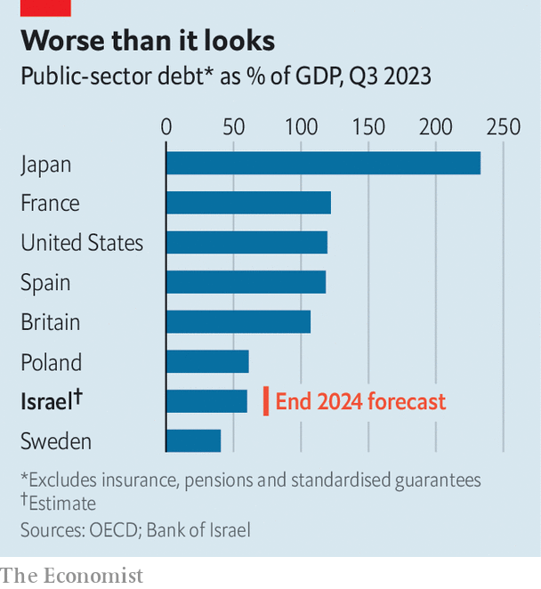

###### Staring down the barrel

# Can Israel afford to wage war? 

##### As the battle continues, costs are spiralling 

 

> Mar 5th 2024 

In the next few weeks Binyamin Netanyahu, Israel’s prime minister, hopes to gain final parliamentary approval for an emergency war budget. It includes more cash for settlers in the West Bank, as well as for religious schools, where teenagers study the Torah rather than science—part of an attempt to unite his fissiparous political coalition. And it also contains a startling break with the past. Everyday welfare spending (long generous in Israel, owing to its socialist foundations) will be slashed in order to fund the country’s armed forces. The military budget will almost double from 2023 to 2024. Israel’s unwritten social contract, which has for 70-odd years promised both a generous welfare state and a fearsome military, is under threat.

Despite continuing discussions about a ceasefire, Mr Netanyahu has been clear that any pause will be temporary. Even if a ceasefire ends up being extended or he leaves office, there is widespread political support for a mightier military. At the same time, the war is proving more expensive than expected. Between October and December Israel’s economy shrank by a fifth at an annualised rate, compared with the previous three months—more than twice the contraction predicted by the central bank. In the same period, over 750,000 people, or a sixth of the labour force, were away from work, many of them evacuees or reservists. Last month Moody’s, a rating agency, downgraded the country’s credit rating for the first time ever. All this raises a question. Can Israel afford to wage war?


The core problem is fiscal. On the eve of Hamas’s attack on October 7th, Israel’s debt-to-GDP ratio was 60%, well below the average in the OECD group of mostly rich countries. But in the final quarter of the year the armed forces burned through 30bn shekels ($8bn), an amount equivalent to 2% of gdp, on top of their usual spending. And it is not just a bigger budget for the armed forces that is causing strain; the government is also having to spend on accommodation for evacuees, furlough schemes and support for reservists. Israeli policymakers think that a debt ratio of 66% would be manageable. Mr Netanyahu’s budget would target an annual fiscal deficit of 6.6% of GDP—enough to produce a debt ratio of around 75%.

For America or Japan such borrowing would be a breeze. In Israel, however, there is always a chance that more conflict is around the corner. Should the country’s tech industry be wounded, perhaps in a war involving other regional powers, up to a quarter of the country’s income-tax take would be vulnerable. The last time that Israel went into battle on the present scale, during the Yom Kippur war in 1973, its debt ratio passed 100%, which sparked a financial crisis. As the central bank printed cash, the banking sector toppled and inflation rocketed to 450% by 1985. To keep bondholders happy, therefore, the government needs room for manoeuvre. 

 


Many now worry that Mr Netanyahu’s budget is too lavish. Although in times of crisis governments may borrow to keep things ticking over, they are wise to do so modestly. Given Israel’s desire to lift military spending, outgoings will not fall back to pre-war levels any time soon. As a result, the government needs a plan to stabilise debt while spending remains high.

Israel’s tax take in 2022 was worth 33% of GDP, just below the OECD average of 34%. Yet Mr Netanyahu’s budget includes only modest increases. Next year value-added tax will rise by one percentage point to 18%; a health tax on incomes will go up by 0.15 percentage points. Policymakers worry that raising corporate taxes would cause the tech sector, which is highly mobile and already struggling to find workers, to flee the country. Harsher taxes on households would risk depressing consumption and make life harder still for those who are already struggling because of the war.

A tale of one city

In the suburbs of Jerusalem, secular professional families, which have had members called up and seen income from businesses plummet, are suffering. Many in Arab neighbourhoods—those worst affected by Mr Netanyahu’s budget—report no longer being welcome at work. A few miles away, though, ultra-Orthodox households, which are exempt from military service and rely on handouts that Mr Netanyahu wants to make more generous, have barely had to tighten their belts. 

The impact on industries is similarly uneven. Israel’s tech sector is bearing up. Some firms even think they can spin a profit, benefiting from a new round of military contracts. Many have moved operations abroad, which lessens the impact of losing employees to the fight. “Our productivity actually improved,” says Chen Bitan at Cyberark, one of the country’s biggest cyber-security companies. “We told our employees the war would be won by the economy,” he explains. Although local tech investment has fallen, it has done so by about the same amount as in Europe—suggesting the war is not to blame.

But the rest of the economy is in trouble. Construction is at a standstill. Farms have lost more than half their workforce. And companies involved in tourism are suffering. In January 77% fewer tourists visited Jerusalem than a year ago. 

The recovery could be glacial, not least because war has exacerbated long-standing problems. One is the economy’s reliance on low-paid Palestinian workers. The West Bank may import as many goods from Israel as before the war, but its 200,000 or so day labourers—equivalent to 5% of Israel’s workforce—cannot get out. Their permits were cancelled after October 7th, and Israel’s government is refusing to let them back in. Farms, factories and building sites lack workers. Yet industrialists are in two minds. “We need the Palestinians, but we cannot be dependent on them,” says one.

 


Israel’s labour market is already tight. Bringing in foreign workers is slow and expensive, and the country’s workforce is less than half the size of its total population. Half of the men in Israel’s ultra-Orthodox population, which is the country’s fastest-growing group, refuse to work on religious grounds. Those who do are often woefully undereducated, having attended religious schools. Arab Israelis, the community with the second-highest fertility rate, also get poor exam results. And in January new rules extended military service from 32 to 36 months for non-Orthodox men, further depleting the labour force.

Should debt continue to spiral, as the economy struggles, things will get difficult. But a repeat of what happened after the Yom Kippur war is unlikely. Israel’s ministries are stuffed with technocrats. The public is aware that their security depends on a stable economy, and is liable to depose irresponsible politicians. Markets think that a default is improbable. Although borrowing is now more expensive for the government, it is far short of the eye-watering prices paid by irresponsible leaders elsewhere. Credit-default-swap rates, an indicator of markets’ trust in a government, rose from 0.5% to 1.4% after October 7th, but have since stabilised and remain below levels seen a decade ago.

Markets appear to have almost as much faith that Israel will not unleash inflation in order to reduce debt payments. The country’s annual inflation, at 3%, is lower than in America, and investors expect it to have fallen to 0.4% by the end of the year. Since the Yom Kippur war, Israel has acquired an inflation-targeting central bank, which is of a hawkish bent. After October 7th it spent $30bn in foreign reserves propping up the shekel (and has another $170bn if the currency needs more cushioning). The shekel has barely moved since. 

The home front

Yet even if a financial crisis is unlikely, that does not mean pain will be avoided. It will just come in a different form: through further spending cuts that are required to guarantee stability. The money that holds Mr Netanyahu’s coalition together will be protected for as long as he remains prime minister. Instead, as indicated by the war budget, Israel’s welfare state will take the hit. Despite having one of the lowest rates of unemployment in the OECD, the country is the fifth-biggest spender on unemployment benefits. Only the governments of Norway and Iceland spend more of their GDP on education. This makes a tempting target for a prime minister who needs to find savings, and has allies to protect.

The welfare ministry, which also cares for evacuees and returned hostages, will have to take an 8% cut under the budget—far above that faced by most other civilian ministries. The ministry has come under fire for its lacklustre support of 135,000 Israelis evacuated from the country’s north and south. It has done little other than pay hotel bills; now officials are reportedly pressing families to return. If Israel stays under Mr Netanhayu’s mismanagement, other ministries will experience similar treatment. Even if he steps down, however, Israel will have to make hard choices between the two pillars of its social contract: its armed forces and its welfare state. ■


