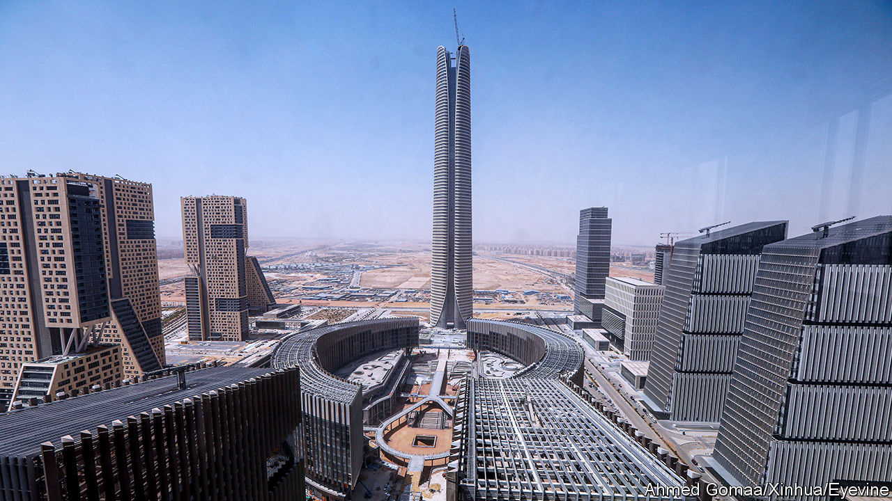

###### Urban economics

# The world is in the midst of a city-building boom 

##### Everyone, from Donald Trump and Peter Thiel to Abdel Fattah el-Sisi, is getting involved 

 

> Mar 7th 2024 

Africa’s tallest building is rising under empty skies. Beneath the Iconic Tower in northern Egypt sits a city that officials expect to one day house 6.5m people. For now, though, it is mostly empty—like the desert that came before it. 

Egypt’s “New Administrative Capital” is part of a rush of city-building. Firms and governments are planning more settlements than at any time in the post-war period, with many already under construction. Ninety-one cities have been announced in the past decade, with 15 in the past year alone. In addition to its new capital in the north, Egypt is building five other cities, with plans for dozens more. India is considering eight urban hubs. Outside Baghdad, Iraq, workers have just broken ground on the first of five settlements.

And it is not just emerging economies that are building. Investors in America have spent years secretly buying land for a new city in California. To the east, the deserts of Arizona and Nevada have lured Bill Gates and Marc Lore, two billionaires, each with plans for their own metropolis. Even Donald Trump, in his bid for re-election, has proposed ten “freedom cities”. In their early stages, many of these projects will attract derision. History suggests that plenty will fail. But the number and diversity of settlements under construction suggests some will triumph. 

 


That is a great thing. Edward Glaeser of Harvard University has lauded cities as mankind’s greatest invention. He notes that agglomerations of money and talent make societies richer, smarter and greener. Since companies move closer to their customers and people closer to their jobs, growing cities beget economic growth. Economists think that doubling a city’s population provides a boost to productivity of 2-5%. Given both the pressing need for new urban areas and the constraints on physical growth in existing ones, starting afresh is sometimes a shrewd decision.

In much of the poor world, land disputes, shantytowns and poor infrastructure choke development. The problem will worsen as urban areas swell by an extra 2.5bn inhabitants by 2050, according to projections by the United Nations, with the new urbanites appearing in regions where cities are already under extreme stress. Builders hope that new metropolises will help relieve the pressure. In Nairobi, near where Stephen Jennings, a former private-equity boss, is building a new city called Tatu, public-transport commutes run to over an hour for most jobs. Construction is progressing nicely in Kenya’s newest settlement, where 5,000 residents already live and work in a gated village. Mr Jennings is building seven other cities across five countries in the region. 

Rich-world cities have problems of their own. The push for a new town outside San Francisco—a project that goes by the label of “California Forever”—came from an “epic housing shortage” on America’s west coast, says Jan Sramek, who leads a group of Silicon Valley investors making it happen. The group, which includes Laurene Powell Jobs, Steve’s widow; Reid Hoffman, a co-founder of LinkedIn; and Sir Michael Moritz, a venture capitalist, will put their plans for “homes, jobs and clean energy” to a public vote in November. If approved, the city will house up to 400,000 residents on 60,000 acres of what is now farmland. Starting again is a necessary part of the solution to housing shortfalls, says Mr Sramek, citing the high costs of revamping existing infrastructure. 

California Forever is among a clutch of planned towns that also aim to improve urban living. The developer is promoting high-density neighbourhoods in which residents can reach schools, jobs and shops without a car. Today’s city-builders have decided that walkability—or what is sometimes called a “15-minute city”—is a crucial selling point. Some, like Dholera in India and Bill Gates’s Belmont in Arizona, are pitching so-called “smart cities”, which use sensors to direct residents away from traffic or tell them the most environmentally friendly time for a shower. 

A few projects double as social experiments. Mr Lore’s Telosa city (adapted from the Greek word for “highest purpose”) will do away with private ownership of land, which will instead be held in a communal trust, with money generated from leasing it spent on public services. Praxis (another Greek word, meaning “theory in practice”) has raised $19m and collected a waiting list of potential residents who want to “create a more vital future for humanity” in the Mediterranean. A private company is building Próspera, a cryptocurrency-accepting, libertarian special economic zone in the Honduras, with a mission to “maximise human prosperity”. Praxis and Próspera are funded in-part by Pronomos, a venture-capital fund established in 2019 to invest in new cities, which is run by Patri Friedman (grandson of Milton) and counts Marc Andreessen and Peter Thiel, two billionaire investors, among its supporters. 

Messrs Andreessen, Lore and Thiel are among a crop of wealthy folk with ideas about how to run cities. But governments also want to experiment. Abundant capital and low interest rates in the 2010s allowed politicians to borrow cheaply. Although rates are now higher, enthusiasm for building remains, as countries copy one another. Leaders are keen on using state finances to reshape domestic economies—and believe that new cities will help. 

Houses built on sand

Muhammed bin Salman of Saudi Arabia hopes that several gleaming new metropolises will attract industries that his country lacks, such as financial services, manufacturing and tourism. NEOM, a city made up of a 170km-long building in the desert, is to be the jewel in the crown. Egypt’s New Administrative Capital is purpose-built for the state’s bureaucratic machinery; the government hopes it will reduce congestion in Cairo. The city already includes the Ministry of Defence’s imposing Octagon—not to be confused with America’s Pentagon—which spreads over a square kilometre. In Indonesia workers are clearing forests for a new capital, Nusantara. For leaders such as Joko Widodo of Indonesia and Abdel Fattah el-Sisi of Egypt, a new capital promises a legacy, lots of jobs and the ability to keep voters at arm’s length.

In other countries, rulers have slightly more esoteric ambitions. El Salvador is planning to sell bonds that pay out in bitcoin in order to fund a crypto-city. The Kingdom of Bhutan said in December that it would build a “mindfulness city”, with neighbourhoods designed on the repeating geometric patterns of a mandala, a Buddhist symbol. The emergence of the China State Construction Engineering Corporation, whose workers are building cities in Africa, South-East Asia and the Middle East, has lowered the costs of all megaprojects, whether fanciful or prosaic.

How many of these cities will prosper? Some infrastructure, such as electricity, internet and roads, must be in place before the first resident arrives, which means that upfront costs can be staggeringly large. Mr Sramek’s company has already sunk $1bn into buying land for California Forever and will need an additional $1bn-2bn for just the first stage of construction. Mr Lore expects to marshal $25bn in initial investment for his city in the desert. Prince Muhammed will lean on his kingdom’s oil riches to pay for NEOM at an initial cost of $319bn. But enthusiasm, and money, can run out; grandiose projects can become white elephants. Work on Egypt’s $60bn capital city has slowed as the country’s economy falters. The Chinese developer behind Malaysia’s Forest City defaulted in 2023, before residents had even moved in.

History points to characteristics shared by successful projects. State institutions can help anchor cities, as Brasília (in Brazil) and Chandigarh (in India) showed in the 20th century. Although both have had problems, people in Brazil and India are voting with their feet. Brasília’s population is growing at 1.2% a year, more than double the national average. Chandigarh, a state capital, is now India’s fourth-richest region on a per-person basis. 

The future is less certain for cities that cannot rely on taxpayers to provide jobs and pay the bills, but California Forever and Tatu seem to be based on sensible ideas. As Mr Jennings puts it, the crucial thing is to focus on getting the “boring stuff”, such as roads and sewerage, right in order to create a city that is walkable and green, but not especially smart. In addition to being what he calls “a dumb city”, Mr Sramek’s California Forever shares another advantage with Tatu: both will piggy-back on neighbouring economies. “We are five miles away from cities on both sides,” says the Californian developer. “The strength of the demand makes a big difference to how fast you can grow.” In Britain, Milton Keynes—a city established in the 1960s, less than an hour by train from London—is thriving. Reston, a planned town outside Washington, DC, is another success. 

Sensible city-builders are wary of taking on debt. Developers have instead started to sell stakes in projects, demonstrating buy-in for what are long-term ventures. “You are looking at a 50-year time horizon,” says Mr Jennings, who admits that it “sounds insane”. He has tapped friends for capital, avoiding private-equity backers and their investment horizons, which normally come in at under a decade. California Forever is entirely funded by equity investments. If the two new settlements succeed, their investors will be rewarded. But so will many others. That is the glory of cities. ■


