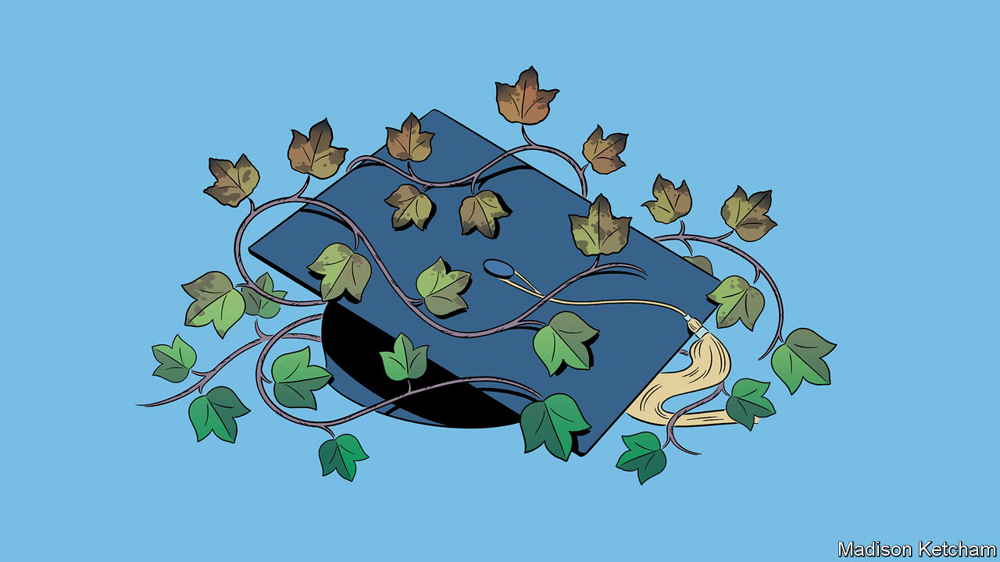
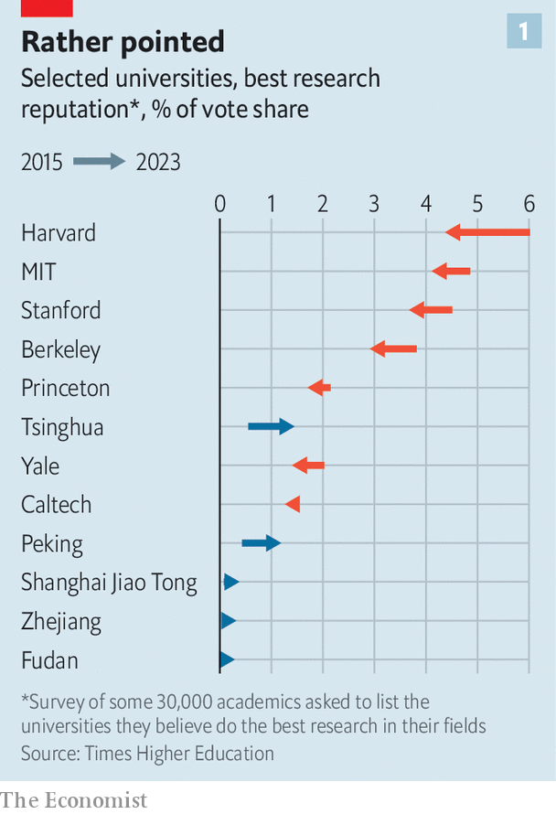

###### Poisoned Ivy

# America’s elite universities are bloated, complacent and illiberal 

##### To keep its competitive edge the Ivy League will have to change 

 

> Mar 4th 2024 

THE STRUGGLE over America’s elite universities—who controls them and how they are run–continues to rage, with lasting consequences for them and the country. Harvard faces a congressional investigation into antisemitism; Columbia has just been hit with a lawsuit alleging “endemic” hostility towards Jews. Top colleges are under mounting pressure to reintroduce rigorous test-based admissions policies, after years of backsliding on meritocracy. And it is likely that the cosy tax breaks these gilded institutions enjoy will soon attract greater scrutiny. Behind all this lies a big question. Can American universities, flabby with cash and blighted by groupthink, keep their competitive edge? 

The origins of the turmoil lie in extreme campus reactions to Hamas’s attack on Israel on October 7th. They led to a blockbuster congressional hearing in December. In it politicians accused three college presidents of failing to curtail antisemitism. The University of Pennsylvania’s then president, Elizabeth Magill, stepped down just days later. Claudine Gay, formerly Harvard’s president,  from her job in January amid twin furores over antisemitism on campus and plagiarism in her scholarship (which she contested). 

Plenty of faculty—both at Harvard and at other elite universities—insist that hard-right Republicans and other rabble-rousers are fabricating controversies. Stirring up animosity towards pointy-headed elites can win them political advantage. But thoughtful insiders acknowledge that, for some years, elite universities, particularly those within the Ivy League, have grown detached from ordinary Americans, not to mention unmoored from their own academic and meritocratic values. 

In theory, these difficulties could promote efforts to correct flaws that are holding back elite education in America. But they could also entrench them. “America’s great universities are losing the public’s trust,” warns Robert George, a legal scholar and philosopher at Princeton. “And it is not the public’s fault.”

To understand the mess that the Ivies and other elite colleges find themselves in, first consider how they broke away from the rest in recent decades. Despite the fact that America’s elite universities have centuries of prestigious history, much of their modern wealth flows from a bull run that began in the more recent past. Back in the 1960s, only a modest gap divided the resources that America’s most and least selective colleges could throw around, according to research by Caroline Hoxby, an economist at Stanford. By the late 2000s, that had widened to an abyss.

This happened in part because of changes that enabled elite universities to enrol ever cleverer students. The collapsing cost of air fares and phone calls made sharp school-leavers gradually more eager to apply to ritzy colleges far from their homes. Smart youngsters from around the world joined them. At about the same time, the expansion of standardised testing made it easier for colleges to identify the very brightest sparks from far and wide. 

History lessons

These smarter, more ambitious entrants were more likely to value top-notch faculty and facilities, and were more willing to pay for them, according to Professor Hoxby’s analysis. And they went on to greater success, which meant the size of donations elite universities could squeeze from alumni began to increase.

Newfangled ways of managing endowments also boosted America’s super-elite colleges. For years top universities managed their nest eggs cautiously, says Brendan Cantwell of Michigan State University. But in the 1980s the wealthiest ones began ploughing into riskier assets, including commodities and property, with considerable success. The richest universities were both more willing and more able to roll the dice; they could also reinvest a larger share of their returns.

All this has opened a chasm between America’s top-ranked colleges and the rest. A mere 20 universities own half of the $800bn in endowments that American institutions have accrued. The most selective ones can afford to splash a lot more money on students than the youngsters themselves are asked to cough up in tuition, which only makes admission to them more sought-after. Acceptance rates at the top dozen universities are one-third of what they were two decades ago (at most other institutions, rates are unchanged). Lately early-career salaries for people with in-demand degrees, such as computer science, have risen faster for graduates from the most prestigious universities than for everyone else. Higher education in America “is becoming a ladder in which the steps are farther apart”, reckons Craig Calhoun of Arizona State University.

 


For all their success, America’s best institutions are now flying into squalls. One clutch of challenges comes from abroad. American universities still dominate the top rungs of most international league tables—but their lead is becoming somewhat less secure. Every year , a British magazine, asks more than 30,000 academics to name the universities they believe produce the best work in their fields. They are growing gradually less likely to name American ones, and a bit more likely to point to Chinese ones (see chart 1).

Research in disciplines such as maths, computing, engineering and physics is becoming especially competitive. Rankings produced by Leiden University in the Netherlands, which scores universities solely on the impact of the papers they produce, now place Chinese universities in pole position for all those subjects (see chart 2). “The difference from five or ten years ago is quite astonishing,” says Simon Marginson at Oxford University. The challenge is not that American output is growing weaker, he reckons, but that the quality produced by rivals is shooting up.

 


Competition to snag the world’s smartest students and faculty is growing more severe, too. Twenty years ago America attracted 60% of the foreigners studying in English-speaking countries; now it gets about 40%. Starting around the time of Donald Trump’s election, high-achieving Chinese—who once had eyes only for America’s finest universities—began sending additional, “back-up” applications to institutions in places such as Singapore and Britain, says Tomer Rothschild, who runs an agency that helps them. 

As challenges from abroad multiply, America’s elite universities are squandering their support at home. Two trends in particular are widening rifts between town and gown. One is a decades-long expansion in the number of managers and other non-academic staff that universities employ. America’s best 50 colleges now have three times as many administrative and professional staff as faculty, according to a report by Paul Weinstein of the Progressive Policy Institute, a think-tank. Some of the increase responds to genuine need, such as extra work created by growing government regulation. A lot of it looks like bloat. These extra hands may be tying researchers in red tape and have doubtless inflated fees. The total published cost of attending Harvard (now nearly $80,000 annually for an undergraduate) has increased by 27% in real terms over two decades.

A second trend is the gradual evaporation of conservatives from the academy. Surveys carried out by researchers at UCLA suggest that the share of faculty who place themselves on the political left rose from 40% in 1990 to about 60% in 2017—a period during which party affiliation among the public barely changed (see chart 3). The ratios are vastly more skewed at many of America’s most elite colleges. A survey carried out last May by the , Harvard’s student newspaper, found that less than 3% of faculty there would describe themselves as conservative; 75% called themselves liberal.

 


Why has this happened? One argument is that academics’ views have not in fact changed that much; instead, Republicans have abandoned them by moving to the right. But conservatives insist that bright sparks with right-leaning views have been choosing to leave or stay out of the profession, in part because lefty colleagues have been declining to hire and promote them. This mix of bloat and groupthink helps explain why prestigious universities often find themselves at odds with the American public in battles over access and speech. 

Start with access: elite colleges clung to affirmative action long after the majority of Americans had decided that it was unfair to give black, Hispanic and Native American students with slightly lower grades an advantage when deciding whom to admit. Academics who spoke against the practice—arguing, for example, that some youngsters were being catapulted onto courses they were poorly prepared for—have often been slammed as bigots by their students and peers.

Knocking on the door

In theory the Supreme Court’s decision to outlaw racial preferences last year should encourage posh universities to junk admissions practices that are even more irksome—such as favouring children of alumni. Instead many have made their admissions criteria even more opaque, potentially damaging universities’ meritocratic pretensions further. At the start of the pandemic, most stopped requiring applicants to supply scores from standardised tests. Now hard-to-evaluate measures such as the quality of personal statements are having to carry more weight. For some institutions that has proved unsatisfactory: in recent weeks Dartmouth and Yale announced that they will require standardised test scores from applicants once again. They are the first Ivies to do so. 

As for speech, elite colleges have done a particularly poor job of handling a generation of youngsters who are alarmingly intolerant of views they don’t like. The Foundation for Individual Rights and Expression (FIRE), an NGO, rates freedom of expression across America’s best-known campuses. Last year it placed two Ivy League outfits, Harvard and Pennsylvania, among the five worst performers; Harvard came last. More than half of students at the five colleges believe it is sometimes acceptable to stop peers attending a speech by a controversial figure. Only about 70% agree that it is “never acceptable” to use violence to stop someone talking.

Universities stand accused not just of tolerating small-mindedness among their students, but of perpetuating it. One theory holds that, if elite universities worked their students harder, they would have less time and energy to fight battles over campus speech. Between the 1960s and the early 2000s the number of hours a week that an average American student spent studying declined by around one third, notes Rick Hess of the American Enterprise Institute, a conservative think-tank. Yet grades do not seem to have suffered. At Yale, the share of all grades marked “A” has risen from 67% in 2010 to around 80% in 2022; at Harvard it rose from 60% to 79%. 

More often blamed are administrative teams dedicated to fostering “Diversity, Equity and Inclusion” (DEI). They have grown in size as the number of administrators of all kinds has increased. They have an interest in ensuring that everyone on campus is polite and friendly, but little to gain from defending vigorous debate. In theory they report to academic deans, says Steven Pinker, a psychologist at Harvard and a member of a faculty group committed to defending academic freedom; in practice they move laterally from university to university, bringing with them a culture that is entirely their own. Critics of DEI departments insist these offices have helped soak campuses with unsophisticated “woke” ideologies that depict complex problems as simplistic battles.

All these problems would be better handled if universities had more effective governance. University presidents, and the deans beneath them, have too often looked intimidated by activist students and administrators, and unwilling to stand up for academics bullied for unpopular views. FIRE, the campaigners for academic freedom, reckon that between 2014 and mid-2023 there were at least 1,000 attempts to get academics sacked or punished for things they said (one fifth of those resulted in people losing their jobs).

Enough said

Years of wishy-washiness about what speech campuses will and will not tolerate have made it more difficult for university leaders to referee the clashes that have erupted between students supportive of Palestinians and those speaking up for Israel. Presidents who have not always held firm on free expression now find themselves besieged by censors of all political stripes. College leaders who, since the start of the Gaza war, have rediscovered their commitment to vigorous debate have inevitably ended up looking partisan.

University boards appear especially weak. They have not grown much more professional or effective, even as the wealth and fame of their institutions has soared. Many are oversized. Prestigious private colleges commonly have at least 30 trustees; a few have 50 or more. It is not easy to coax a board of that size into focused strategic discussions. It also limits how far each trustee feels personally responsible for an institution’s success.

Furthermore, trusteeships are often distributed as a reward for donations, rather than to people with the time and commitment required to provide proper oversight. Universities generally manage to snag people with useful experience outside academia. But many trustees prefer not to rock the boat; some are hoping that their service will grant children or grandchildren a powerful trump card when it comes to seeking admission. Too many see their job as merely “cheerleading, cheque-writing and attendance at football games”, says Michael Poliakoff of the American Council of Trustees and Alumni, an organisation that lobbies for governance reform. And at many private universities the way in which new trustees are appointed involves cosying up to current ones or to university authorities. Outsiders can struggle to be picked at all.

Where is all this going? Reports of campus antisemitism have roused lawmakers on both sides of the aisle. In December a bipartisan group in Congress added new language to a draft bill that aims to boost funding for short, non-degree courses. They proposed finding the cash for this by preventing students at very rich universities from taking federal student loans. That idea was dropped in February, amid worries that it would create new obstacles for poor students, but it has since been replaced with a new proposal: that wealthy universities be required to “share risk” with the government by covering the government’s losses in the event that federal loans are not repaid. Universities have long resisted talk of such schemes. 

Elite universities’ tax advantages are another possible target. For years politicians have accused them of “hoarding” huge endowments while raising prices for students and snaffling government money for research. Ten top colleges got about $33bn in federal research grants and contracts between 2018 and 2022, reckons Open the Book, an NGO. Over the same period, the endowments swelled by about $65bn. Until 2017 universities paid no tax on income from these nest-eggs; then Mr Trump hit the very richest with a recurring annual levy of 1.4%. He has implied that, if re-elected, he will take another bite. 

At a minimum a Republican administration would make much sharper use of regulators, such as the civil-rights monitors employed in the federal education department. They might be encouraged to launch more investigations, for example into admissions rules or the work of DEI teams. Republicans have already meddled energetically in the running of public universities, over which they have far greater control. The University of Florida announced on March 1st that it had got rid of all its DEI positions in order to comply with a newish state rule. Signed into law a year ago by the state’s Republican governor, Ron DeSantis, it prevents state money from being spent on such things. 

Better for universities to heal themselves. Smaller, more democratically selected boards would provide better oversight. More meritocratic admissions would improve universities’ standing. Greg Lukianoff of FIRE wants to see campuses stripped of bureaucrats “whose main job is to police speech”. Instead universities should invest in programmes teaching the importance of free and open debate, argues Tom Ginsburg of the University of Chicago, who runs a forum designed to do just that: “If your ideas aren’t subjected to rigorous scrutiny, they’re not going to be as good,” he explains.

Reformers would also like more people in the political centre, and on the right, to make careers in academia. No one thinks this will happen quickly. But college bosses could start by making it clear that they will defend the unorthodox thinkers they already have on their payrolls, reckons Jim Applegate, who runs a faculty group at Columbia University that aims to promote academic freedom. They could discourage departments from forcing job applicants to submit statements outlining their DEI approach (one study a few years ago suggested this was a condition for a fifth of all university jobs, and more than 30% at elite colleges). Lately these have looked less like honest ways of spotting capable candidates and more like tests of ideology.

The ongoing furore over antisemitism could bring the impetus universities need to reform. But a less optimistic scenario exists, too. Seeking to escape heat over hate speech, college leaders could choose to become all the more watchful of what their students and faculty say. Tighter rules about speech on campus might deflect brickbats in the short term; but in the long term they would only degrade the quality of both teaching and research at American universities. “We are at an inflection point,” believes Professor George of Princeton. “It could go either way.” ■

