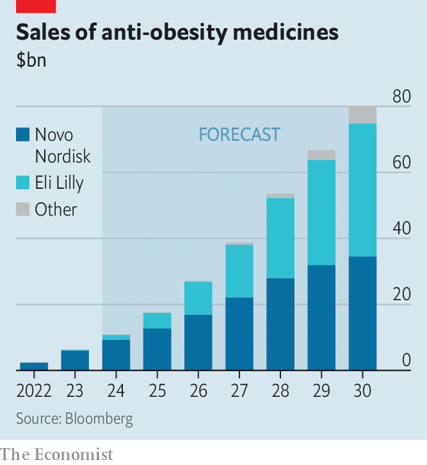

###### The real skinny

# A frenzy of innovation in obesity drugs is under way 

##### Novo Nordisk and Eli Lilly are printing money now. But they will not be a stagnant duopoly 

 

> Mar 7th 2024 

Weight-loss jabs have turned out to be blockbusters. And for good reason. For one thing, after centuries of false promises and quackery, these drugs actually work. With nearly half the world’s population expected to be obese or overweight by 2030, demand for them is assured. And, more excitingly, they may be approved for a broader set of uses. Clinical trials suggest that they could reduce the risk of heart attacks, kidney disease and perhaps even Alzheimer’s. By the end of the decade  could hit $80bn, making them one of pharma’s biggest classes of drugs. 

No wonder enthusiasm for the makers of these drugs, Novo Nordisk and Eli Lilly, is at fever pitch. Since the start of 2023 Novo, maker of Wegovy (and its sibling Ozempic), has seen its market capitalisation soar by 87% to $560bn, making it Europe’s most valuable company. Meanwhile the market value of Lilly, maker of Zepbound (and its sibling Mounjaro), has more than doubled to $740bn. One of these drugmakers could be the first to attain a market value of a trillion dollars, joining an elite club mostly made up of tech firms. 

 


Add in the limited volumes and high prices for these drugs today, and you might think that this nascent industry is on course to be a price-gouging duopoly. In fact, the market will soon look drastically different from what you see now. 

Right now the drugs are in short supply. Shortages of their active ingredients, like semaglutide for Wegovy, and of the skinny “pens” used to inject the medicine, are a constraint on production. And with a list price of almost $16,000 a year, these treatments are not cheap. Although a few users may be able to afford the cost themselves, most will need help from insurers or health services—many of which have yet to be convinced that the benefits are worth the drugs’ eye-watering prices. 

Access will be an even bigger problem in much of the emerging world, which is projected to experience the largest increases in obesity as incomes rise and diets change. So far most of Lilly’s and Novo’s sales have been in America, with the rest going mainly to Europe. Nor does it help emerging-world patients that the jabs need to be refrigerated, making them unsuitable for use in countries with less developed supply chains.

Yet there are good reasons to think that in future the market will see expanded supply, lower prices and a more global patient base. For a start, investment by Lilly and Novo to expand production should ease bottlenecks over time. Both firms are pouring billions of dollars into boosting supply by building their own capacity and teaming up with other manufacturers. Lilly and Novo are also racing to gain an edge over each other. Novo has already developed a pill that is about as effective as its injectable version. Lilly expects to launch its own obesity pill in a few years. Both companies also have newer versions of the drugs in the late stages of development which are more efficacious or have fewer side-effects. 

More important in the long term, however, is the array of competitors preparing to enter the market. Wegovy, Zepbound and their ilk are less protected by patents than, say, Humira, a blockbuster anti-inflammatory drug that has reaped more than $200bn in sales over 20 years. 

Already more than 70 companies are running close to 100 clinical trials for obesity drugs. These include big pharma firms (Amgen and Boehringer Ingelheim) and smaller biotechs (Viking Therapeutics and Structure Therapeutics) in the West, as well as Chinese drugmakers such as Sciwind Biosciences and Eccogene. Many are testing versions that are distinct enough from Wegovy and Zepbound that patent protections will not apply, allowing them to come to market within a few years, should they gain regulators’ blessing. 

Some candidates in the pipeline could be more effective than existing treatments; others might do away with the inconvenience of today’s drugs, which require patients to inject themselves once a week and to continue taking them indefinitely to keep their weight down. Viking’s experimental drug, for example, has been shown to help patients shed more weight than existing jabs. Amgen is testing a treatment that does not require patients to be on the drugs indefinitely. And Structure is developing a promising-looking pill.

Healthy competition 

This frenzy of innovation is welcome. Lilly and Novo may lose their lead in the long term if cheaper alternatives arise; or they may themselves furiously innovate to reduce costs. Either way, prices should come down, making the drugs more accessible to patients around the world. Today the two pharma firms are reaping the rewards from their blockbuster drugs. But in time it will be consumers who benefit most of all. ■

