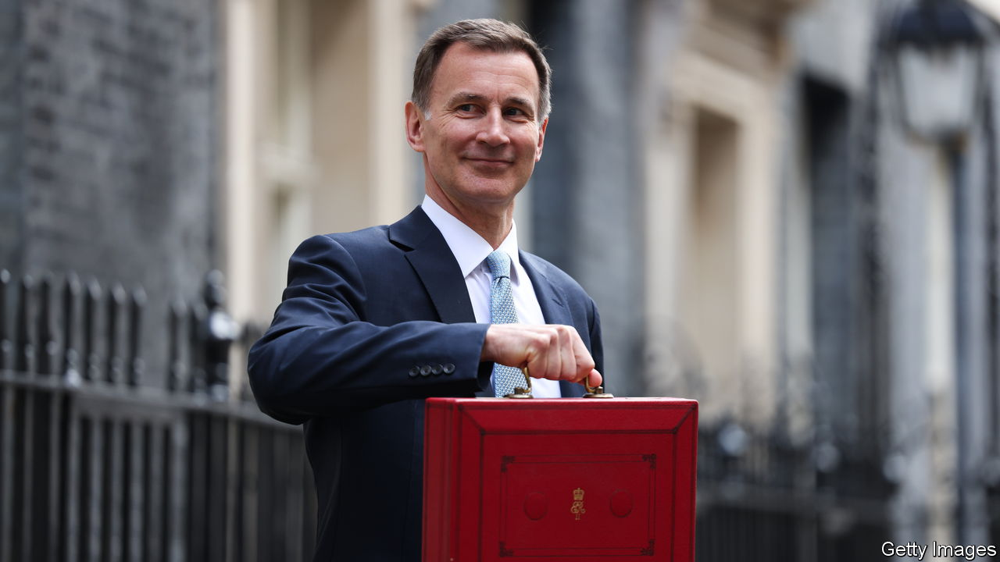

###### Jam today, ingredients tomorrow

# Britain’s budget cuts taxes on the promise of productivity gains 

##### Jeremy Hunt has got it the wrong way round 

 

> Mar 6th 2024 

JEREMY HUNT, Britain’s chancellor of the exchequer, was appointed for his technocratic manner by a government that increasingly resents technocracy. That tension was on display when he delivered a budget on March 6th. The speech was full of progress towards sensible aspirations: to fix a nonsensical benefit system for parents; reform the tax regime for temporary “non-dom” immigrants; and make workers, pensioners and landlords pay the same rate of tax. Yet the budget was ultimately governed by Mr Hunt’s baser political instincts, or at least those of the ruling Conservative Party. Those instincts called for big tax cuts to win votes in a general election to be held by January. 

Mr Hunt therefore pruned national insurance, a payroll tax, by two percentage points, replicating a cut he announced in November. Because only workers pay national insurance and it sits atop tax on income of most kinds, this is a step towards the equal treatment to which Mr Hunt aspires. Yet the cut is expensive and comes at a time when the public finances are under pressure. It seems affordable only because of projections for future public spending that look less like a plan than a fantasy.

To see why, consider the growing demands on the British state. Rising interest rates mean that servicing the national debt costs 3-4% of GDP, up from 1-2% before the pandemic. An ageing population requires more outlays on health care and the state pension, which together cost nearly 15% of gdp, compared with 12% in 2007. With war raging in Ukraine and geopolitics fraught, the government hopes to raise defence spending from about 2% to 2.5% of GDP. Taxes have risen to over 36% of GDP, the highest since 1949, and the government is following its loosest-ever guidelines for keeping its finances in order. Yet public services are in an awful state: the National Health Service (NHS) has huge waiting lists, strikes are frequent, the courts are backlogged and the roads have more potholes than the Moon has craters.

Mr Hunt has been able to loosen the purse-strings anyway, for two main reasons. One is that he is leaving less of a budgetary buffer to guard against nasty surprises. Another is that his spending plans are so tight. After the election Mr Hunt envisages raising spending on public services by 1% a year in real terms, which, given Britain’s growing population, means spending per person would be flat. Even if services were running smoothly, that would be ambitious, because the public-sector wage bill tends to rise in real terms as overall incomes grow.

Fear not, argues Mr Hunt. Public-sector productivity—a slippery, albeit measurable, concept—has fallen by nearly 6% since before the pandemic. Boosting it would mean having to spend much less, thus making his plan achievable. To that end, Mr Hunt sensibly increased investment spending, especially on the NHS, which is committed to raising labour productivity by 1.9% a year. Advances in artificial intelligence and other technologies should help reduce the amount of time staff spend on paperwork; he promises upgrades to MRI scanners, for example, which will help doctors diagnose conditions faster. 

Such investments are worth trying. The trouble is that Mr Hunt is banking the pay-off before it is assured. There are many reasons to doubt his optimism. Since 2010 the government has already tried to eke out every possible saving from the public sector. Nobody at Microsoft, let alone in the NHS, yet knows how best to put generative AI to use—and would you trust ChatGPT to fill out medical forms on your behalf? Past infusions of cash into the NHS that were intended for investment have instead been spent on fighting fires. Britain’s record on transforming public-sector computer systems is chequered, to say the least.

The public finances are too fragile for tax cuts paid for by a speculative plan. Only 18 months ago Britain faced a bond-market meltdown. The path of interest rates remains uncertain. The debt-to-GDP ratio ratchets up with every crisis—and the world is becoming more crisis-prone. A prudent government would therefore earn the right to cut taxes. But the present one has its eyes firmly fixed on the election, and every incentive to leave its likely successors in the Labour Party in a tight spot. As the population ages, Britain is becoming more financially frail, too. ■

