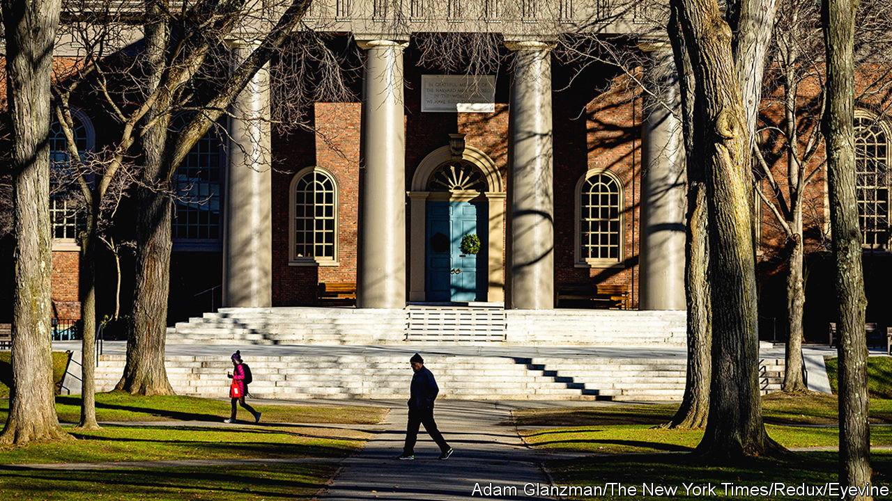

###### Course correction

# How to fix the Ivy League 

##### Its supremacy is being undermined by bad leadership 

 

> Mar 7th 2024 

America’s grandest universities have had a humbling few months. Administrators—many of whom had embraced social-justice activism and often promulgated their views on current affairs—went strangely mute after Hamas’s attack on October 7th, in which about 1,200 Israelis were killed. Loud opposition to oppression of all kinds turned timid when one of the oldest prejudices, antisemitism, reared its ugly head on elite campuses. Donors revolted. The president of the University of Pennsylvania resigned in December after widely derided testimony before Congress, in which she struggled to say whether students who call for the genocide of Jews ought to be punished. The similarly hapless president of Harvard, who in addition faced accusations of plagiarism, was forced to do the same.

On their own, these embarrassments are not an existential threat to the standing of America’s most vaunted universities. Their ability to anoint America’s aspiring elites remains intact—as do their eye-wateringly large financial endowments. But the fiascos of recent months have exposed . 

This matters because these institutions are engines of America’s intellectual and economic prowess. They have helped make the country a magnet for global talent and they are critical to its lead in scientific innovation. But their credibility, built up over hundreds of years, is now being eroded.

Many Americans have noticed that they are hypocritically unmeritocratic in their admissions, censorious towards conservatives and flat-footed in dealing with antisemitism. On the first point, the Supreme Court has ordered universities to stop considering race when deciding whom to admit. But many continue to favour the offspring of alumni. These “legacy” preferences are deeply regressive and make a mockery of high-minded commitments to diversity, equity and inclusion (DEI), which—to a greater extent than any other American institutions—elite universities have espoused. 

The DEI enforcers at such colleges not only seek to regulate student speech; many also require applicants for academic jobs to write diversity statements signalling adherence to progressive ideas, thus weeding out diversity of thought. And this supposedly oppression-eradicating bureaucracy has failed dismally to deal with antisemitism as it erupts on elite campuses. On February 26th a mob of protesters at the University of California, Berkeley, forcibly cancelled a speech by a visiting Israeli lawyer and intimidated Jewish students attending the event. 

Ignoring these problems raises two serious risks. The first is domestic. Although they are mostly private institutions, top universities depend on billions of dollars of public funding, in the form of research grants and loan assistance. The steady leftward drift of their administrations has imperilled this. Republican lawmakers are not just threatening the preferential tax rates on university endowments. They also aim to fight illiberalism with illiberalism by banning the teaching of certain ideas. 

The second threat is to the global standing of America’s elite institutions. Internecine conflict over social-justice ideology saps the appeal of American universities, not just to Americans but to potential students from other countries too.

There is some fledgling resistance within the academy, which wise administrators should not ignore. A newly formed group of professors called Faculty for Yale argue that their university must return to its original mission and “insist on the primacy of teaching, learning and research as distinct from advocacy and activism”. A few years ago, such a statement would have been utterly uncontroversial; that this is now considered brave dissent is dismaying. 

Earning back public trust is possible. Elite universities need to make admissions fairer by eliminating ancestral privilege and reintroducing the consideration of standardised test scores, which are less easily gamed by the children of the wealthy. They need to embrace academic freedom at all times—not just when it suits them—and stop policing the views of students and faculty. Compulsory diversity statements should be scrapped. The rapidly expanding administrative apparatus that has enabled all this dysfunction should be scaled down. So, too, should many universities’ overstuffed corporate boards. They should employ fewer cheerleaders for the university president and more tough, independent voices. 

If America’s great universities wish to remain pre-eminent for centuries more, they must correct course now. Credibility often diminishes slowly—and then all at once.■

